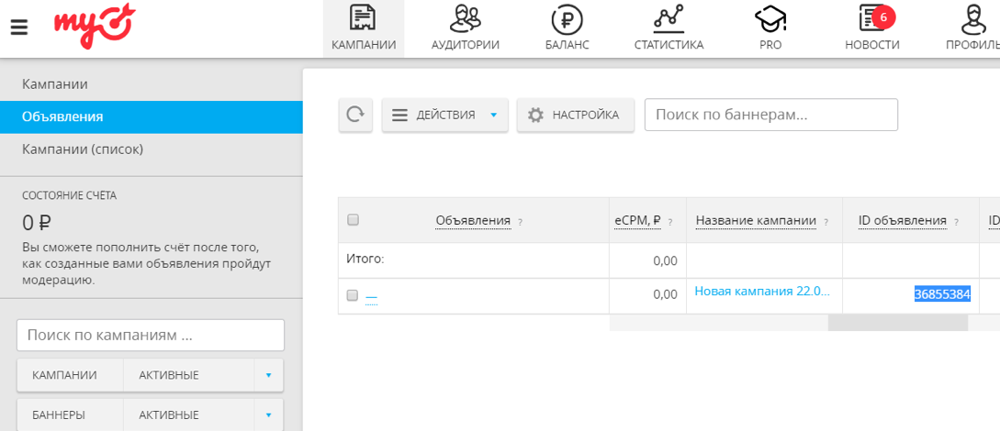

# Шаги по созданию привязки объявления myTarget к виджету CallKeeper

1. Создайте форму OK Lead Ads на сайте [Одноклассники](ok.ru).

С инструкцией по созданию OK Lead Ads можно ознакомиться по [ссылке](https://insideok.ru/blog/instrukciya-kak-sozdat-reklamnoe-obyavlenie-lead-ads).

2. Зарегистрируйтесь на сайте [myTarget](https://target.my.com) и создайте кампанию с привязкой к форме Lead Ads. Если у вас возникнут сложности с настройкой кампании, ознакомьтесь со [справочными материалами](https://target.my.com/adv/help/).

3. Перейдите в Личный кабинет CallKeeper, вкладка Сервисы - OK Lead Ads.

Если при переходе на [страницу](https://callkeeper.ru/dashboard/ok.php) Вы видите сообщение об отсутствии подключенных аккаунтов, убедитесь, что Вы залогинены под своими учетными данными на сайтах myTarget и CallKeeper, и нажмите кнопку "Подключить".

4. Вы будете направлены на сайт myTarget, где Вам предложат предоставить права чтения статистики для приложения CallKeeper.

После предоставления разрешения, Вы будете вновь направлены на страницу [страницу OK Lead Ads](https://callkeeper.ru/dashboard/ok.php), с основным интерфейсом управления формами.

5. Для создания привязки формы OK Lead Ads и виджета CallKeeper нажмите на кнопку "Добавить форму" и Вы перейдете на страницу создания/редактирования формы.

Чтобы создать форму выберите пользователя myTarget, виджет CallKeeper, введите произвольные название формы и адрес сайта, а также введите ID объявления, который можно найти на вкладке "Объявления" на странице myTarget.

Указание UTM-меток не является обязательным.

Звонки будут инициироваться после привязки транслируемого объявления к виджету.

### **Примечание**

К одному пользователю CallKeeper может быть привязано несколько конечных рекламодателей из myTarget. Привязка осуществляется не к рекламному агентству (у которого может быть несколько аккаунтов на myTarget), а именно к конечным пользователям.

Существует ограничение – одного рекламодателя myTarget можно привязать только к одному user id в системе CallKeeper. При этом после привязки можно создавать неограниченное количество баннеров, с которых будут собираться лиды.

[Вернуться](/README.md)
