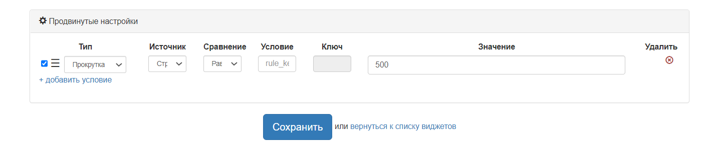
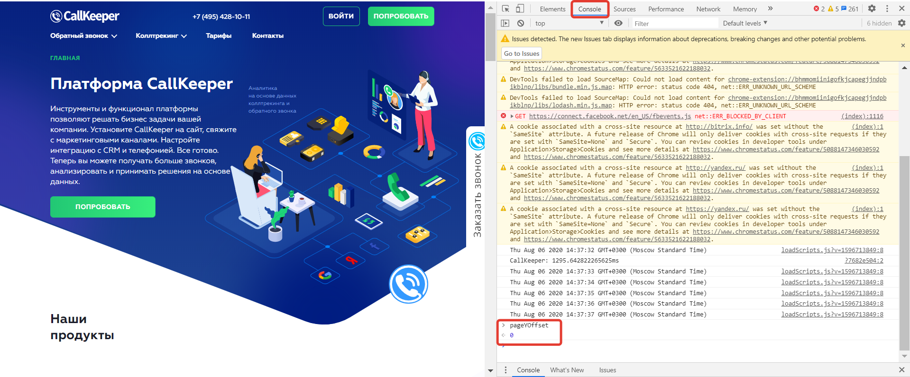
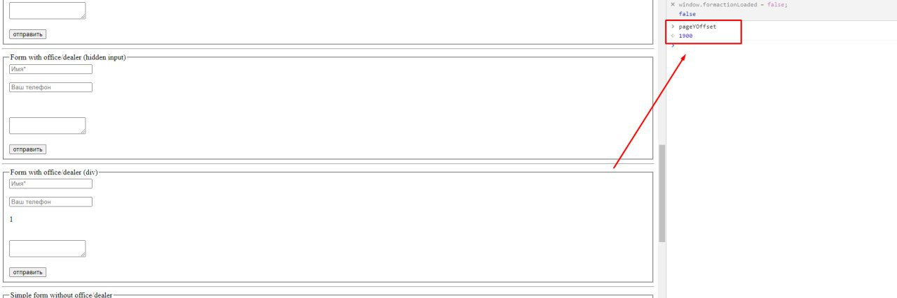

# Появление виджета и лидогенератора по скроллу
Настройка позволяет вызвать виджет или лидогенератор на конкретном месте страницы при скролле.
## Настройка
В продвинутых настройках указать высоту прокрутки, на которой должен вызваться виджет/лидогенератор.

«Тип», «Источник», «Сравнение», «Условие» – работают также, как и в других продвинутых настройках. «Значение» – Высота прокрутки страницы

**Пример**: если нужно использовать вызов по скроллу только на странице типа /cars, то выбираем условие Источник "Страница", Сравнение "Содержит", Условие – cars. На странице с этим условием будет работать правило вызова по скроллу.

Когда пользователь проскроллит до этой точки страницы – вызовется инструмент. Вызов по скроллу возможен 1 раз в 30 мин. Текущая высота прокрутки страницы может быть получена из консоли, из свойства pageYOffset.
**pageYOffset** – свойство окна window, доступное только для чтения. Значение pageYOffset начинает отсчитываться от верхнего края страницы и увеличивается по мере прокручивания.

## Чтобы указать в настройках оптимальное значение необходимо:
1. Проскроллить страницу до конкретного места, где должен появляться инструмент
2. Вызвать консоль, ввести pageYOffset, нажать на Enter
3. Скопировать значение pageYOffset и вставить в продвинутые настройки

