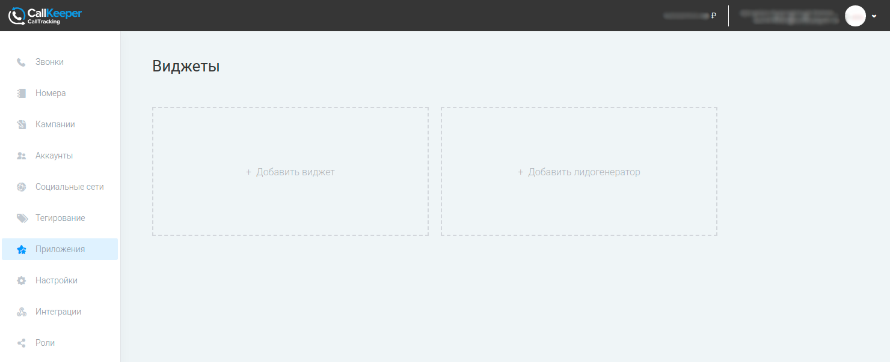
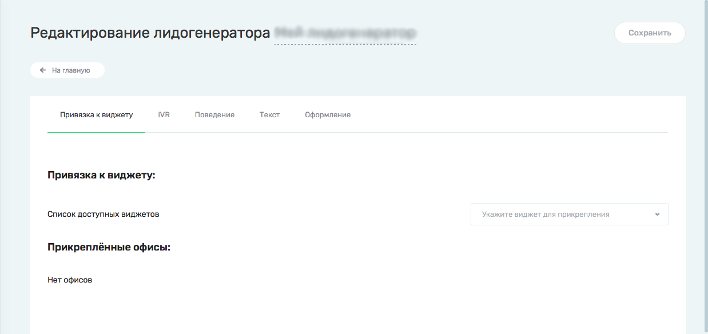
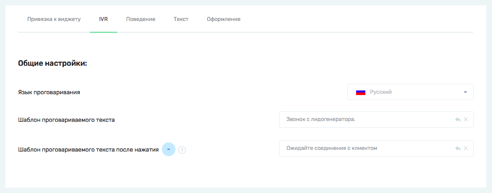
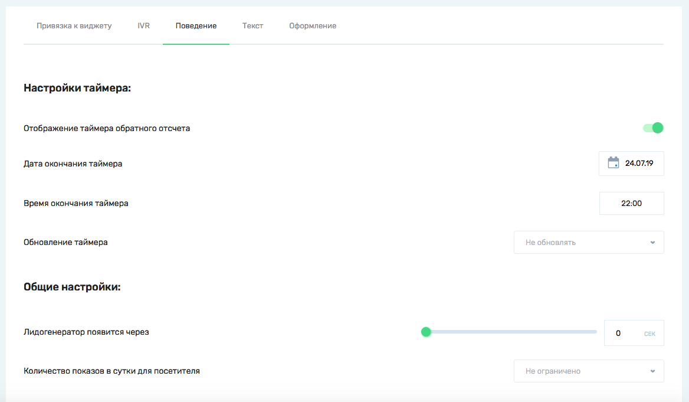
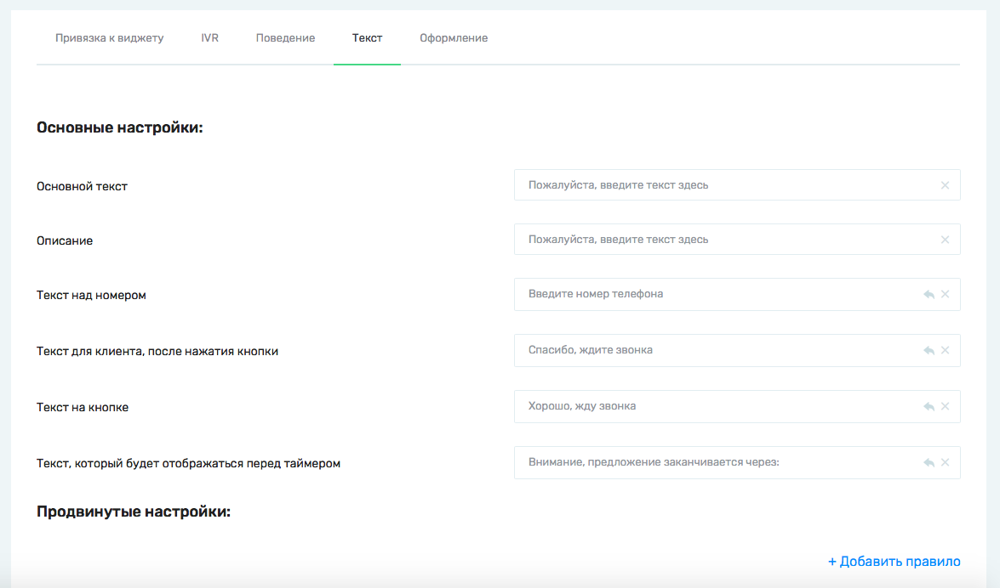
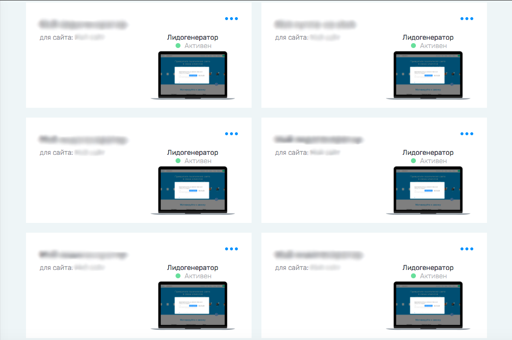

# Лидогенератор

#### Примечание:
`Инструмент доступен только для аккаунтов, перенесенных с callkeeper.ru/callkeeper.com`
________

`Лидогенератор - это один из инструментов для получения звонков`

## Навигация

* [Создание лидогенератора](#создание-лидогенератора)
* [Настройки лидогенератора](#настройки-лидогенератора)
  * [IVR](#ivr)
  * [Поведение](#поведение)
  * [Текст](#текст)
  * [Оформление](#оформление)

## Создание лидогенератора

Перейдите в раздел Приложения. Здесь вы можете создавать инструменты для получения звонков и лидов.

Нажмите "Добавить лидогенератор".

Вы перейдете в редактирование настроек лидогенератора.

## Настройки лидогенератора

Вы можете изменить название лидогенератора в верхней строке, кликнув по нему.

Лидогенератор не является самостоятельным инструментом. Его нужно обязательно привязать к существующему виджету. Обратите внимание, что настройки, связанные с Сценарием звонка и Расписанием работы, лидогенератор возьмет из виджета, к которому вы его привяжете.

Если у вас еще нет виджета, вы можете закончить настройки Лидогенератора, сохранить его и перейти к [созданию виджета](/documentation/apps/widget/widget_ru.md#виджет-обратного-звонка-calltracking). Не забудьте позже вернуться в настройки Лидогенератора и привязать его. Без привязки к виджету Лидогенератор не будет работать.

Офисы автоматически подтянутся из привязанного виджета.
_____
### IVR

На вкладке IVR вы можете отредактировать текст, который услышит менеджер при звонке с этого виджета.

Если у вас включен сервис SmartCall, то у вас будет возможность настроить два шаблона проговариваемого текста - до и после нажатия/проговаривание цифры для инициации звонка.

______
### Поведение

На вкладке Поведение вы можете отрегулировать настройки показа лидогенератора и настроить таймер, отображаемый на лидогенерторе. 
При помощи таймера вы можете визуально отразить длительность спецпредложения, особых скидок, завершения распродажи или другого, конечного по времени предложения.

_______
### Текст

На вкладке Текст вы можете ввести текст, который будет отображаться на лидогенераторе.

_______
### Оформление

На вкладке Оформление вы можете настроить внешний вид лидогенератора и его элементов.

Загрузите фоновую картинку, нажав на кнопку "Загрузить".

(Ограничения по загрузке картинки)
_______
#### Примечание:
`Лидогенераторы могут отображаться не на всех экранах.`

`Общее правило запрета показа лидогенератора:`

`Ширина картинки + 250 > Ширина окна браузера`

`Высота картинки + 50 > Высота окна браузера`

`Размеры даны в пикселях.`

`Поэтому, если фоновая картинка вашего лидогенератора по размерам достаточно большая, то на маленьких мониторах они могут не показываться.`
______

После завершения настроек Лидогенератора нажмите кнопку "Сохранить" в правом верхнем углу.

Все созданные Лидогенераторы отобразятся в общем списке инструментов в разделе Приложения.

[Вернуться к оглавлению](#навигация)

[Вернуться на главную](/README.md#documentation)
