# Виджет обратного звонка Calltracking

#### Примечание:
`Инструмент доступен только для аккаунтов, перенесенных с callkeeper.ru/callkeeper.com`
________

`Виджет обратного звонка - это самостоятельный инструмент, с помощью которого пользователи могут заказывать обратный звонок. `

`
Кроме этого, виджет - это основа для многих других инструментов сервиса Calltracking.
`

## Навигация
* [Создание виджета](#создание-виджета)
* [Настройки виджета](#настройки-виджета)
  * [Офисы](#офисы)
  * [Расписание](#расписание)
  * [Сценарий](#сценарий)
  * [IVR](#ivr)
  * [Поведение](#поведение)
  * [Текст](#текст)
  * [Оформление](#оформление)
  * [Общая информация](#общая-информация)

## Создание виджета

Перейдите в раздел Приложения. Здесь вы можете создавать инструменты для получения звонков и лидов.

Нажмите "Добавить виджет". 

Введите название нового виджета и сайт, для которого вы создаете этот виджет. Оба поля носят информативный характер, вы сможете отредактировать их позже. 

Обратите внимание на поле "Для кого сохранить виджет". По умолчанию вы можете создавать инструмент только для себя - для аккаунта, под которым вы залогинились. Если вам выдадут роль на создание инструмента другому пользователю, то в этом списке кроме вашего аккаунта появится список аккаунтов, для которых вы можете создавать инструменты по роли.

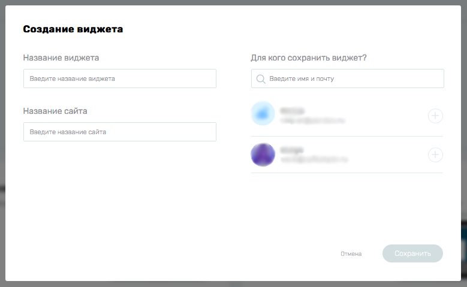

Выберите, для какого аккаунта вы создаете виджет и нажмите Сохранить.

Вы перейдете на страницу настроек виджета.

## Настройки виджета
### Офисы

Вы можете в любой момент изменить название виджета и сайт, для которого вы его планируете использовать, кликнув по ним в верхней строке.

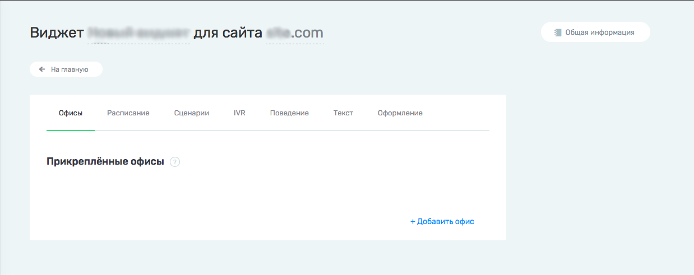

Прикрепите к виджету минимум один офис. Список офисов автоматических подгружается из номеров офисов. [Подробнее здесь](/documentation/calltracking/calltracking_instruction.md#Добавление-офисов).

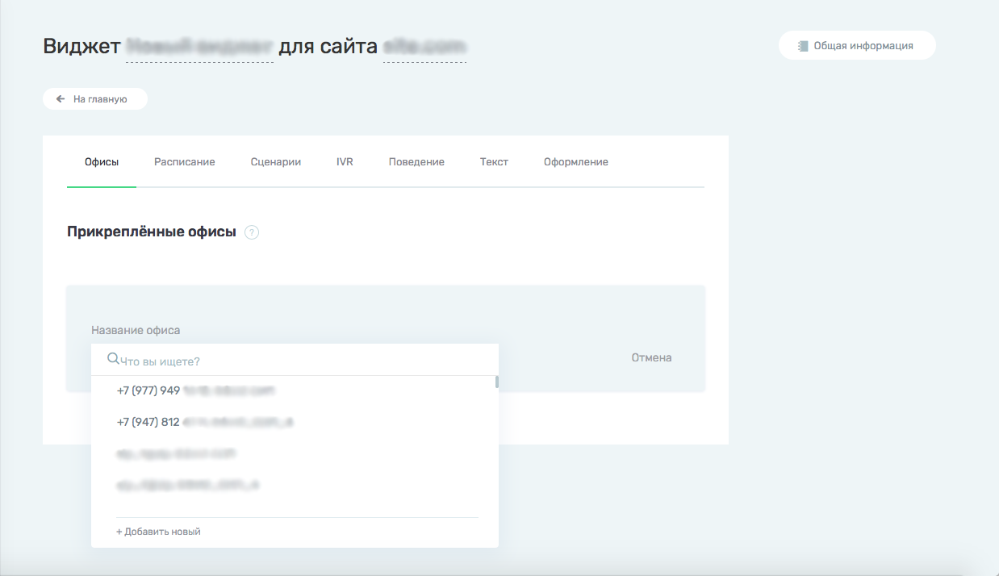

После прикрепления офиса, он отобразится в виджете.

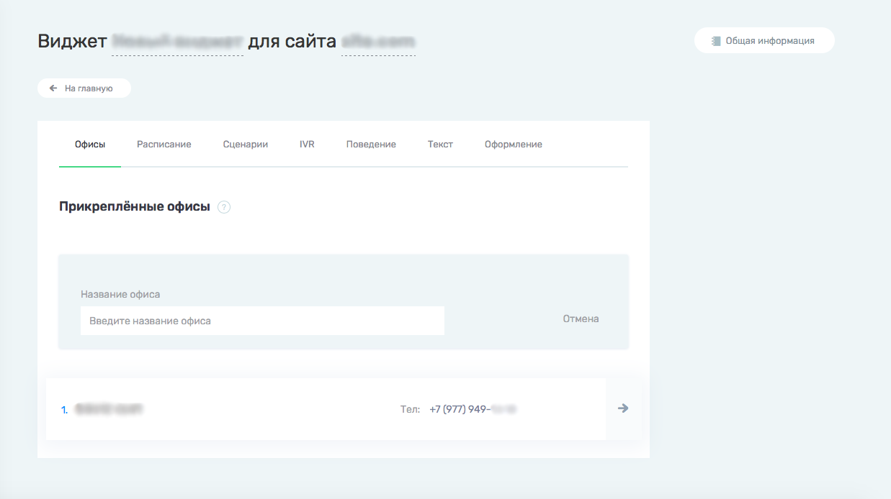

Вы можете нажать на стрелку справа от выбранного офиса и настроить отправку уведомлений.

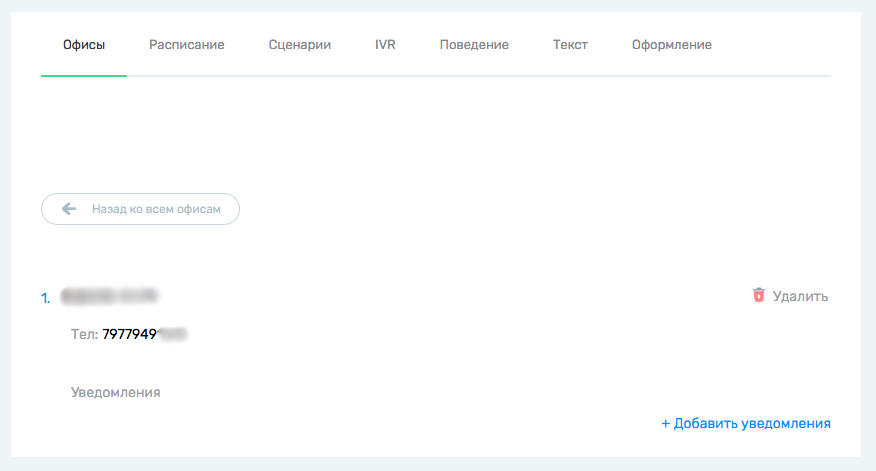

Нажмите "+ Добавить уведомление".

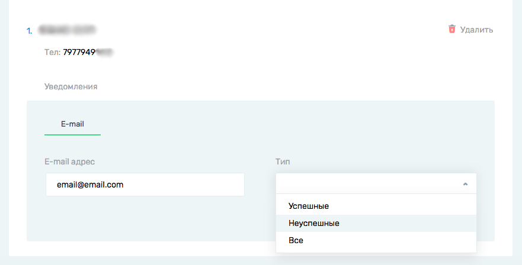

Введите email, на который будут отправляться уведомления, и типы звонков, по которым они будут отправляться.

Например, при каждом неуспешном звонке на указанный номер офиса на почту email@email.com будет приходить уведомление о неуспешном звонке.

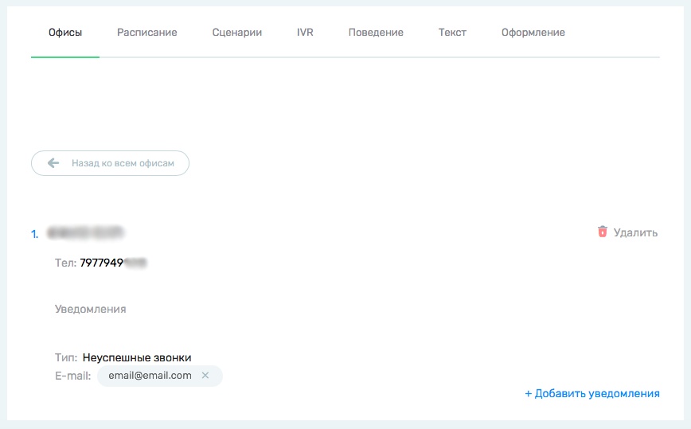

Вы можете добавить несколько email для отправки уведомления по разным типам звонков и в любой момент удалить ненужные, нажав на крестик рядом с почтой.

______

### Расписание

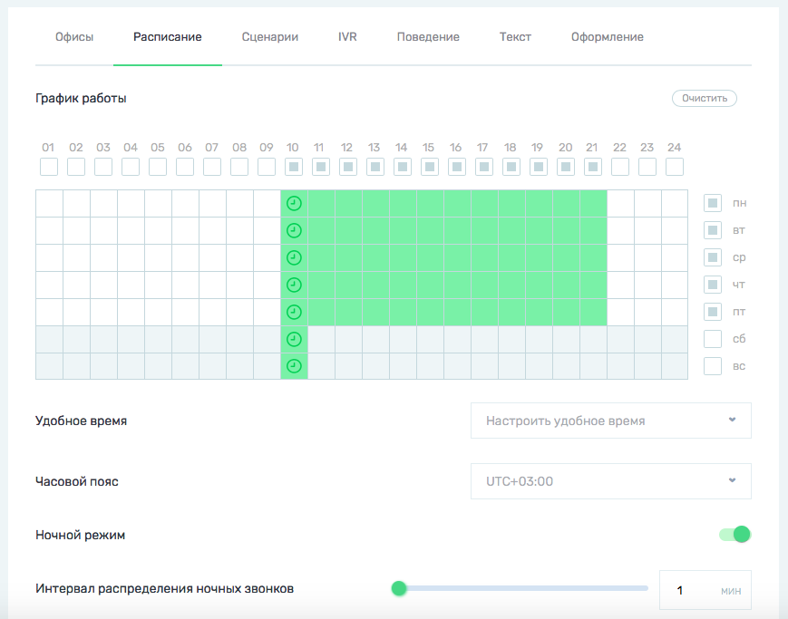

Следующий шаг - настройка расписания работы виджета.
В таблице отметьте зеленым часы работы вашего офиса. В эти часы будут проходить звонки, заказанные с виджета и с прикрепленных к нему инструментов.

- `Удобное время - это время, в которое поступит звонок, заказанный в нерабочее время. По умолчанию отображается на виджете, если пользователь выберет опцию: перезвоните мне в удобное время.`

Выберите удобное время для нужных дней недели.

Удобное время автоматически появится в таблице расписания в виде зеленой клетки с часами.

- `Часовой пояс - часовой пояс, к которому будет привязано рабочее время виджета.`

- `Ночной режим - если вы хотите, чтобы в нерабочее время клиенты не видели ваши инструменты на сайте, оставьте настройку неактивной. Если ночной режим включен, то в нерабочее время клиенты увидят инструмент с ночным текстом (настраивается здесь) и смогут заказать отложенный звонок.`

- `Интервал распределения ночных звонков - интервал, с которым состоятся звонки, запланированные на одно и то же время. Не рекомендуется ставить интервал больше 10 минут.`

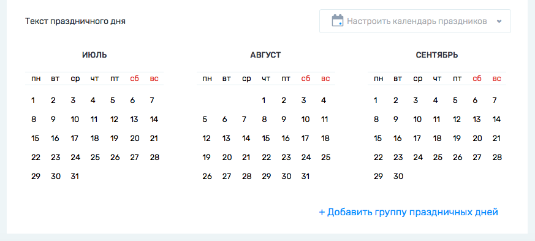

В календаре праздничных дней вы можете выбрать праздничные дни и специальный текст, который будет отображаться только в этот день. 
Вы также можете сделать день рабочим, настроим рабочие часы при выборе праздничного дня или отредактировав его позже в строках под календарем. 

_______
### Сценарий

На вкладке Сценарий вы можете настроить сценарий звонка.

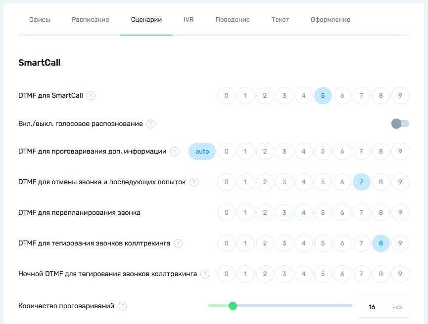

Настройки SmartCall - способ взаимодействия менеджера коллцентра со звонком. Выберите нужные цифры для действий, которые вы хотите использовать.

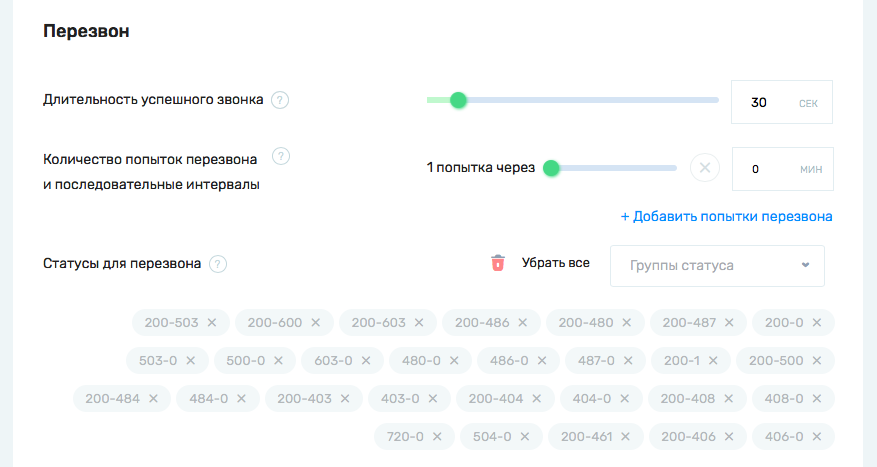

Настройте правила, по которым у вас будут планироваться перезвоны после неуспешных звонков.

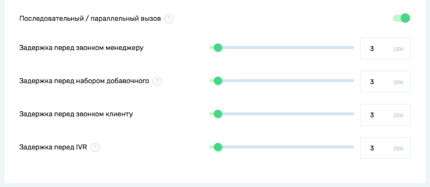

Выставление задержек перед началом определенных действий может быть важно для корреткной работы АТС.
_______
### IVR

На вкладке IVR вы можете отредактировать текст, который услышит менеджер при звонке с этого виджета.

Если у вас включен сервис SmartCall, то у вас будет возможность настроить два шаблона проговариваемого текста - до и после нажатия/проговаривание цифры для инициации звонка.

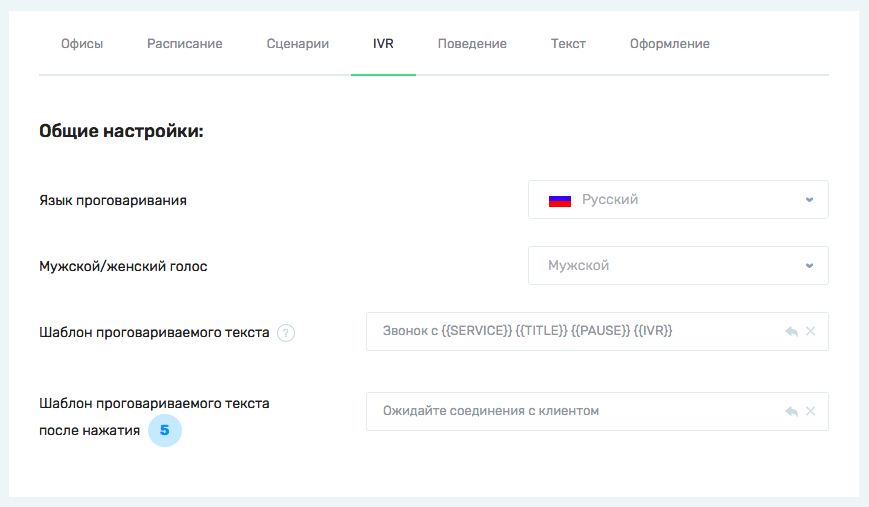
_______
### Поведение

На вкладке Поведение вы можете настроить условия показа виджета.

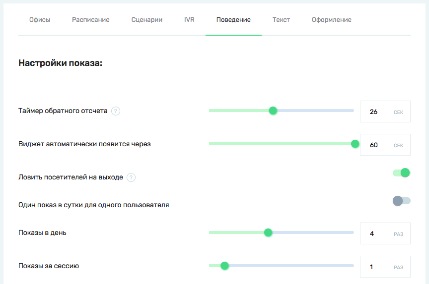
_______
### Текст

На вкладке Текст вы можете настроить различный текст для разных сценариев показа виджета. 
Также укажите ссылки на дисклеймеры сервиса Callkeeper/Calltracking и вашей рекламной кампании.

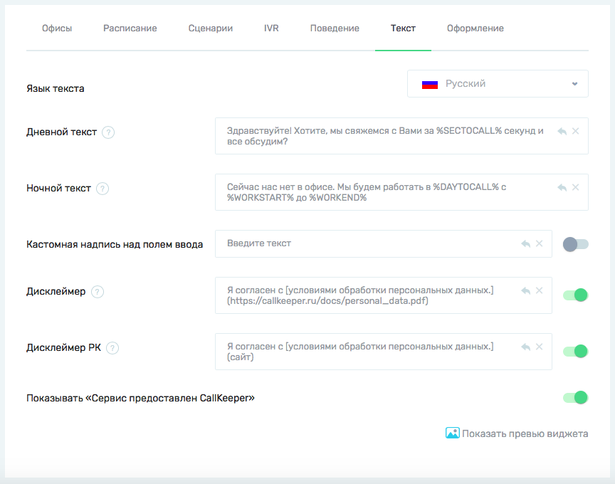

Вы можете использовать метазаполнители - специально оформленные слова, которые автоматически заменяются на параметры из настроек вашего виджета. 

Чтобы посмотреть, как выбранный вами текст будет выглядеть на виджете, нажмите на Показать превью виджета в правом нижнем углу.

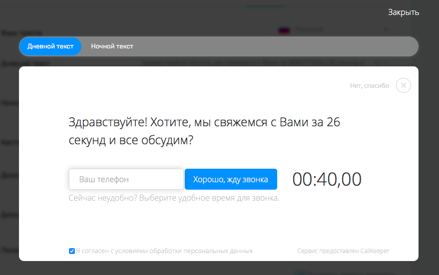

______
### Оформление

На вкладке Оформление вы можете детально настроить внешний вид виджета: цвета текста и кнопок, скругление углов, расположение кнопок инструмента. 

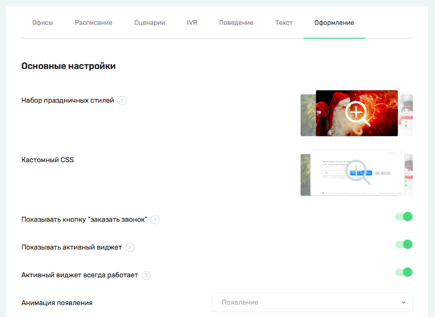

- `Набор праздничных стилей - особые стили для виджета, привязанные к праздничным датам. Обновляются автоматически`
- `Кастомный CSS - шаблоны стилей, которые вы настроили самостоятельно или обратившись к своему менеджеру`

После завершения настроек на вкладке Оформление нажмите "Сохранить как новый".
Если вы настраиваете стиль впервые, то другого варианта у вас не будет. Если вы повторно зашли в настройки виджета и внесли правки в настройки Оформления, то у вас появится еще один вариант - "Сохранить изменения". В этом случае старый стиль перезапишется с новыми изменениями. Если вы выберете "Сохранить как новый", то у вас появится еще один стиль.

Все созданные стили можно посмотреть, щелкнув на картинку напротив настройки Кастомный CSS. 
Здесь же вы можете выбрать один из ранее созданных стилей.
_______

Все настройки (кроме вкладки Оформление) сохраняются и обновляются автоматически.

______

### Общая информация
Нажмите на кнопку Общая информация.
В этой вкладке хранится общая информация о вашем виджете.

Чтобы разместить ваш виджет на сайте, скопируйте содержимое строки Код для вставки на сайт и добавьте ее на свой сайт перед закрывающим тегом </body>. 

- `Hash виджета - уникальный идентификатор виджета в нашей системе`.

_____
После завершения настроек вы можете нажать "На главную" и вернуться к списку всех приложений.

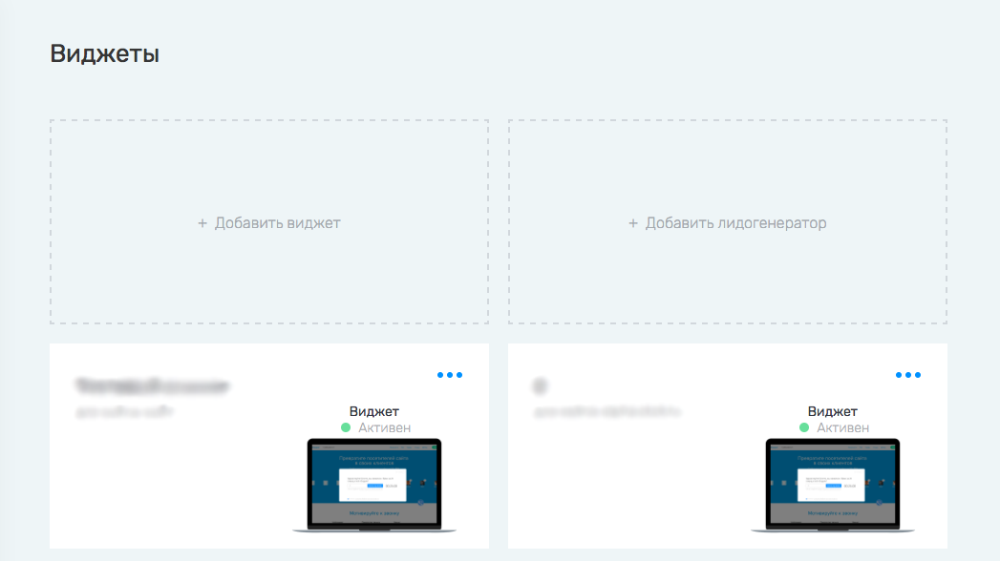

Здесь будут отображаться все созданные вами приложения.

[Вернуться к оглавлению](#навигация)

[Вернуться на главную](/README.md#documentation)
