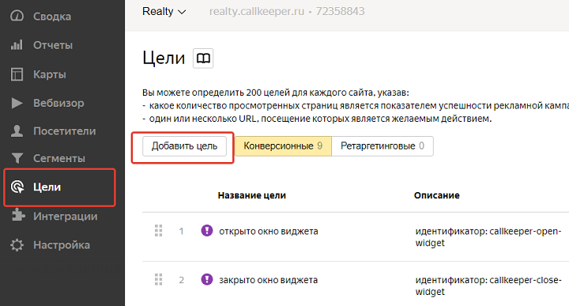

# Настройка целей в Яндекс Метрике

## Навигация
* [Описание ](#Описание)
* [Настройка ](#Настройка)
* [Доступные идентификаторы событий CallKeeper для Яндекс.Метрики ](#Доступные-идентификаторы-событий-CallKeeper-для-Яндекс.Метрики )

## Описание 

CallKeeper автоматически отправляет данные в Яндекс.Метрику.

Чтобы настроить передачу данных, необходимо авторизоваться в аккаунте Яндекс.Метрики https://metrika.yandex.ru/ под правами администратора или редактора.

## Настройка 

Выберите нужный счетчик в списке и зайдите в его редактирование. 

Перейдите на вкладку Цели и выберите добавить цель. 

Название цели на ваше усмотрение. Выберите тип условия JavaScript-событие. Укажите идентификатор цели, выбрав нужный идентификатор события CallKeeper, указанный ниже.

## Доступные идентификаторы событий CallKeeper для Яндекс.Метрики 

**Десктопные инструменты CallKeeper**
callkeeper-open-widget — открыто окно виджета.

callkeeper-close-widget — закрыто окно виджета.

callkeeper-call_order-widget — заказан звонок с виджета.

callkeeper-open-lg — открыто окно лидогенератора.

callkeeper-close-lg — закрыто окно лидогенератора.

callkeeper-call_order-lg — заказан звонок с лидогенератора.

callkeeper-open-form — открыта онлайн-форма CallKeeper.

callkeeper-close-form — закрыта онлайн-форма CallKeeper.

callkeeper-call_order-form — заказан звонок с онлайн-формы CallKeeper.

callkeeper-open-videowidget — открытие инструмента через видеовиджет.

callkeeper-close-videowidget — закрытие инструмента, открытого через видеовиджета.

callkeeper-call_order-videowidget — заказан звонок с виджета, открытого через видеовиджет.

**Мобильные инструменты CallKeeper**
callkeeper-open-portable — открыта мобильная версия виджета V1.

callkeeper-close-portable — закрыта мобильная версия виджета V1.

callkeeper-call_order-portable — заказан звонок из мобильной версии виджета V1.

callkeeper-t2c-portable — клик на иконку прямого звонка в мобильной версии виджета V1.

callkeeper-open-mobile — открыта мобильная версия V2/V3.

callkeeper-close-mobile — закрыта мобильная версия V2 (для V3 пока не реализовано).

callkeeper-call_order-mobile — заказан звонок в мобильной версии V2/V3.

callkeeper-t2c-mobile — клик на иконку прямого звонка мобильной версии виджета V2/V3.

callkeeper-open-ckapp — открыт микролендинг CKAPP (укажите номер счетчика в настройках CKAPP)

callkeeper-call_order-ckapp — заказан звонок с микролендинга CKAPP (укажите номер счетчика в настройках CKAPP)

**Видеовиджет CallKeeper**

callkeeper-init-videowidget - видеовиджет отобразился на странице

callkeeper-open-videowidget - видеовиджет открыт в развернутом виде

callkeeper-minimize-videowidget - видеовиджет свернут

callkeeper-close-videowidget - видеовиджет закрыт

callkeeper-pause-videowidget - видео поставлено на паузу

callkeeper-play-videowidget - воспроизведение видео

callkeeper-mute-videowidget - выключен звук видео

callkeeper-volumeon-videowidget - включен звук видео

callkeeper-15sec_view-videowidget - просмотр видео 15 секунд

callkeeper-30sec_view-videowidget - просмотр видео 30 секунд

callkeeper-45sec_view-videowidget - просмотр видео 45 секунд

callkeeper-60sec_view-videowidget - просмотр видео 60 секунд

callkeeper-75sec_view-videowidget - просмотр видео 75 секунд

callkeeper-90sec_view-videowidget - просмотр видео 90 секунд

callkeeper-105sec_view-videowidget - просмотр видео 105 секунд

callkeeper-120sec_view-videowidget - просмотр видео 120 секунд

callkeeper-full_view-videowidget - просмотр видео до конца

callkeeper-open_from-videowidget - открытие инструмента через видеовиджет

callkeeper-close_from-videowidget - закрытие инструмента, открытого через видеовиджет

callkeeper-call_order_from-videowidget - заказ звонка с инструмента, открытого через видеовиджет

**Встроенная форма видеовиджета**

callkeeper-open-videowidget_form — открыто окно формы Видеовиджета

callkeeper-close-videowidget_form — закрыто окно формы Видеовиджета

callkeeper-call_order-videowidget_form — заказан звонок с формы Видеовиджета

**Дополнительный функционал в мобильных версиях V2/V3**

callkeeper-telegram-mobile — открыто приложение Telegram.

callkeeper-viber-mobile — открыто приложение Viber.

callkeeper-whatsapp-mobile — открыто приложение WhatsApp.

callkeeper-vk-mobile — открыто приложение ВКонтакте.

callkeeper-facebook-mobile — открыто приложение Facebook Messenger.

callkeeper-yandexmap-mobile — открыто приложение Яндекс.Карты.

callkeeper-yandexnav-mobile — открыто приложение Яндекс.Навигатор.

callkeeper-googlemap-mobile — открыто приложение GoogleMaps.

callkeeper-link_#-mobile — клик на дополнительную иконку в мобильной версии. # — порядковый номер иконки в V2 (для V3 пока не реализовано).
отправка событий Яндекс.Такси, 2ГИС, Instagram, LinkedIn и с формы обратной связи в V3 пока не реализована.

**Обработка форм на сайте**

callkeeper-call_order-formaction — заказан звонок с помощью метода FormAction.

callkeeper-call_order-ckaction — заказан звонок с помощью метода CKAction (событие настраивается клиентом)

**Отправка события по API**

После обработки форм методом API startCall или запуска звонка таким методом будет отправлено событие call (необходимо запросить отдельную настройку).
Звонки коллтрекинга

calltracking_call_order — звонок коллтрекинга

**Составная цель для звонков**

callkeeper-call_order — составная цель заказа звонка для следующих событий:

callkeeper-call_order-iform — заказан звонок с помощью метода iForm.

callkeeper-call_order-portable

callkeeper-call_order-widget

callkeeper-call_order-lg

callkeeper-call_order-formaction
(для скриптов сделанных после 10.06.2020)

callkeeper-call_order-mobile

callkeeper-call_order-form

callkeeper-call_order-videowidget

Обратите внимание, что portable и mobile относятся к смартфонам и мобильным устройствам. У всех событий регистр написания нижний.

Статистика по добавленным целям станет доступна в соответствующем отчете Яндекс.Метрики «Конверсии».

Данные по целям доступны также в любом отчете Яндекс.Метрики с фильтром Цели.

Дополнительных настроек выполнять не нужно, CallKeeper автоматически определит наличие кода Яндекс.Метрики на вашем сайте, номер счетчика и передаст данные о событиях.

[Вернуться к оглавлению](#навигация)
[Вернуться на главную](/README.md/#documentation)
