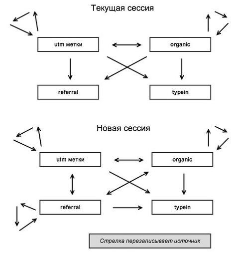

# Модель атрибуции

**Атрибуция** — это правило, по которому ценность конверсии распределяется по отдельным точкам взаимодействия с брендом. На основе атрибуции система аналитики определяет канал, который сыграл решающую роль в достижении цели.
У нас используется модель атрибуции "Последний непрямой клик" (Last Non-Direct Click)
Эта модель по умолчанию используется в отчетах Google Analytics, кроме отчетов по многоканальным последовательностям. По ней 100% ценности конверсии присваивается последнему переходу, который состоялся до прямого захода на сайт.

Всего у нас есть **4 основных типа трафика**:

**utm** — рекламный трафик, размеченный utm-метками;

**organic** — трафик из органической выдачи поисковых систем ('bing', 'yahoo', 'rambler', 'tut', 'yandex', 'google');

**referral** — реферальный трафик (ссылки со сторонних ресурсов);

**typein** — прямые переходы;

## Логика перезаписи источников:
Когда пользователь приходит в первый раз на сайт, мы получаем данные об источнике перехода. Этот же пользователь может вернуться на сайт с другого источника, и нам нужно либо перезаписать текущий источник, либо этого не делать. Логика перезаписи полностью повторяет логику Google Analytics:

1. Переходы с utm-разметкой перезаписывают всё и всегда (даже самих себя).
2. Переходы из органической выдачи аналогично — перезаписывают всё и всегда.
3. Прямые переходы не перезаписывают никогда и ничего. Они фиксируются только в случае самого первого захода на сайт, при условии что других источников до этого зафиксировано не было.
4. Реферальные переходы в рамках текущей сессии ничего не перезаписывают, перезапись происходит только при условии отсутствия сессии у пользователя. Т.к. посетитель часто в рамках текущего визита переходит на сайт со стороннего ресурса, который реальным источником не является — например из почтового сервиса, где у него была ссылка на активацию регистрации.*

*Внутренние реферальные переходы не учитываются: когда домен реферального источника совпадает с доменом текущей страницы (т.е. при переходе между страницами сайта и между поддоменами).
Например, у вас есть сайт: site.com. На вашем сайте есть блог: blog.site.com. Переходы с сайта на блог и обратно считаются внутренним трафиком: то есть источник blog.site.com не фиксируется как referral и не перезаписывает другие источники при новой сессии. Так, если пользователь перешел с blog.site.com на site.com (а также с alex.blog.site.com на site.com), источник не перезапишется и такой переход будет равноценен переходу с site.com/about на site.com/contacts.

## Логика определения типа источника:
- В текущей сессии: берем необходимые параметры из текущей cookie.
- Если сессия новая, берем источники последних непрямых переходов из cookie, установленной на 180 дней.
- Перезаписываем параметры, согласно логики перезаписи источников.
- Если обнаружены новые utm-метки (как минимум utm_source) - устанавливаем тип источника utm.
- Если нет новых utm-меток, но есть новый органический источник - зачищаем старые utm-метки и устанавливаем тип источника organic.
- Если нет ни новых utm-меток, ни нового органического источника, но есть сохраненные utm-метки (как минимум есть utm_source) - устанавливаем тип источника utm.
- Если нет никаких utm-меток, но есть текущий реферальный источник с признаками органики - устанавливаем тип источника organic. Если реферальный источник без признаков органики - устанавливаем тип источника referral.
- Если совсем ничего нет, значит это прямой заход - устанавливаем тип источника typein.

Таким образом мы расфасовываем посетителей по этим 4 корзинам.

___
Данная модель атрибуции - это упрощенный вариант модели, взятой из следующих источников:
1. [Как Метрика определяет источник трафика](https://yandex.ru/support/metrica/general/sources-tracking.html)
2. [Google Analytics campaigns and traffic sources](https://support.google.com/analytics/answer/6205762#flowchart)
3. [Модуль определения источников посетителей сайта](https://habr.com/ru/post/208112/)
