# Работа с сервисом Calltracking

### Навигация:

- [Регистрация в Calltracking](#Регистрация-в-Calltracking) 
- [Подменные номера](#Подменные-номера)
  - [Добавить свой номер](#Добавить-свой-номер)
  - [Купить номер](#Купить-номер)
  - [Добавление офисов](#Добавление-офисов)
- [Настройка кампаний](#Настройка-кампаний)
  - [Группа правил](#Группа-правил)
  - [Примеры настраиваемых правил](#Примеры-настраиваемых-правил)
  - [Код на сайт](#Код-на-сайт)
- [Настройки](#Настройки)
- [Аккаунты](#Аккаунты)
  - [Настройка аккаунтов](#Настройка-аккаунтов)
- [Роли](#Роли)
- [Интеграции](#Интеграции) 

## Регистрация в Calltracking

На главной странице ckct.ru нажмите кнопку «Регистрация».

Введите имя пользователя, email, номер телефона, пароль и нажмите «Зарегистрироваться».

Перейдите в указанную при регистрации почту и подтвердите адрес электронной почты, нажав на кнопку «Подтвердить почту».

Вы будете автоматически перенаправлены в личный кабинет calltracking.

После регистрации с вами свяжется менеджер и расскажет, как можно оплатить сервис.

## Подменные номера

Откройте раздел «Номера» слева.

Автоматически откроется вкладка «Подменные номера».
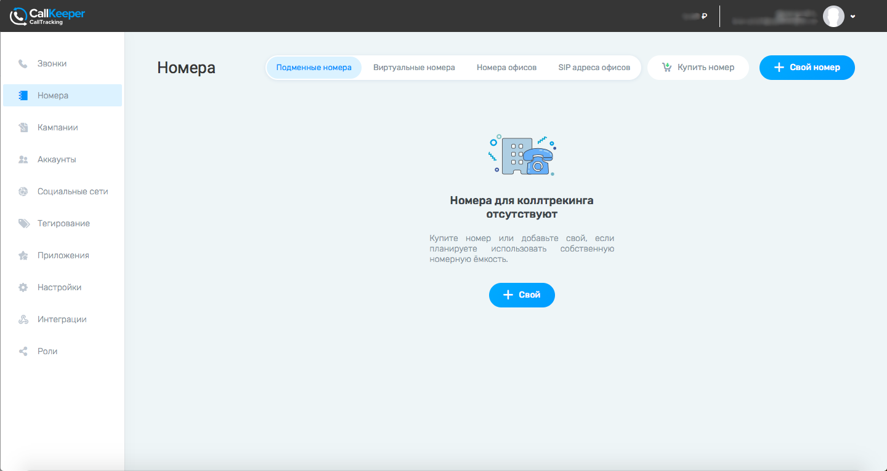

Здесь вы можете купить подменные или виртуальные номера, установить номер для офиса или SIP-номер для офиса и добавить собственные подменные номера.

### Добавить свой номер

Для того чтобы добавить ваши собственные номера для коллтрекинга, нажмите кнопку «+ Свой номер».
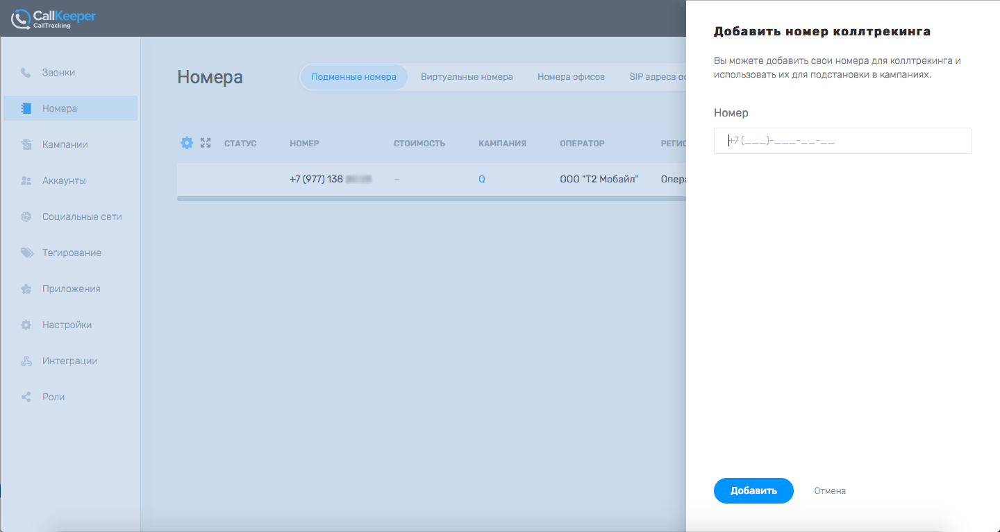

На появившейся справа вкладке вы можете ввести свой номер и нажать кнопку «Добавить».

Все добавленные таким образом номера попадут в ваш список подменных номеров. После этого нужно будет связаться с техническим отделом для уточнения ряда вопросов по подключению добавленного вами номера. Это можно сделать через вашего менеджера.

### Купить номер

Чтобы купить номера, нажмите кнопку «Купить номер».

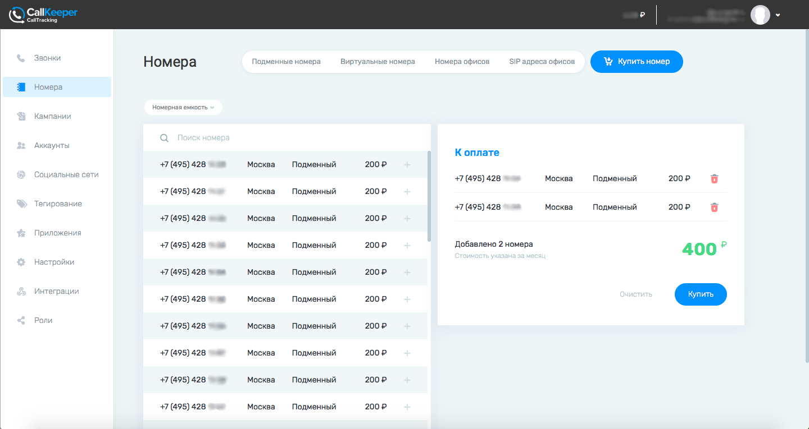

Вы можете купить номера из определенной номерной емкости - регионы можно выбрать в выпадающем списке при нажатии на кнопку «Номерная емкость».

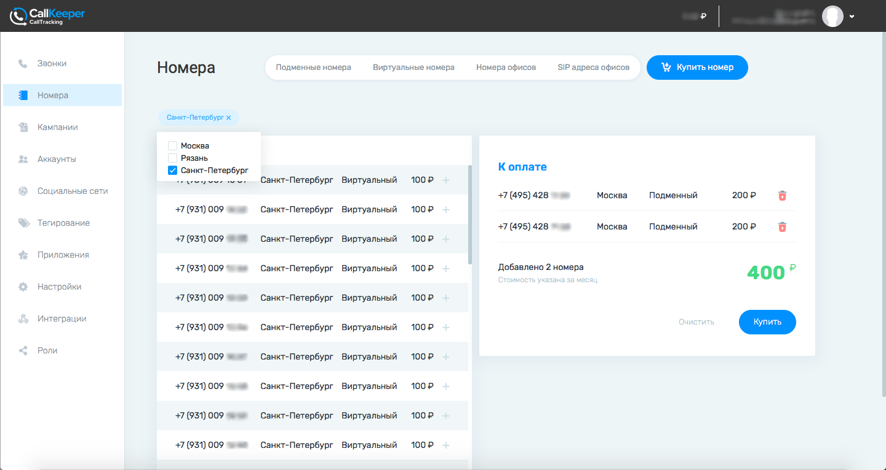

Если вашего региона нет в списке, уточните возможность добавления номеров у вашего менеджера.

Обратите внимание на то, что цена номера может варьироваться в зависимости от региона.

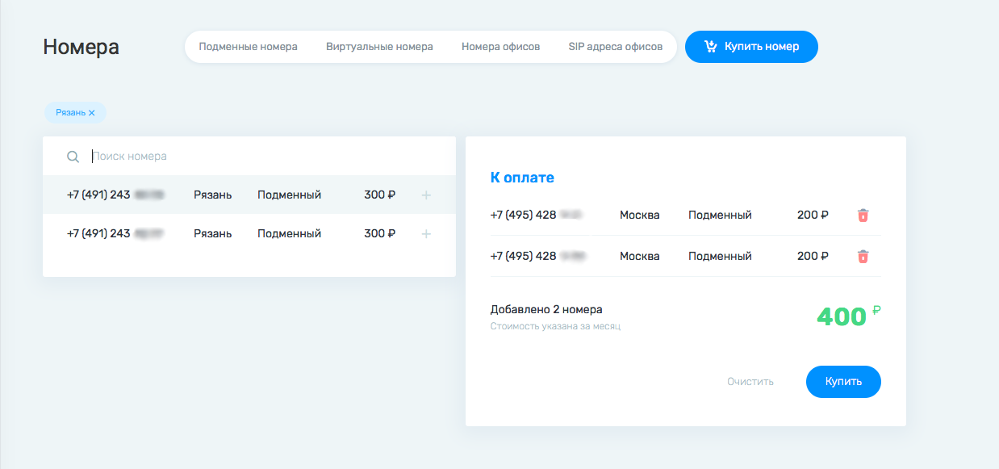

Для покупки виртуального номера введите в поисковой строке слово «виртуальный».

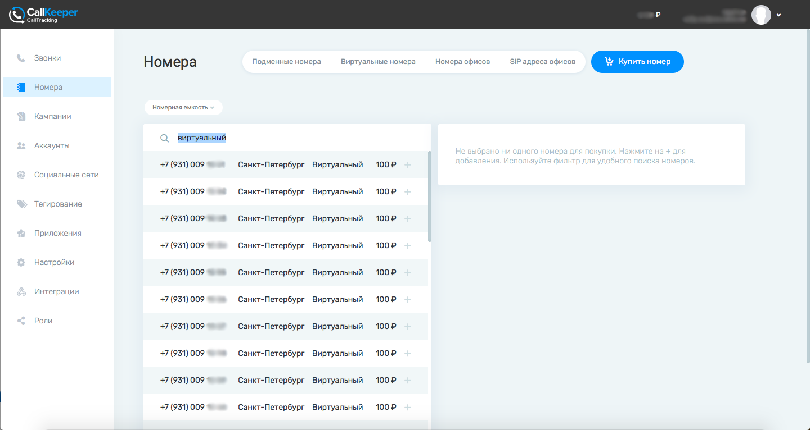

Выберите номера, которые вы хотите купить, и нажмите «Купить».

Купленные и добавленные номера появятся во вкладке «Подменные номера». Здесь же будет информация об их статусах и статистика. Обратите внимание, что в таблице отображается статистика по номерам только за последнюю неделю.

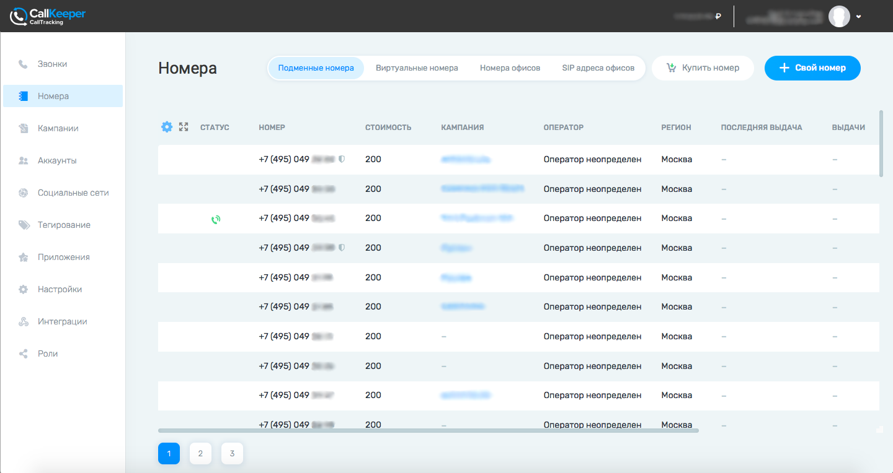

Вы можете самостоятельно настроить отображение некоторых столбцов в таблице. Для этого нажмите на значок шестеренки и выберите в выпадающем списке, какие столбцы вы хотите видеть.

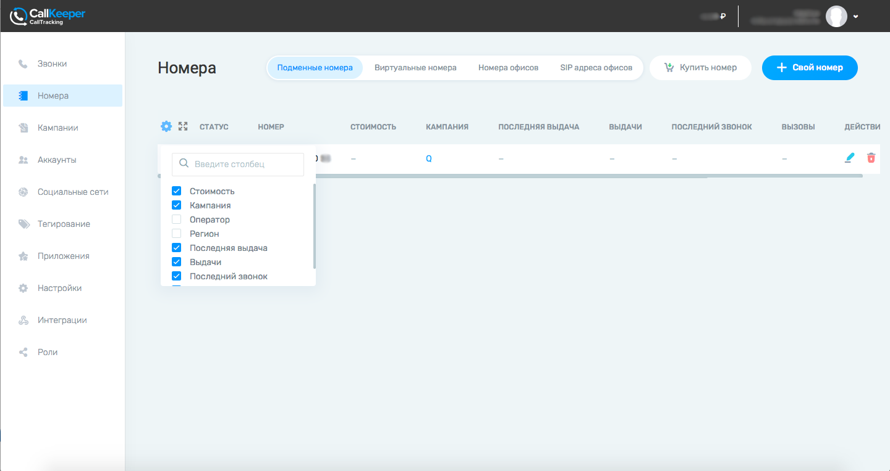

Вы также можете сортировать информацию по столбцам.

### Добавление офисов

Откройте вкладку «Номера офисов». Нажмите на кнопку «Добавить номер офиса». В открывшейся вкладке вы можете ввести настоящий номер вашего офиса и название офиса. Все поля обязательны для заполнения.

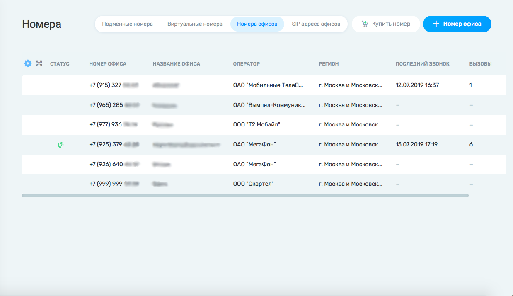

Все данные по офисам сохраняются на этой же вкладке.

Вы можете самостоятельно настроить отображение некоторых столбцов в таблице. Для этого нажмите значок шестеренки и выберите в выпадающем списке столбцы, которые вы хотите видеть.

После того, как вы установили хотя бы один офис и приобрели номера для подмены, можно настроить кампанию, в которой эти номера будут использоваться.

## Настройка кампаний

Перейдите в раздел «Кампании» слева и в открывшемся окне нажмите на кнопку «Создать» или перейдите во вкладку «Добавить кампанию».

Заполните поля «Название» и «Сайт».
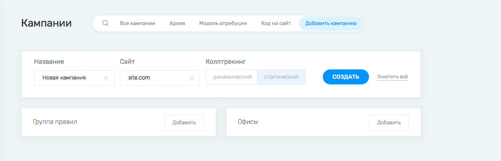

Далее нужно добавить офис. Нажмите на кнопку «Добавить».

В списке офисов автоматически отобразятся ранее созданные офисы.

Селекторы блоков для разметки телефонов - поле ввода для html-селектора, в котором будет подменяться телефон.

Если вы используете номера коллтрекинга не на сайте, то напишите в этом поле точку или любое значение.

В подменных номерах отобразятся все доступные вам подменные номера (купленные или добавленные).

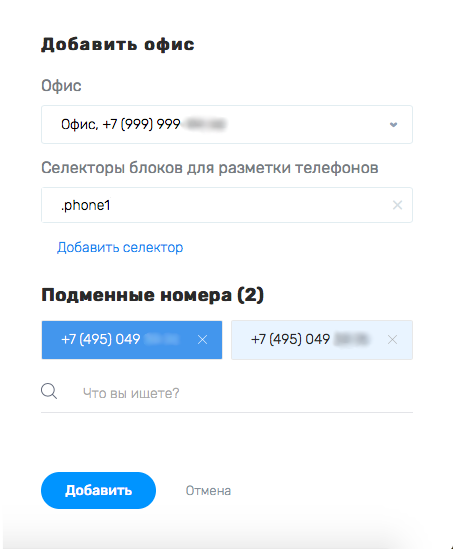

В открывшейся вкладке выберите один из ранее созданных офисов, заполните селектор блоков для разметки телефонов и выберите один или несколько подменных номеров и нажмите на кнопку «Добавить».

Прикрепите к кампании один или несколько офисов. В списке автоматически появятся созданные ранее офисы. Если вам нужно добавить еще один офис, то вернитесь в раздел «Номера», выберите вкладку «Номера офисов» и «Добавить офис».

#### `Примечание: Коллтрекинг может быть статическим или динамическим.`

Статический коллтрекинг - к каждому выбранному офису кампании привязано не более одного номера. В этом случае каждому офису будет подставляться только один номер. Динамический коллтрекинг - хотя бы к одному офису кампании привязано более одного номера коллтрекинга, которые будут выдаваться на каждую сессию по очереди.

### Группа правил

«Группа правил» - вы можете настроить правила, при которых на сайте будут показываться подменные номера для выбранного офиса. Правила включают в себя наличие определенных utm-меток, источников перехода и соблюдение логических правил.

Для более тонкой настройки вы можете объединять несколько правил. 

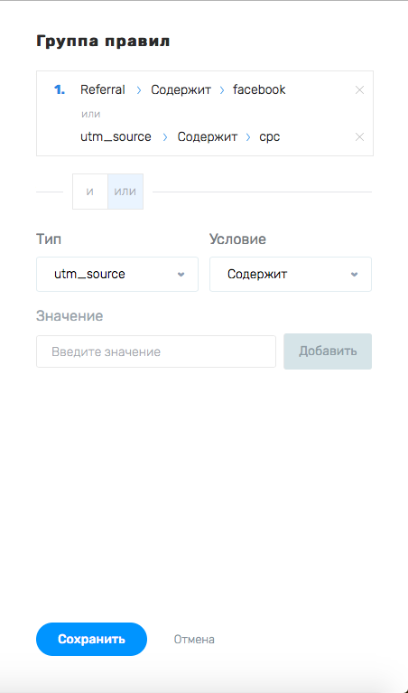

Выражение «и» означает необходимость выполнения всех условий, объединенных этим правилом.  

Выражение «или» - альтернативный выбор - должно выполниться хотя бы одно условие из указанных.

### Примеры настраиваемых правил:

**Referral** - в значении прописывается адрес сайта, переход с которого попадет под это правило. Если вы хотите отслеживать посетителей с конкретных партнерских или поисковых сайтов, то вам нужно настроить правило с этим значением.

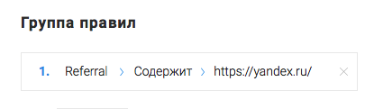

Отслеживание посетителей, пришедших из поисковой системы **yandex.ru.**

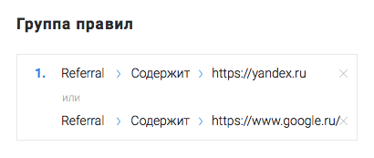

Отслеживание посетителей, пришедших из поисковых систем **yandex.ru или google.ru.**

**Тип источника** - тип иcточника перехода. Возможные варианты:
- direct - прямой заход 
- referral - переход с любого другого сайта (но не с сайтов-поисковиков). Если вы хотите отслеживать переходы с конкретного сайта, выберите в первом выпадающем окне **"Referral"** и пропишите нужный вам сайт.
- organic Search - переход по поисковым запросам
- cpc - правило по такому типу источника среагирует на наличие любой utm-метки

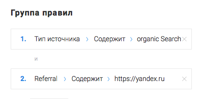

Отслеживание посетителей, пришедших **только** из поисковой системы **yandex.ru**. Переход из поисковой системы google.ru не будет учитываться.

**Страница на сайте** - любая часть url, на которую среагирует это правило. Если вам нужно отслеживать переходы не со всего домена, а более точечно - с конкретных страниц сайта, вы можете прописать нужную часть адреса при помощи этой настройки.

**utm-метки** - вы можете настроить правило срабатывания кампании по конкретным значениям utm-меток. Выберите нужную utm-метку, пропишите ее значение и нажмите "Добавить". Если для вас важен факт наличия utm-метки (рекламный трафик), а не переходы с конкретными значениями utm-меток, выберите в первом выпадающем окне **"Тип источника"** и далее "cpc".

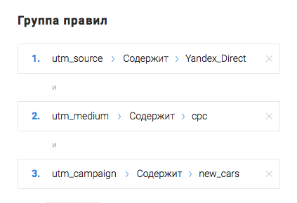

Пример настройки для utm-меток.

Настройте нужные правила и нажмите «Сохранить».

После нажатия кнопки «Создать» новая кампания появится во вкладке «Все кампании».

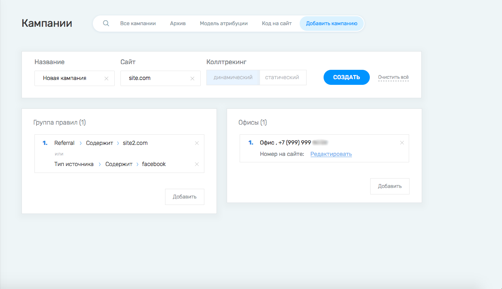

Во вкладке «Все кампании» вы можете отредактировать созданные кампании, запускать их или отправлять в архив.

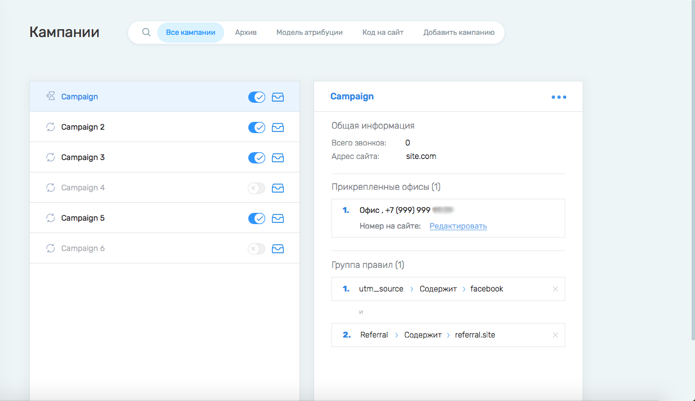

` Важно: если у вас несколько активных кампаний, то их порядок в списке имеет значение. Проверка условий кампаний идет по порядку, начиная с первой и самой верхней.`

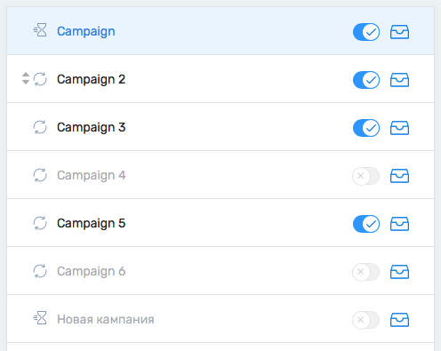

Поэтому, например, если вы хотите создать кампанию без правил, к которой относились бы все пользователи, не попавшие под условия других кампаний, то такая кампания должна быть последней в списке. Если вы поставите ее на первое место, то она будет срабатывать автоматически для всех (т.к. у нее нет правил). Даже если дальше по списку будет кампания с более точными правилами для конкретного лида, он не попадет под нее, т.к. проверка правил остановится на первой.

### Код на сайт

Чтобы сервис работал на вашем сайте нужно добавить код.

В разделе «Кампании» перейдите во вкладку «Код на сайт».

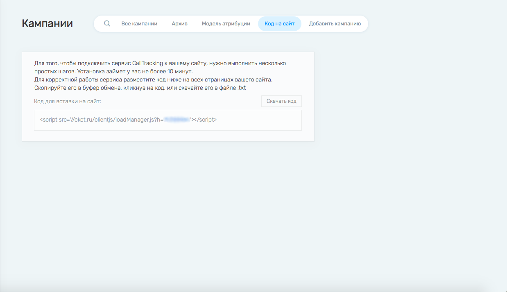

Если вы используете номера коллтрекинга не для подмены номеров на сайте, то пропустите этот шаг.

## Настройки

В разделе «Настройки» вы можете настроить модель атрибуции.

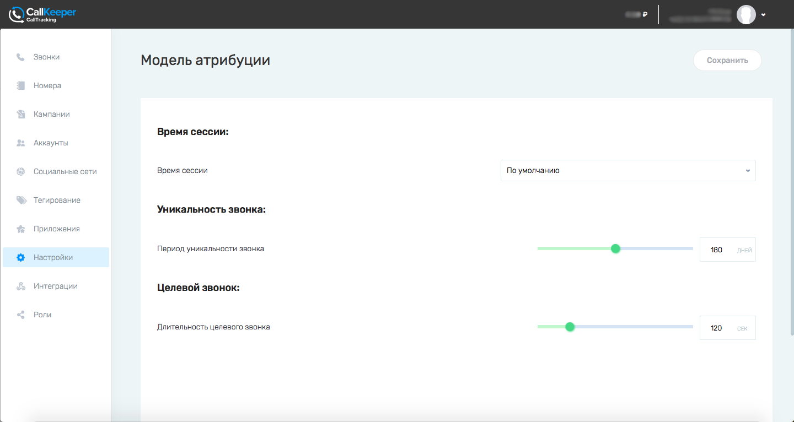

По умолчанию максимальное время сессии и время после сессии - 5 минут. 
Вы можете выбрать пользовательские настройки и установить промежутки времени самостоятельно.

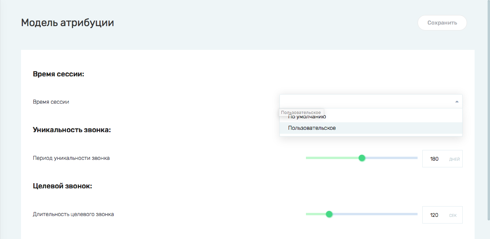

Если это время слишком маленькое, то при звонке данные по клиентам не определятся или определятся частично.

Еще один признак того, что вы выставили слишком короткое время сессии - частая выдача номера-заглушки. Это номера, которые автоматически выдаются при нехватке номеров. В таблице номеров такой номер выделен значком щитка. 

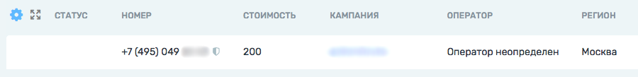

Если все остальные подменные номера офиса уже выданы, то номер-заглушка будет выдаваться повторно каждому новому посетителю, пока один из выданных номеров не освободится.

В такой ситуации сложно отслеживать лиды по кампаниям. Для решения проблемы нужно сбалансировать два показателя - количество используемых подменных номеров и продолжительность сессии. При необходимости - докупить подменные номера и скорректировать  продолжительность сессии.

Слишком маленькое время сессии может привести к тому, что подменные номера будут слишком часто переназначаться новым пользователям и итоговая информация по звонкам исказится.

Слишком большое время сессии может привести к тому, что все подменные номера будут выданы посетителям и останутся закрепленными за ними в течение долгого времени. Новым посетителям не будет хватать подменных номеров и они будут получать номер-заглушку.

Оптимально выставлять время сессии в зависимости от среднего времени пребывания пользователя на сайте.

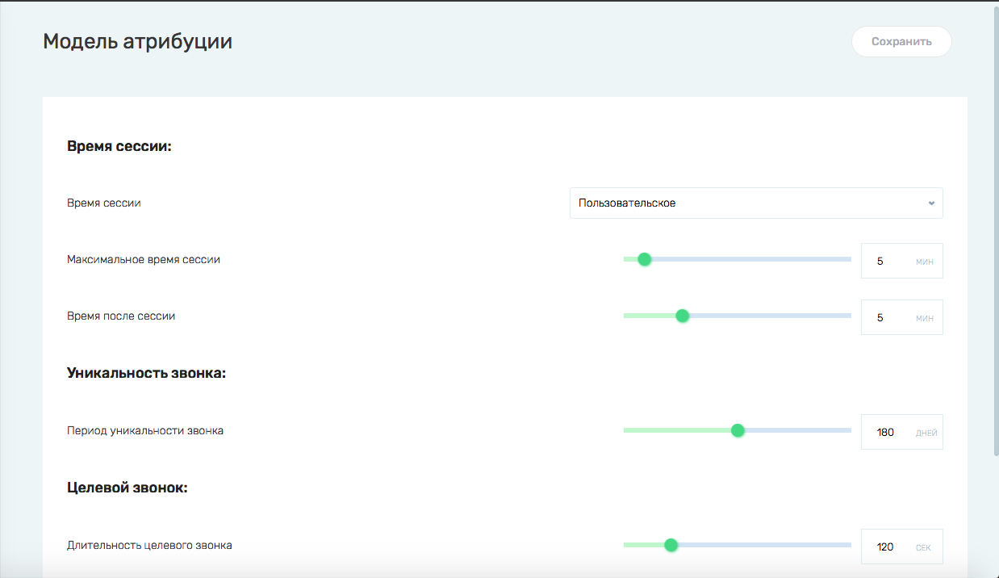

Также для автоматического тегированиня звонков по параметрам "Уникальный", "Целевой" и "Уникально-целевой" вы можете установить нужные значения уникальности звонка и целевого звонка.

По умолчанию период уникальности звонка - 180 дней.

По умолчанию длительность целевого звонка - 120 секунд.

`Важно: за один раз срабатывает только одна кампания. Поэтому если на вашей странице используется несколько номеров, то чтобы подменялись все номера во всех селекторах, вам нужно создать кампанию с соответствующим количеством офисов.`

## Аккаунты

Для удобства вы можете прикрепить несколько аккаунтов к одному и вместе управлять общими сущностями - подменными номерами, офисами, кампаниями, звонками.

Для разграничения прав на редактирование, удаление и просмотр сущностей существует система ролей.

Перейдите в раздел «Аккаунты». Изначально здесь отображается только ваш аккаунт, который вы можете отредактировать.

### Настройка аккаунтов

Для редактирования информации об аккаунте нажмите на три точки в правом верхнем углу карточки и выберите пункт «Редактировать профиль».

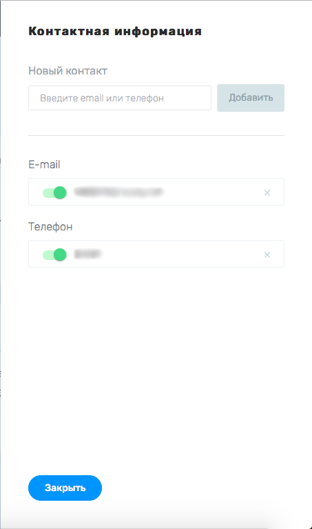

Контактная информация - здесь указаны контактные данные, которые будут использоваться для отправки уведомлений.

Вы можете добавить контакты, на которые будут приходить уведомления.

Для добавления аккаунта введите адрес электронной почты, на который был зарегистрирован этот аккаунт, и пароль, указанный при регистрации в появившейся вкладке. Нажмите кнопку «Добавить».

Чтобы прикрепить к своему аккаунту еще один аккаунт и начать работать вместе, нажмите на кнопку «+ Аккаунт». Вы можете добавить только уже зарегистрированные в системе аккаунты.

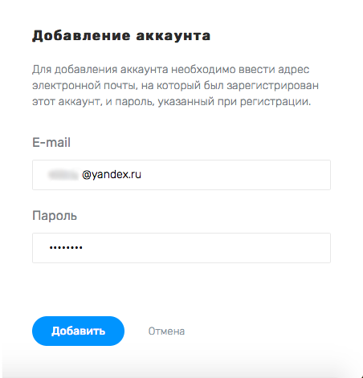

Аккаунт появится в разделе «Аккаунты»  рядом с вашим и в выпадающем списке в правом верхнем углу.

Теперь вы можете перейти в этот аккаунт, открыв выпадающее меню в верхнем правом углу и щелкнув по нужному аккаунту.
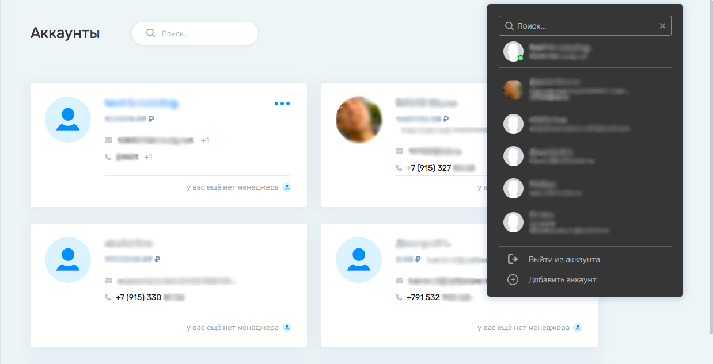

## Роли

Чтобы начать работать с прикрепленными аккаунтами, нужно выдать им роли.

Чтобы выдать роль у вас должен быть:

- прикрепленный аккаунт (минимум один)

- созданная роль

Перейдите в раздел «Роли». В этом разделе отображаются все созданные вами и выданные вам роли.

При помощи ролей можно ограничивать доступ и возможности других аккаунтов редактировать общие сущности.

Вы можете разрешить другим аккаунтам просматривать ваши звонки, номера, виджеты, интеграции и/или кампании без возможности редактировать их (права настраиваются отдельно на каждую сущность) или выдать полный доступ.

Чтобы добавить новую роль нажмите на кнопку «+ Роль».
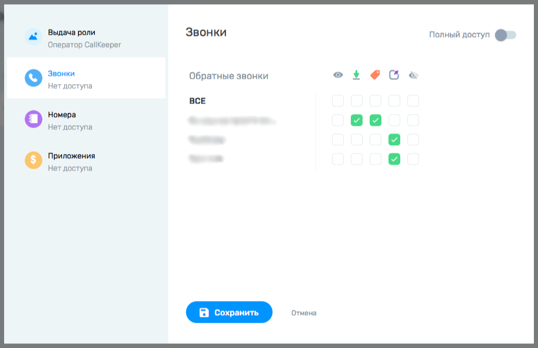

В открывшемся окне вы можете ввести название роли, добавить картинку и выбрать уровень доступа для каждой сущности.

Выберите нужную сущность в списке слева и отметьте чекбоксы напротив нужных прав.

Нажмите кнопку «Сохранить».

Новая роль появилась в списке созданных ролей.

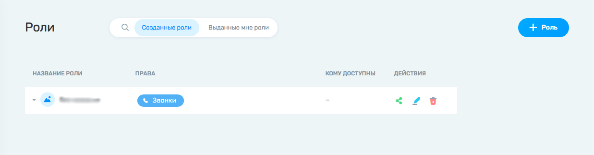

Щелкните по строке роли, чтобы просмотреть все права, доступные по этой роли. Вы можете отредактировать роль, нажав на значок карандаша, или удалить ее, нажав на урну.

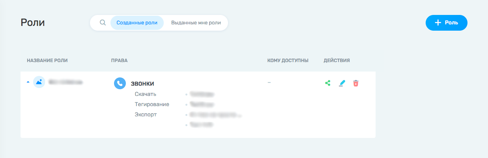

Чтобы выдать роль, у вас должен быть прикрепленный аккаунт.

Нажмите на значок «Добавить пользователя».

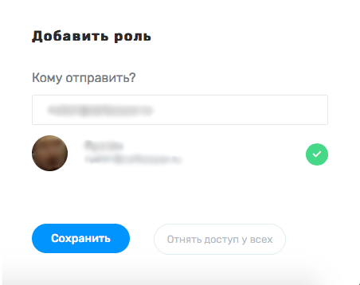

В появившейся вкладке введите почту нужного аккаунта, дождитесь, пока он появится в списке, нажмите на плюс напротив аккаунта, затем на кнопку «Сохранить». Роль можно выдать только аккаунтам, уже зарегистрированным на ckct.ru.

Аккаунт, которому вы выдали эту роль, появится в строке роли в разделе «кому доступны».

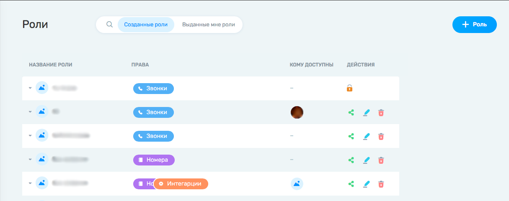

Сущности, на которые вы выдали роли - номера, кампании, интеграции, звонки, виджеты, - будут отображаться в личном кабинете выбранного аккаунта в соответствии с выданными на них правами.

Если вы выдали права только на просмотр, то аккаунт, получивший эту роль, сможет видеть выбранные сущности, но не сможет их редактировать, удалять, покупать или создавать. Это относится только к вашим сущностям. Сущности, созданные самим аккаунтом, находятся в его полном распоряжении.

## Интеграции

Вы можете настроить отправку вебхуков по определенным событиям.

Для этого перейдите в раздел «Интеграции».

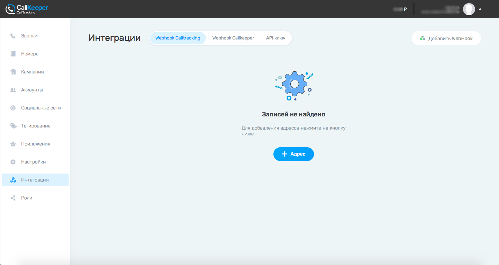

Здесь будут отображаться все настроенные вебхуки.

Для добавления нового вебхука нажмите «+ Адрес».

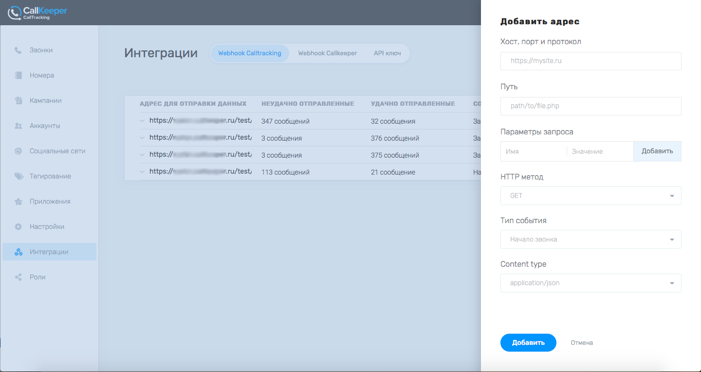

Заполните поля в открывшейся вкладке.

**«Хост, порт и протокол»** - хост - доменное имя сервера или его ip, порт - дефолтный http-порт - 80; в некоторых случаях, если прием данных настроен на другой порт, указывается через двоеточие после домена, протокол - http/https,

**«Путь»** - все,что идет в строке до знака вопроса (если его нет, то до конца строки)

**«Параметры запроса»** (имя, значение) - параметры, идущие после знака вопроса; пары ключ=значение, разделяются значком &.

**HTTP метод** - get - все параметры передаются в самой строке; post - данные не видно явно из строке, передаются в теле запроса

**«Тип события»** - начало и завершение звонка

**«Content type»** - тип содержимого тела запроса

Нажмите кнопку «Добавить».

Все созданные пути для вебхуков сохранятся во разделе «Интеграции».

Вы можете удалить вебхуки, нажав на значок мусорного ведра или отредактировать созданные вебхуки, нажав на кнопку с карандашиком.

[Вернуться к оглавлению](#)

[Вернуться на главную](/README.md)
