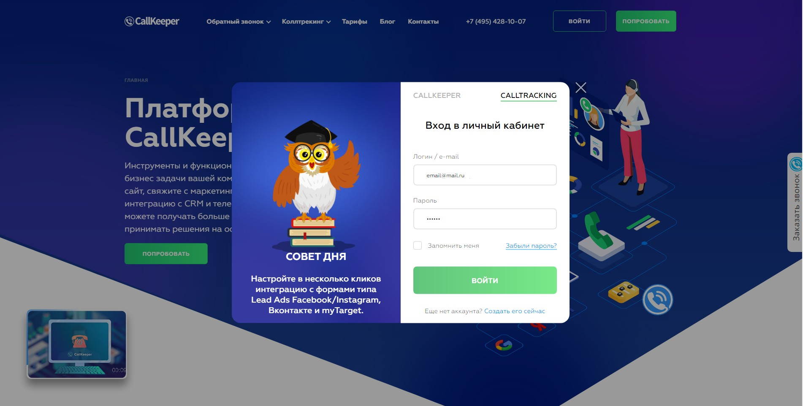

# Настройка интеграции с DCM

## Навигация
* [Об интеграции ](#Об-интеграции)
* [Настройка интеграции в личном кабинете CallTraking ](#Настройка-интеграции-в-личном-кабинете-CallTraking)

## Об интеграции

С помощью DCM вы сможете анализировать рекламу любых медийных продуктов или просмотров видео.

При интеграции DCM начнет собирать данные по всем взаимодействиям пользователя с вашей рекламой вместе с информацией о просмотре рекламы и переходах с неё на ваш сайт (информация по переходам доступна только для рекламных размещений в Google). 

## Настройка интеграции в личном кабинете CallTraking

Для того чтобы настроить интеграция DCM в личном кабинете CallTraking необходимо:

**Привязать аккаунта Google в Личном кабинете CallTraking**
- зайти в личный кабинет CallTraking

- перейти во вкладку интеграции

- найти в списке интеграций Double Click и нажать " подключить "

- откроется окно для входа в Google аккаунт , где необходимо будет авторизоваться.

- затем появиться окно в котором необходимо будет ввести "ID профиля DCM", его можно будет найти кликнув по иконке профиля google в правом верхнем углу браузера "google chrome"

  
  **Обратите внимание**, интеграцию нельзя включить, пока все поля со "*" не будут заполнены.

  **Настройка интеграции**

  Поля которые необходимо будет заполнить :

  

1)floodlightActivityId – id floodlight (можно получить в DCM);

(Для лидов вы создаете новый floodlight-тег в DCM. Именно в нем, в итоге, будут содержаться данные по лидам.)

2)ID для отправки  (src) –  только цифры, полный url не нужен;

3)Тип конверсии (type) – цифры и латинские буквы (можно получить в DCM Floodlight - Activity groups);

4)Категория конверсии (cat) – цифры и латинские буквы. Что бы её получить, необходимо создать в разделе Activities - Advanced properties новую сущность, категория конверсии это Activity tag string

   

- Номер переменной для связи конверсий в которую передается ID, вы указываете только ее номер в DCM;

- Номер переменной для передачи свободного параметра. 
  Например, можно указать в ней название вашего проекта, латиницей. В первом поле задаете ее номер из DCM, во втором – значение. Это значение будет присвоено всем конверсиям;

- Номер переменной для utm_source, в которую передается информация по рекламному источнику, вы указываете только ее номер в DCM;

- Номер переменной для utm_medium, в которую передается информация по рекламному каналу, вы указываете только ее номер в DCM;

  
  
  
- Номер переменной для utm_compaign, в которую передается информация по рекламной кампании, вы указываете только ее номер в DCM;

- Номер переменной для utm_content, в которую передается информация по рекламному объявлению, вы указываете только ее номер в DCM;

- Номер переменной для utm_term, в которую передается информация по ключевому слову, вы указываете только ее номер в DCM.

[Вернуться к оглавлению](#навигация)

[Вернуться на главную](/README.md/#documentation)
