# Настройка интеграции с Tik-Tok leads

## Навигация
* [Описание ](#Описание)
* [Создание интеграции](#Создание-интеграции)
* [Проверка интеграции](#Проверка-интеграции)
* [Метрики звонков ](#Метрики-звонков)
* [Возможные ошибки и способы решения](#Возможные-ошибки-и-способы-решения)
* [Инструкция пользователя](#Инструкция-пользователя)

## Описание
Интеграция с Tik-Tok leads позволять автоматически инициировать звонки пользователям, которые заполнили быструю форму в приложении Tik-tok.
Для этого необходимо : 

1) Аккаунт пользователя TikTok и аккаунт рекламодателя TikTok For Business

2) Настроить рекламные кампании, объявления,мгновенные формы в TikTok For Business

3) Активный виджет в личном кабинете CallKeeper

4) Настроить интеграцию и страницу tik-tok

## Создание интеграции

**Для создания интеграции необходимо:**

- Зайти в личный кабинет CallTracking. 

- Во вкладке «Социальные Сети» выберите "TikTok Leads".

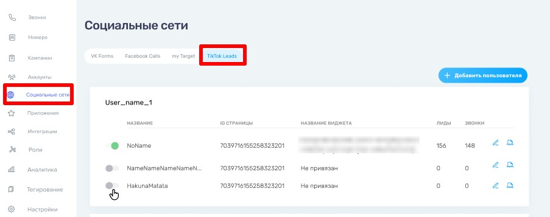

- В открывшейся вкладке в правом верхем углу нажмите «Добавит пользователя».

 

- При подключении аккаунта в новом окне Tik-tok уточнит, под каким аккаунтом Tik-tok вы хотите войти.

 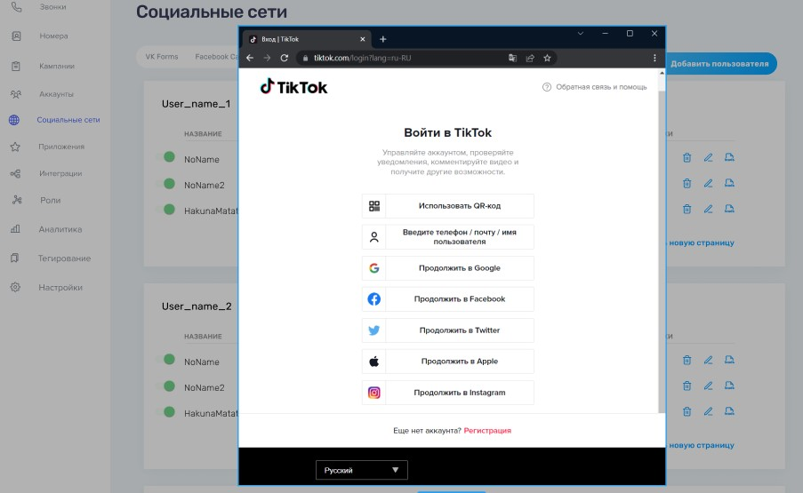

- Затем откроется окно на стороне TikTok для подтверждения доступа:  
(Галочки в данном окне убирать не нужно)

 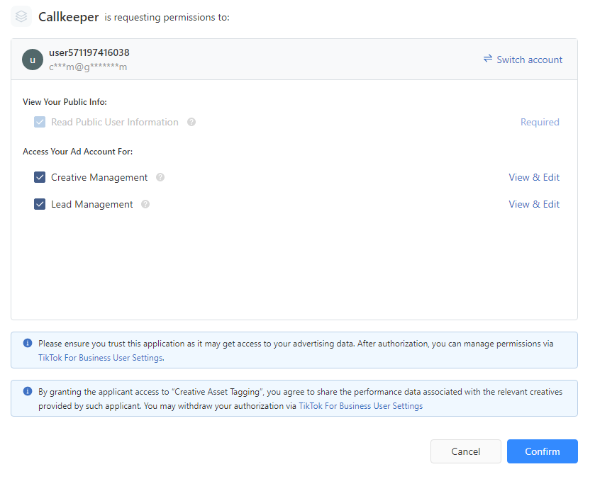
 
 Затем вас перенаправит в личный кабинет CallTracking:
 
 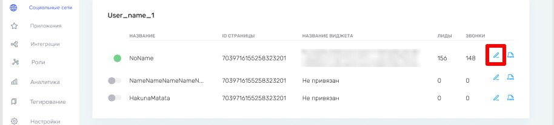
 
- Каждая страница настраивается отдельно :

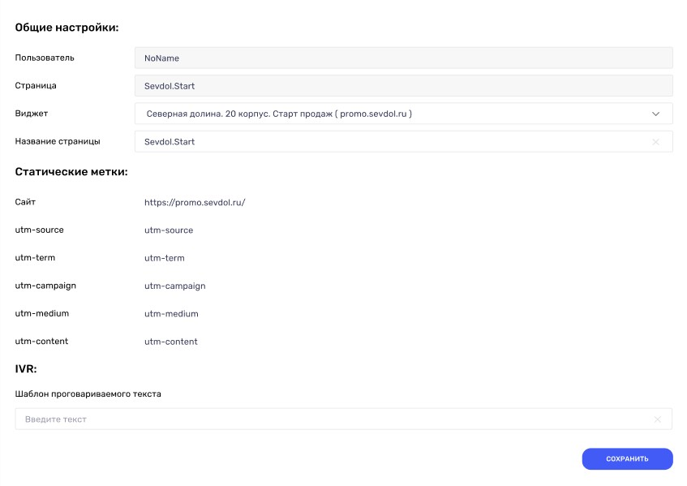

**Общие настройки:**

- Пользователь - название вашего аккаунта
- Страница - выбранная вами страница для редактирования
- Название страницы - название вашей страницы из Тик-ток, его можно изменить для удобства если это необходимо

**Статические Метки:**

- по желанию можно добавить произвольные значения UTM-меток.

**IVR:**

- Так же можно добавить шаблон для проговариваемого текста.

##  Проверка интеграции

После того как вы настроили ваши кампании и добавили формы для рекламных объявлений, вы можете их проверить до активации кампании.

**Обратите внимание!** В приложении, одним пользователем можно проверить определенную форму только один раз.

Вам необходимо перейти в список объявлений и кликнуть на свернутое меню рядом с "Просмотр данных"
После, в появившимся меню выберите пункт "Preview".

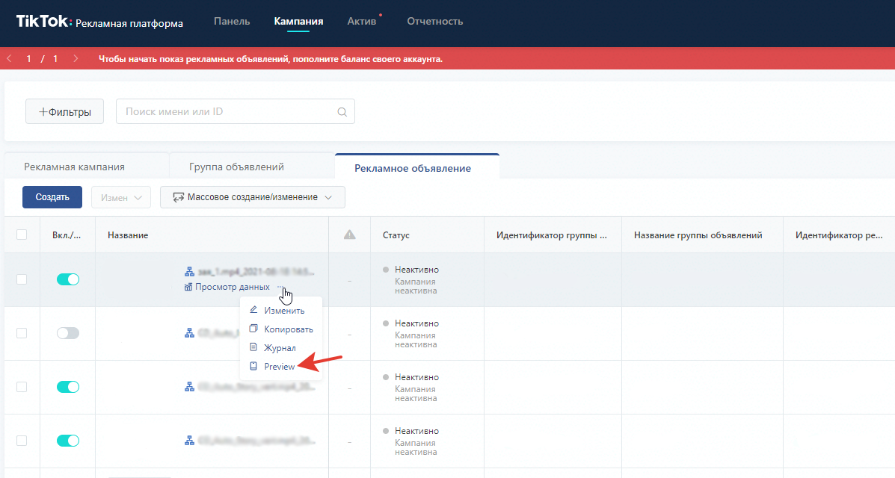

Откроется окно настройки предварительного просмотра на телефоне.

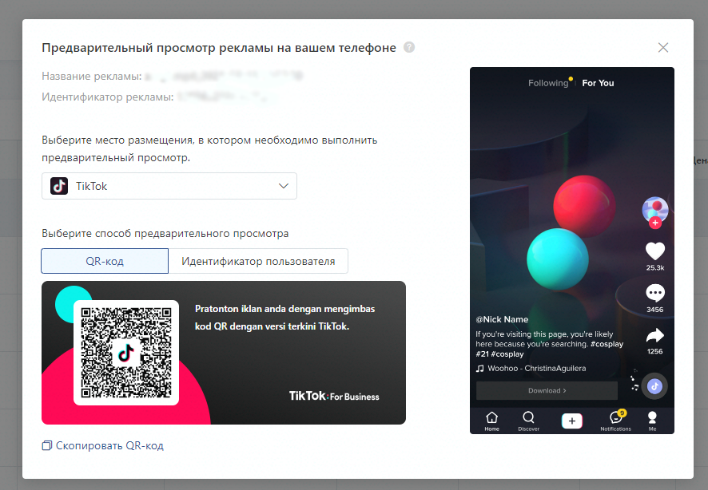

Будет доступно 2 варианта проверки:

1. Через QR-code. 

 Необходимо на вашем устройстве, где установлено приложение TikTok:
- перейти в настройки профиля 

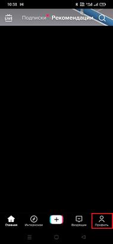                             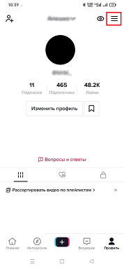
 
- выбрать пункт QR-код

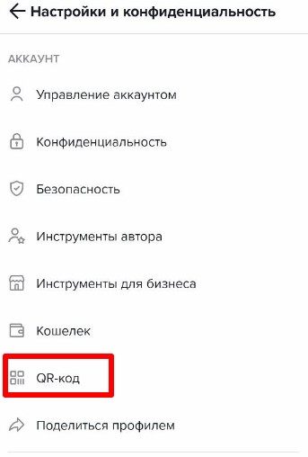

- далее в правом верхнем углу нажать на сканирование кода и отсканировать код из рекламного объявления

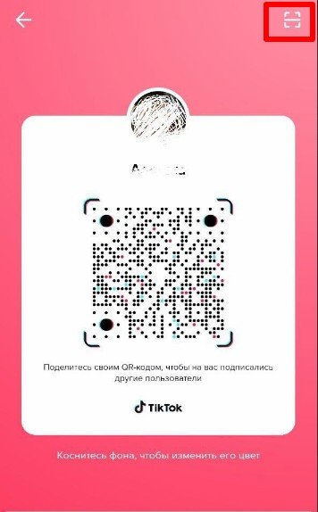

После просмотра нескольких роликов, появится рекламный ролик с формой лидогенерации.

2. Через идентификатор пользователя.

 Необходимо на вашем устройстве, где установлено приложение TikTok:
- перейти в настройки профиля 

                             

- далее необходимо прокрутить все настройки аккаунта до места, где написана версия вашего приложения

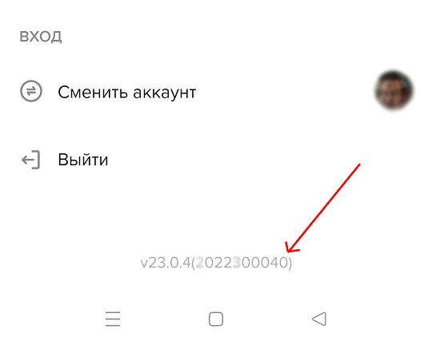

- после нескольких кликов на область рядом с версией приложения появятся системные данные

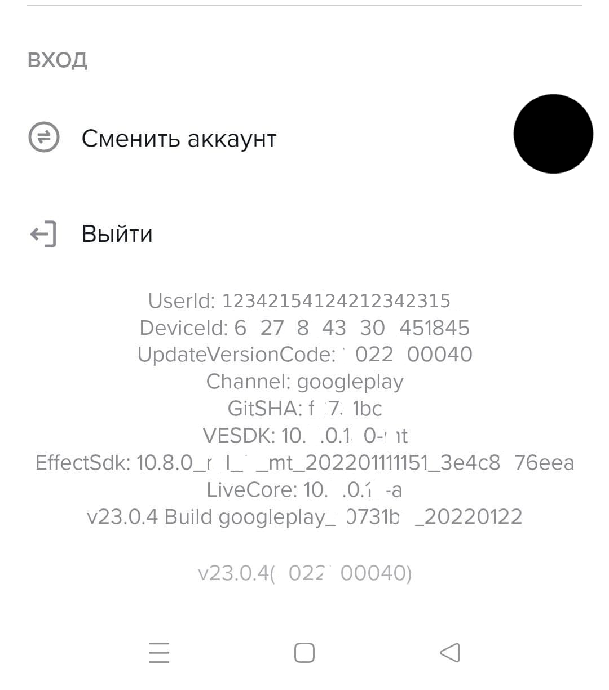

- необходимо получить UserId.Данный UserId вводится в окне предварительного просмотра в рекламном кабинете

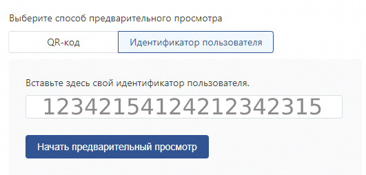

После просмотра нескольких роликов, появится рекламный ролик.

## Метрики звонков

Звонки по формам из Tik-tok считаются обратными звонками, поэтому информация по ним будет предоставлена в личном кабинете CallKeeper вкладка - "Звонки".

Вся информация по звонку отображается в личном кабинете, её можно отфильтровать по нужным параметрам на странице Личного кабинета CallKeeper вкладка - "звонки" - Фильтр.

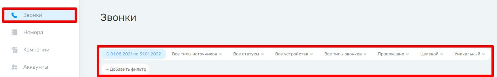

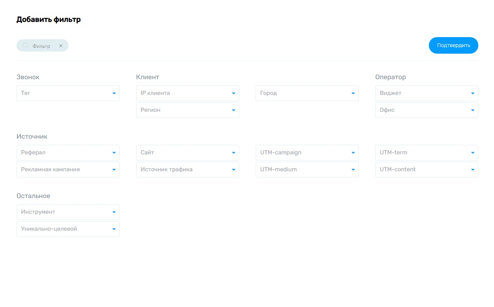

Информация по каждому звонку показана ниже:

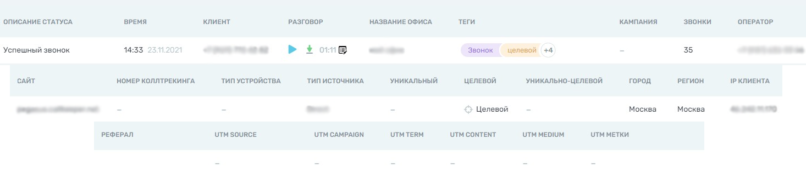

По количествую лидов и звонков с каждой страницы информация будет предоставлена во вкладке Личного кабинета CallKeeper вкладка - "социальные сети" - Tik-tok:
- по количеству лидов 
- общиму числу звонков с каждой формы

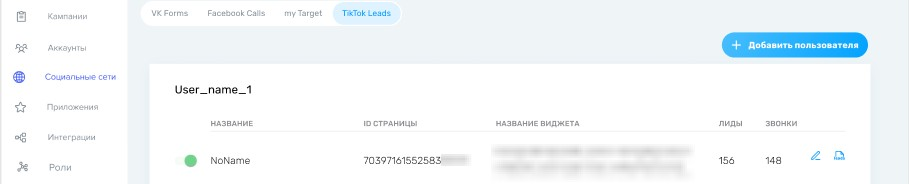

Так же на этой странице есть кнопка " Подробная инфомация о лидах"

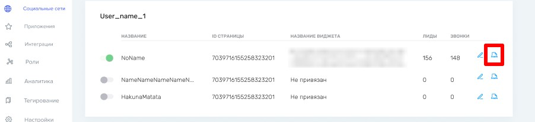

Где отражены лиды по времени и статусу звонка :

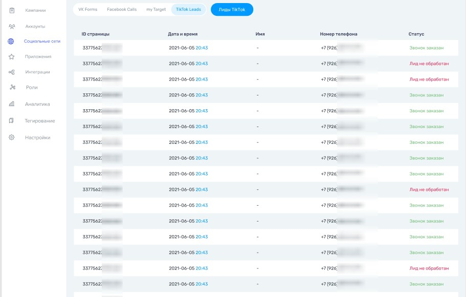

## Возможные ошибки и способы решения
 Ошибка: 
 
 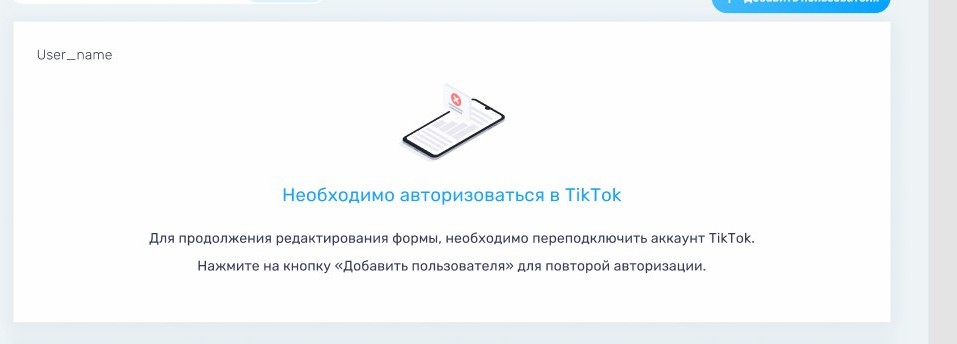

 Вариант исправления : необходимо авторизоваться в аккаунт тик-ток ещё раз.
 
 Ошибка :
 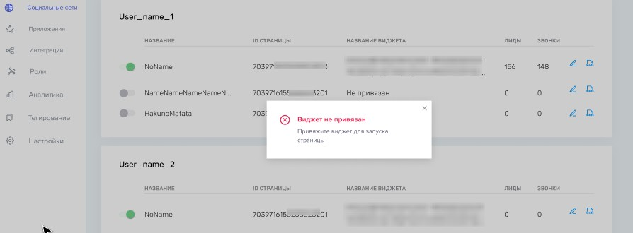 

Вариант исправления : Проверить настройки виджета и страницы или повторить настройку.

## Инструкция пользователя

 При просмотре видео в Tik-tok у пользователя будет появляться рекламное объявление внизу которого будет кнопка для перехода на форму для ввода данных. 
 
Алгоритм действий пользователя:
- нажать на кнопку внижней части экрана для открытия мгновенной формы.
- заполнить информацию в окне ввода.
- получить обратный звонок.

[Вернуться к оглавлению](#навигация)

[Вернуться на главную](/README.md/#documentation)
