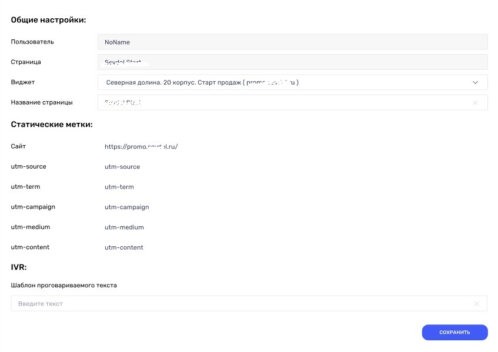

# Настройка интеграции с TikTok leads

## Навигация
* [Описание ](#Описание)
* [Создание интеграции](#Создание-интеграции)
* [Проверка интеграции](#Проверка-интеграции)
* [Метрики звонков ](#Метрики-звонков)
* [Возможные ошибки и способы решения](#Возможные-ошибки-и-способы-решения)
* [Инструкция пользователя](#Инструкция-пользователя)

## Описание
**Что дает интеграция CallKeeper и TikTok:**

⦁	При подключении Вы получаете сразу звонки, а не заявки.

⦁	Ночной режим — настройка автоматической обработки и запуска обратного звонка в ближайшее рабочее время.

⦁	Проговаривание при соединении информации — названия формы, рекламного блока, имени клиента и т.д. Вам сразу становится понятно, с какой формы звонит клиент. 

⦁	Хранение, контроль и полная отчетность информации для анализа: источник звонка, телефон, запись разговора, содержание заявки.

⦁	Информация по количеству лидов* и звонков по каждому рекламному объявлению.

*Лид — потенциальный клиент, тем или иным образом отреагировавший на маркетинговую коммуникацию (заполнил форму, оставил контакты, подписался на паблик и т.д.).
Виджет обратного звонка от CallKeeper позволяет автоматически инициировать звонки клиентам, которые заполнили форму в TikTok и оставили в ней свой номер телефона. 

**Что потребуется для интеграции:**

⦁	Аккаунт в TikTok и аккаунт рекламодателя TikTok For Business.

⦁	Настроенные рекламные кампании, объявления, мгновенные формы в TikTok For Business.

⦁	Активный виджет в личном кабинете CallKeeper.

⦁	Настроить интеграцию и форму для рекламного объявления. 

## Создание интеграции

**Для создания интеграции необходимо:**

- Зайти в личный кабинет CallTracking:

- Во вкладке «Социальные Сети» выберите "TikTok Leads":

- В открывшейся вкладке в правом верхем углу нажмите «Добавит пользователя»:

 

- При подключении аккаунта в новом окне Tik-tok уточнит, под каким аккаунтом TikTok вы хотите войти:

 

- Затем откроется окно на стороне TikTok для подтверждения доступа:  
(Галочки в данном окне убирать не нужно)

 
 
 Затем вас перенаправит в личный кабинет CallTracking:
 
 
 
- Каждая страница настраивается отдельно :

**Общие настройки:**

- Пользователь - название вашего аккаунта.
- Страница - выбранная вами страница для редактирования.
- Название страницы - название вашей страницы из Тик-ток, его можно изменить для удобства если это необходимо.

**Статические Метки:**

- по желанию можно добавить произвольные значения UTM-меток.

**IVR:**

- Так же можно добавить шаблон для проговариваемого текста.

Так же кажду страницу можно выключить и включить по желанию : 

##  Проверка интеграции

После того как вы настроили ваши кампании и добавили формы для рекламных объявлений, вы можете их проверить до активации кампании.

Вам необходимо перейти в список объявлений и кликнуть на свернутое меню рядом с "Просмотр данных".
После, в появившимся меню, выберите пункт "Preview".

Откроется окно настройки предварительного просмотра на телефоне.

Будет доступно 2 варианта проверки:

- Через QR-code,
- Через идентификатор пользователя.

1. Через QR-code. 

- На Вашем устройстве с установленным приложением TikTok, перейдите в настройки профиля:

                             
 
- Далее в настройках конфиденциальности выбрать пункт QR-код: 

- После чего, в правом верхнем углу нажать на иконку/кнопку «Сканировать код» и отсканировать код Вашего рекламного объявления: 

2. Через идентификатор пользователя.

- На Вашем устройстве с установленным приложением TikTok, перейдите в настройки профиля:

                             

- Прокрутите все настройки аккаунта внизу, до места, где указана версия приложения: 

- Кликните несколько раз на область рядом с указанной версией, после чего должны появиться системные данные: 

- В системных данных получить, скопировать, запомнить или записать данные поля UserId. В окне предварительного просмотра в рекламном кабинете введите данные поля UserId:

## Метрики звонков

Звонки по формам из TikTok считаются обратными звонками, поэтому информация по ним будет предоставлена в личном кабинете CallKeeper вкладка - "Звонки".

Вся информация по звонку отображается в личном кабинете, её можно отфильтровать по нужным параметрам на странице Личного кабинета CallKeeper вкладка - "Звонки" - Фильтр.

Информация по каждому звонку показана ниже:

По количеству лидов и звонков с каждой страницы информация будет предоставлена во вкладке Личного кабинета CallKeeper вкладка - "Социальные Сети" - TikTok:
- по количеству лидов 
- общему числу звонков с каждой формы

Так же на этой странице есть кнопка "Подробная инфомация о лидах"

Где отражены лиды по времени и статусу звонка :

## Возможные ошибки и способы решения
 Ошибка: 
 
 

 Вариант исправления : необходимо авторизоваться в аккаунт TikTok ещё раз.
 
 Ошибка :
 
  

Вариант исправления : Проверить настройки виджета и страницы или повторить настройку.

## Инструкция пользователя

 При просмотре видео в TikTok у пользователя будет появляться рекламное объявление внизу которого будет кнопка для перехода на форму для ввода данных. 
 
Алгоритм действий пользователя:
- Нажать на кнопку в нижней части экрана для открытия мгновенной формы.
- Заполнить информацию в окне ввода.
- Получить обратный звонок.

[Вернуться к оглавлению](#навигация)

[Вернуться на главную](/README.md/#documentation)
