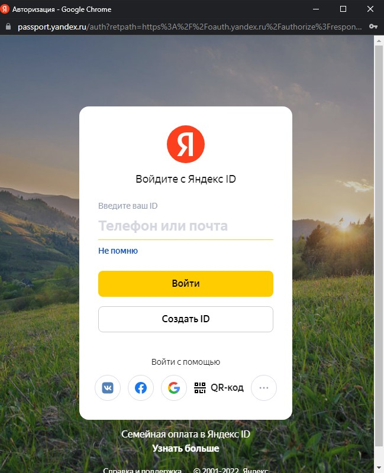

#  Интеграция с Яндекс Метрикой отправка данных по звонкам

## Навигация
* [Описание ](#Описание)
* [Подключение Яндекс.Метрики в личном кабинете CallKeeper](#Подключение-Яндекс.Метрики-в-личном-кабинете-CallKeeper)
* [Настройки счётчиков ](#Настройки-счётчиков)
* [Отправка событий ](#Отправка-событий)
* [Отчеты ](#Отчеты)

## Описание

Интеграция позволяет отправлять звонки динамического и статического коллтрекинга, а также обратные звонки CallKeeper и их параметры в стандартные отчеты по звонкам в Яндекс.Метрику.

Чтобы настроить передачу данных, необходимо авторизоваться в аккаунте Яндекс.Метрики https://metrika.yandex.ru/ под правами администратора или редактора.
 

## Подключение Яндекс.Метрики в личном кабинете CallKeeper

Для подключения интеграции необходимо:

1. Зайти в свой личный кабинет на https://ckct.ru/ :

2. Перейдите по ссылке https://ckct.ru/dev/lk/integrations в раздел Интеграции в личном кабинете Callkeeper и нажать подключить:

3. Откроется окно авторизации Яндекс , где необходимо ввести данные аккаунта под которым вы хотите войти:

4. После этого откроется странница на который необходимо выбрать счетчики которые вы хотите добавить: 

## Настройки счётчиков

Для настройки счётчиков необходимо нажать на его название и откроется окно настройки : 

Для более детального формирования отчета можно использовать параметры которые будут передаваться в цели Яндекс.Метрики:

**Тип звонков:**

Данный параметр  позволит отсеить только нужные звонки при отправки в цель. Событие делится на 3 категории :

Все типи звонков - включают в себя обратные и входящие звонки.

Только обратные звонки - звонки которые были заказаны пользователем.

Только входящие звонки - звонки CallTracking.

**Длительность:**

Примеры длительности :

0 секунд : все звонки отправляются в цель.

30 секунд : звонок с длительностью более 30 секунд отправляется в цель.

**Статус звонка:**

Параметр при выборе которого будут отправляться звонки со всему статусами , только успешные или только неуспешные звонки.

Все звонки - включают в себя как успешные так и неуспешные звонки.

Успешные звонки - звонки которые состоялись.

Неуспешные звонки - это звонки которые по какой-либо причине не состоялись.

**Тегирование:**

Параметр с помощью которого можно выбрать теги которые будут передаваться в цель.

Теги могут браться те что были присвоенны звонкам или их можно задать в ручную для обратных и входящих звонков.

**Достижение цели:**

Необходимо выбрать в какую цель будут отправляться события. Цель необходимо настроить в Яндекс.Метрике. 

**Отправлено:**

Параметр который показывает количество отправленных событий в цель.

**Дополнительно**

Данный параметр позволит отсеить неуникальные и не неуникально-целевые звонки.

После выставления настроек их необходимо сохранить.

## Отчеты
Передаваемые данные собираются в отдельную группу отчетов в Яндекс.Метрике: «Качество обработки звонков», «Источники звонков», «Звонки, детально».

Отчет **качество обработки звонков** казывает длительность звонка и долю пропущенных звонков. Данные помогут проанализировать эффективность работы менеджеров или коллцентра.

Отчет **Источники звонков** показывает подробности о посетителях и их поведении на сайте. Отображает данные только по звонкам динамического коллтрекинга.

Отчет **Звонки, детально** является основным отчетом о звонках, отображает данные динамического и статического коллтрекинга. Содержит информацию о дате/времени звонка, длительности разговора, номере телефона клиента, статуса звонка: первичный/вторичный, источника трафика, который привел к звонку и другие параметры.

Статус звонка «привязанный/непривязанный» показывает наличие сессии у звонка. Если произошла ошибка привязки, и статус отобразился как «непривязанный», то это значит, что Яндекс.Метрика не нашла уникальный идентификатор ClientID. Это может произойти в случае звонка на статический номер или нехватки номеров, также, если пользователь совершил звонок, не заходя на сайт (записал номер телефона и перезвонил по нему, не посещая сайт). Ошибка привязки сессии может быть также в случае, если на сайте не установлен счетчик Яндекс.Метрики или установлен некорректно, либо блокируется сторонними сервисами.
После интеграции во вкладке Цели появится автоматически созданная Яндекс.Метрикой цель «Звонок»

Данные по звонкам коллтрекинга могут также отображаться в виде Конверсии, для этого необходимо предварительно создать соответствующую цель в Яндекс.Метрике с типом условия JavaScript-событие, идентификатор цели для звонков коллтрекинга calltracking_call_order или обратного звонка call.

Данная цель может быть использована для настройки автоматических стратегий, корректировки ставок в рекламных кампаниях Яндекс.Директа.

**Важно:** звонки, отправляемые в Яндекс.Метрику, могут обрабатываться внутри Яндекс.Метрики в течение 24 часов и не отображаться в отчетах до окончания обработки.
По вопросам, связанным с отправкой звонков в Яндекс.Метрику, пишите нам на i@callkeeper.ru или вашему персональному менеджеру. 

[Вернуться к оглавлению](#навигация)

[Вернуться на главную](/README.md/#documentation)
