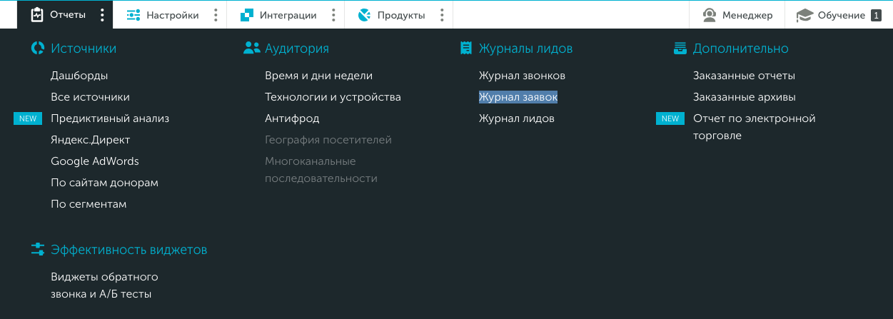
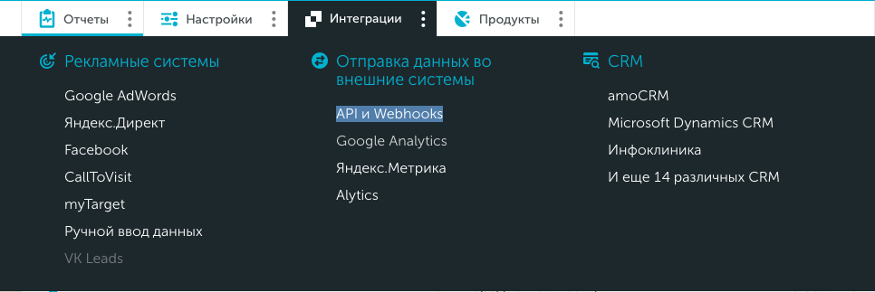
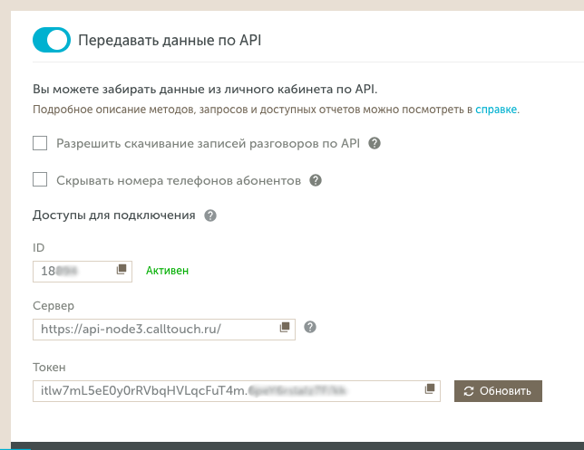

# Интеграция с Calltouch 

## Навигация

* [Журнал заявок](#журнал-заявок)

## Журнал заявок

Отправка информации по звонкам в журнал заявок в личном кабинете Calltouch. 

Обратитесь к вашему менеджеру и укажите следующую информацию:

•	id виджетов, для которых настраивается интеграция
•	siteId (доступно в личном кабинете Calltouch)
•	server (доступно в личном кабинете Calltouch)
•	token (доступно в личном кабинете Calltouch)

Вы может посмотреть последние три значения в своем личном кабинете Calltouch, вкладка Интеграции/API и Webhooks – Доступы для подключения.

Минимальный набор возможных значений, которые мы передаем: 

•	номер телефона клиента
•	id сессии звонка (нужен для определения источника перехода на сайт)
•	комментарий «CallKeeper»

Дополнительно по запросу можно передавать название формы и дату заказа звонка.
Если клиенту нужна дополнительная информация по звонку – по запросу в тикете мы можем передавать ее в комментарии (длина комментария не более 4000 символов). Возможность передачи именно этих данных уточняется в тикете.

Данные в журнал заявок передаются хуком. В зависимости от настройки хука - данные по отложенным звонкам передаются до или после звонка. Некоторых данных при передаче хука до звонка может не быть.

Иногда бывает, что id сессии коллтача не собирается (по разным причинам). Данные в журнал заявок все равно придут. Но если хук отправили без id сессии, то не будет источника перехода на сайт посетителя.

Можно сделать индивидуальную настройку для отправки только по успешным звонкам и/или только по последней попытке.

Отдельно есть интеграция для передачи в журнал заявок информации по tap-2-call’ам (прямые звонки) (важный момент: при этом передается номер телефона менеджера, так как в этом случае мы не можем собрать информацию о номере телефона клиента).

[Вернуться к оглавлению](#навигация)

[Вернуться на главную](/README.md#documentation) 
