# Настройка интеграции с Facebook LeadAds

#### Примечание:
`Интеграция работает только для аккаунтов, перенесенных с callkeeper.ru/callkeeper.com`
________

## Навигация
* [Страница Facebook. Роли](#Страница-Facebook-роли)
* [Форма Facebook](#Форма-Facebook)
* [Интеграция с Calltracking](#Интеграция-с-Calltracking)
* [Создание тестового лида в Facebook](#Создание-тестового-лида-в-Facebook)
* [FAQ](#faq)

Что необходимо для интеграции:

- Страница в Facebook.

- Настроенная форма LeadAds.

- Активный виджет в ЛК Calltracking.  

Порядок действий для создания интеграции:

## Страница Facebook. Роли  

Откройте в Facebook страницу, для которой будете создавать формы.

Убедитесь, что у вас есть доступ уровня «Администратор» к нужной странице.

Это можно проверить в Разделе «Роли страницы»:

_Путь: /Настройки/Роли страницы_

Если вы хотите, чтобы интеграция подтягивала динамические метки с Facebook (например, campaign_name, ad_id и др.), убедитесь, что у вас есть доступ к рекламному аккаунту в Facebook. Уровень доступа определяет владелец рекламного аккаунта.

Если вы владелец рекламного аккаунта, вы можете выдавать доступ к своему рекламному аккаунту другим людям.
 
Для этого откройте страницу, для которой вы создаете форму. Перейдите в настройки и выберите Ads  Manager.

На открывшейся странице выберите свой рекламный аккаунт.

Далее откроется страница с информацией о кампаниях.

Нажмите на три полоски рядом с заголовком Ads  Manager  и в открывшемся выпадающем меню выберите «Настройки».

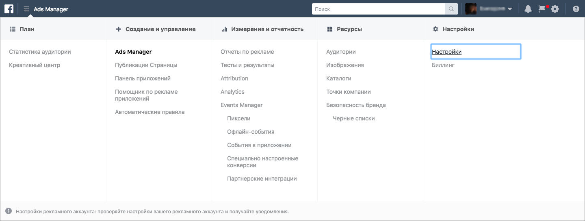

На открывшейся странице обратите внимание на раздел «Роли для рекламного аккаунта». Здесь указаны все аккаунты, которым выданы роли от имени вашего рекламного аккаунта.

Для подтягивания динамических меток Facebook у аккаунта-администратора страницы должен быть доступ к рекламному аккаунту. Уровень доступа (Аналитик рекламного аккаунта/Рекламодатель рекламного аккаунта/Администратор рекламного аккаунта) вы выбираете сами.

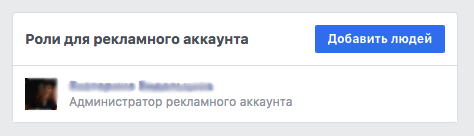

Нажмите на кнопку «Добавить людей», чтобы выдать роли другим аккаунтам.

В поисковой строке введите имя нужного аккаунта (аккаунт должен быть у вас в друзьях), назначьте нужную роль и нажмите «Подтвердить».

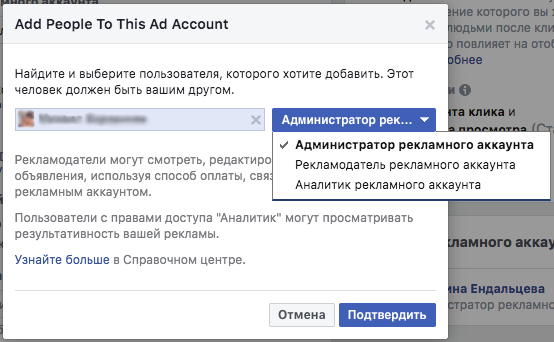

Если ваш рекламный аккаунт привязан не к пользователю, а к компании, то доступ настраивается через Business  Manager:

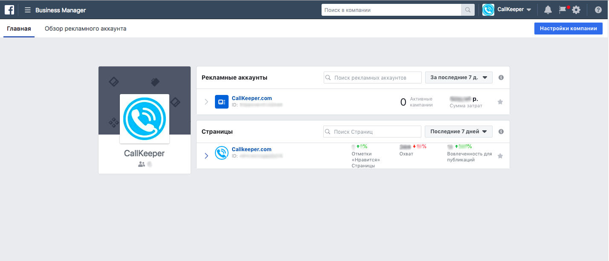

Зайдите в рекламный аккаунт, нажмите на три полоски слева и выберите Настройки.

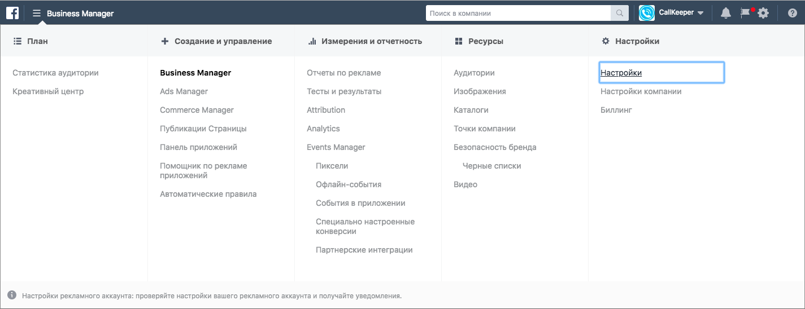
 
В открывшемся окне откройте раздел Рекламные аккаунты и перейдите в Роли для рекламного аккаунта.

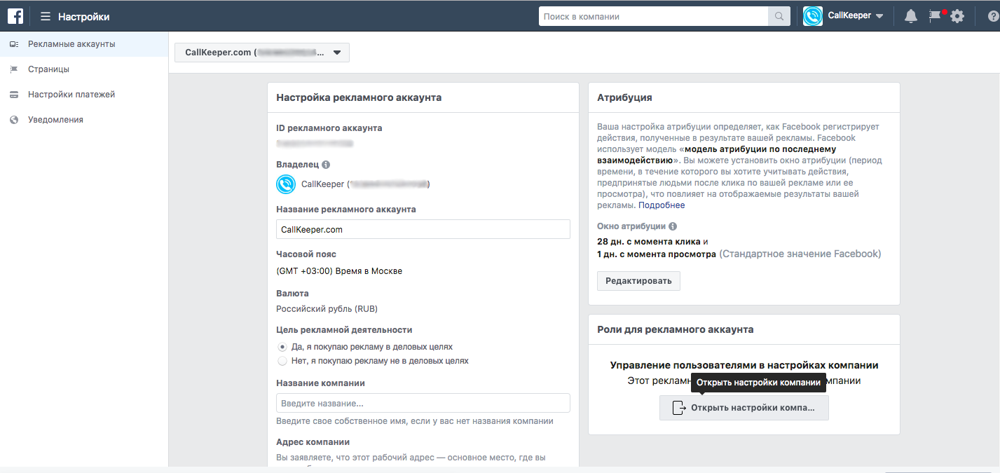 

В открывшемся окне выберите Аккаунты/Рекламные аккаунты.

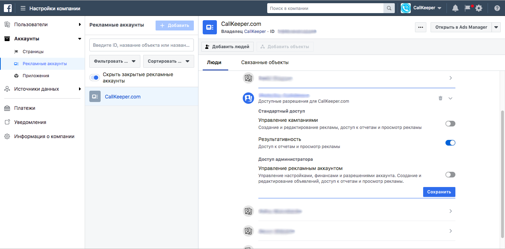

Уровень доступа к аккаунту зависит от того, какие права вы хотите выдать. Обратите внимание, что для подтягивания динамических меток Facebook у аккаунта должен быть один из возможных уровней доступа.

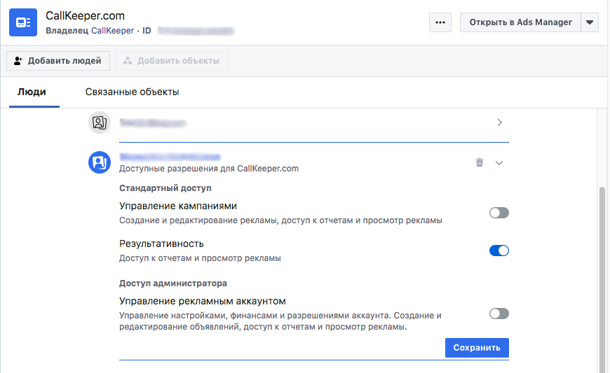
  

## Форма Facebook

Откройте страницу, для которой вы настраиваете формы. У вашего рекламного аккаунта должен быть доступ к этой странице.

Перейдите во вкладку инструменты для публикации:

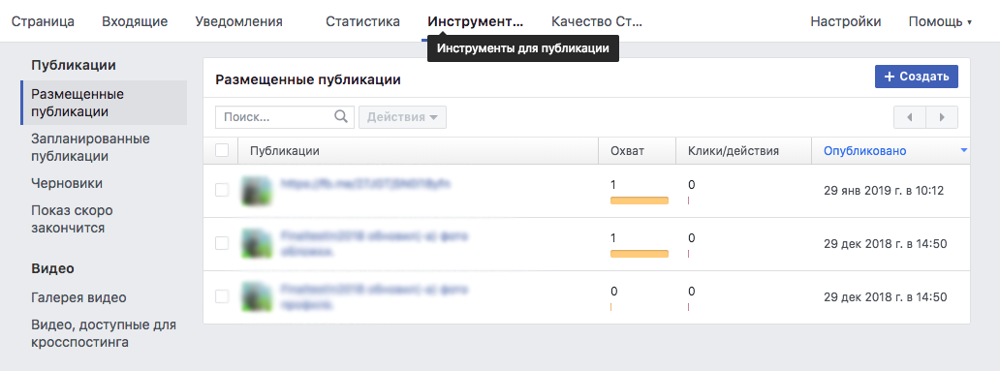

После этого перейдите во вкладку «Формы рекламы для лидов» — «Библиотека форм».

_Путь: /Инструменты для публикации/Формы рекламы для лидов._

Создайте и настройте новую форму или скопируйте существующую:

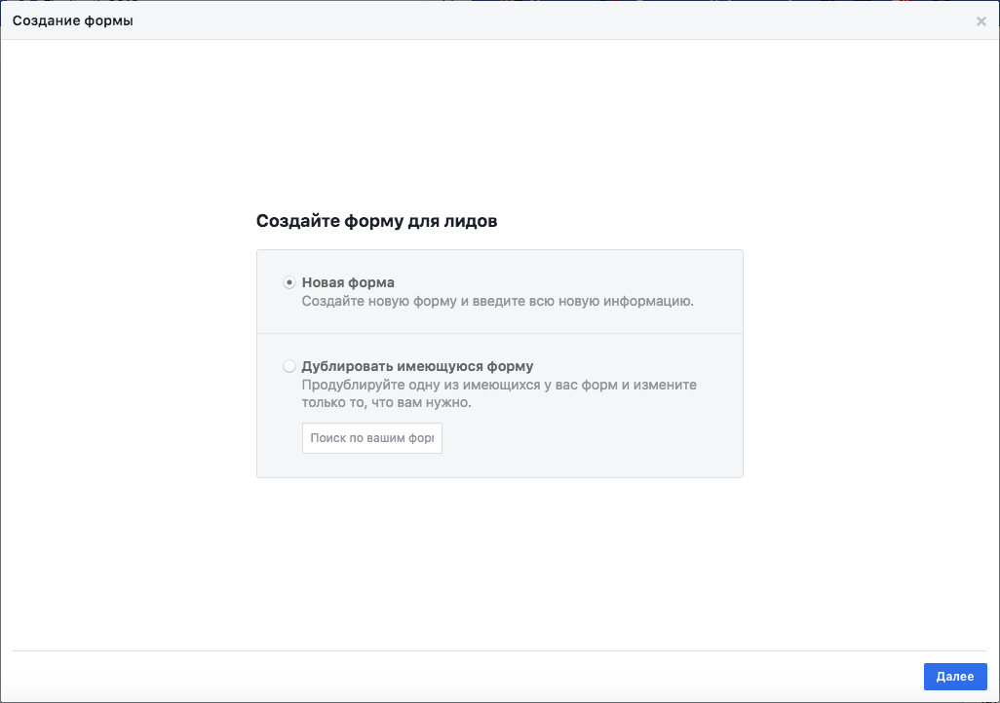

Настройте новую форму, заполните необходимые поля, загрузите картинку.

В разделе «Вопросы» добавьте поля, которые будут отображаться в вашей форме. Обязательно добавьте поле для записи телефонного номера (Contact  fields/Phone  number).

  
Если необходимо добавить дополнительные вопросы, нажмите «Добавить новый вопрос» и выберите интересующие вас поля. Здесь же вы можете настроить выбор нескольких офисов, чтобы в последующем связать их настройками виджета в личном кабинете (Custom  Questions/Альтернативный вопрос).

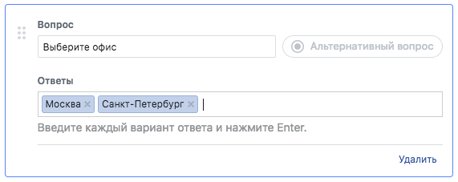
  
Укажите и сохраните имя формы, которое также отразится в ЛК CallKeeper. Нажмите «Сохранить» и «Завершить».

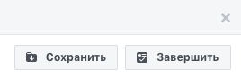

## Интеграция с Calltracking

Зайдите в личный кабинет Calltracking. Во вкладке Социальные сети выберите Facebook.
  
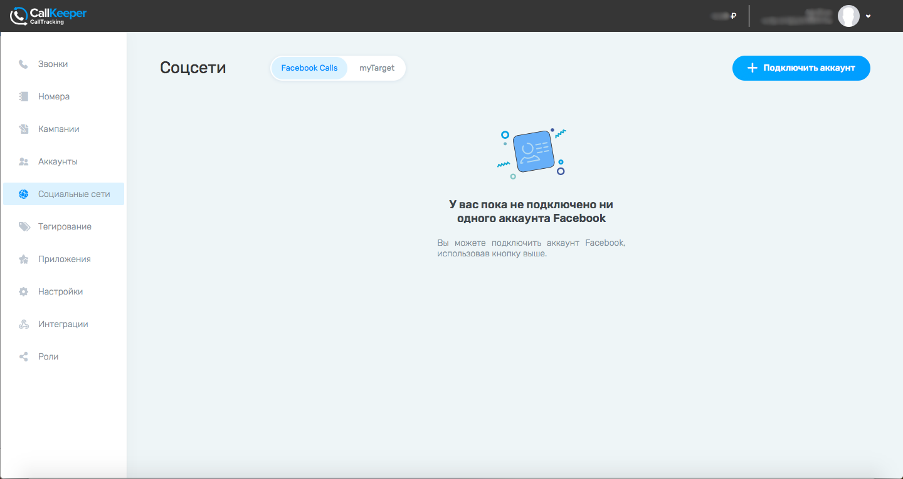

В открывшейся вкладке нажмите  "+ Подключить аккаунт".

При подключении аккаунта в новом окне Facebook уточнит, под каким аккаунтом Facebook вы хотите залогиниться.

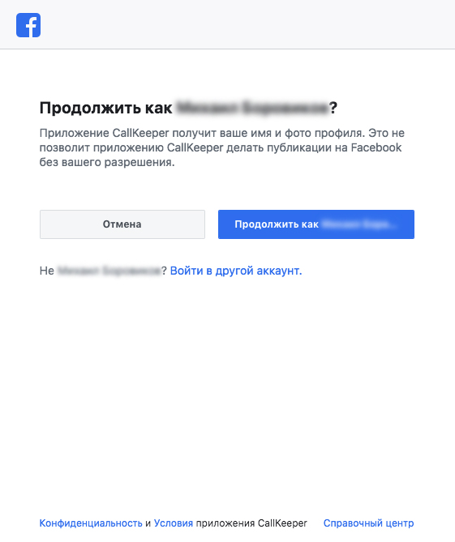

После этого откроется первое окно, на котором будут отображены все страницы Facebook, подключенные к аккаунту, под которым вы залогинились.

______
#### Примечание: 
`Если вашим аккаунтом Facebook пользуются несколько аккаунтов CallKeeper, то на это этапе нужно всегда выбирать все страницы. Эта настройка влияет на всех пользователей, интегрированных с этим аккаунтом Facebook.`
______
На следующем шаге вам предложат выбрать действия, которые приложение CallKeeper сможет совершать со страницами, которые вы уже выбрали. Обе настройки рекомендуется сделать активными.

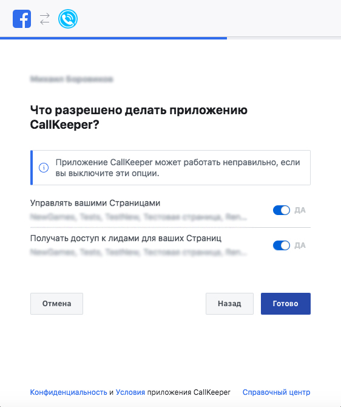

Если все выбрано правильно, то вы увидите следующее окно:  

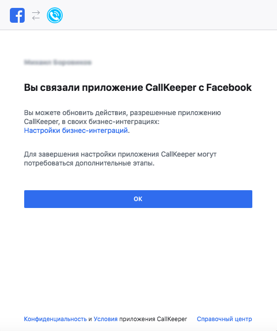

После этого появится окно настроек страниц Calltracking. Все страницы, выбранные в этом окне, будут привязаны к вашему аккаунту в Calltracking.

________
#### Примечание: 
`В этом окне вы можете выбрать либо те страницы, которые нужны вам, либо все страницы, которые вы указали в начале. Эта настройка никак не повлияет на других пользователей, интегрированных с этим же аккаунтом Facebook.`
_______

В личном кабинете Calltraking нажмите «+ Добавить новую форму»  

Все выбранные на предыдущем шаге страницы и формы отобразятся в конструкторе формы.
Настройки становятся доступными по мере заполнения полей. Начните с выбора страницы.

Далее выбирете нужную форму, обязательно привяжите ее к виджету и выбирете необходимые вопросы.
Вы можете добавить нужные utm-метки - эта настройка опциональная. 

Если у вас еще нет виджета, вы можете закончить настройки формы Facebook, сохранить еe и перейти к [созданию виджета](/documentation/apps/widget/widget_ru.md). Не забудьте позже вернуться в настройки формы Facebook и привязать еt. Без привязки к виджету формы Facebook не будет работать.

Во вкладке IVR вы можете отредактировать текст, который услышит менеджер при звонке с выбранной формы Facebook.

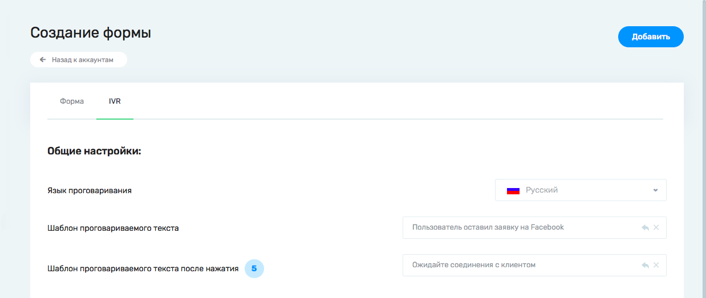

Если у вас включен сервис SmartCall, то у вас будет возможность настроить два шаблона проговариваемого текста - до и после нажатия/проговаривание цифры для инициации звонка.

Для сохранения настроенной формы нажмите "Добавить".

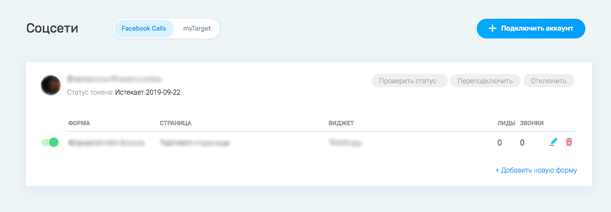

Добавленную форму можно отредактировать, нажав на карандаш, или удалить, нажав на мусорное ведро.

Чтобы форма работала, переведите ползунок напротив формы вправо - в активное состояние.

Вы можете добавить несколько аккаунтов Facebook и несколько форм, привязанных к каждому аккаунту.

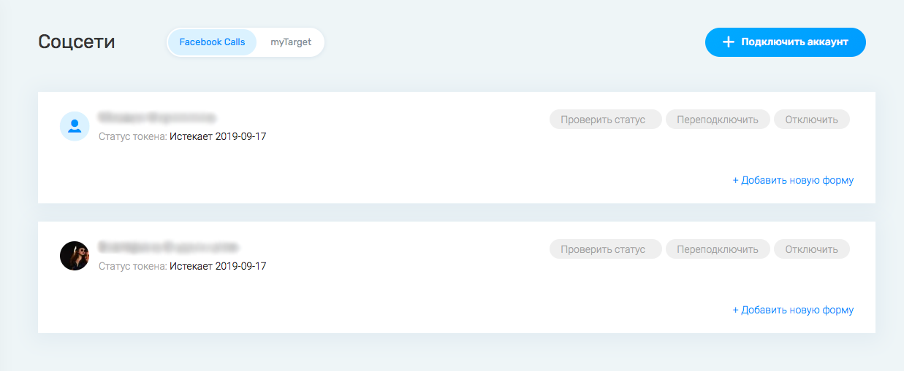
_________
#### Примечание: 
`Мы добавили дополнительную проверку на доступ к аккаунту, странице и форме Facebook. Если у нашего приложения возникнут проблемы с доступом к любой их этих сущностей, вы увидите соответствующую маркировку рядом с ней: зеленая галочка – все в порядке, красный крестик – есть проблема с подключением.`
_________
Нажмите на кнопку "Проверить статус" напротив нужного аккаунтаю

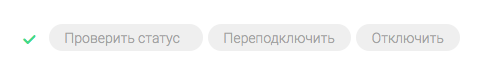

Если вы увидите красный крестик рядом с одной из сущностей, обратитесь к вашему менеджеру.

Проблема может заключаться в истекшем токене, отсутствии прав на одну из указанных сущностей или иной причине.

Попробуйте переподключить аккаунт, обратив внимание на поля, где вы выдаете приложению CallKeeper доступ к различным сущностям (выбор страницы, выбор форм).

## Создание тестового лида в Facebook

Вы можете проверить настройку своей интеграции, воспользовавшись инструментом для тестирования рекламы для лидов.

Авторизуйтесь в Facebook  и перейдите по ссылке: [https://developers.facebook.com/tools/lead-ads-testing/](https://developers.facebook.com/tools/lead-ads-testing/#_=_)

На этой странице вы можете отправить тестовые лиды на все созданные вами формы и страницы, закрепленные за активным аккаунтом Facebook.

  
Выберите нужную страницу и форму:

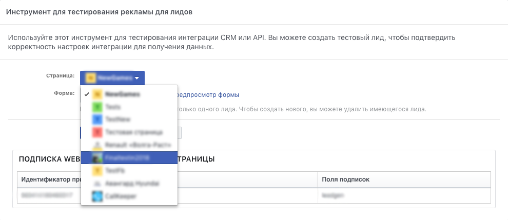

Вы можете отправить пустой лид, нажав на кнопку «Создать лид».

**В этом случае звонка по лиду не будет.**

Или откройте предпросмотр страницы, заполните данные и нажмите Submit, чтобы отправить заполненный лид.

**В этом случае по отправленному лиду произойдет звонок.**

Для каждой формы вы можете создать только один лид.

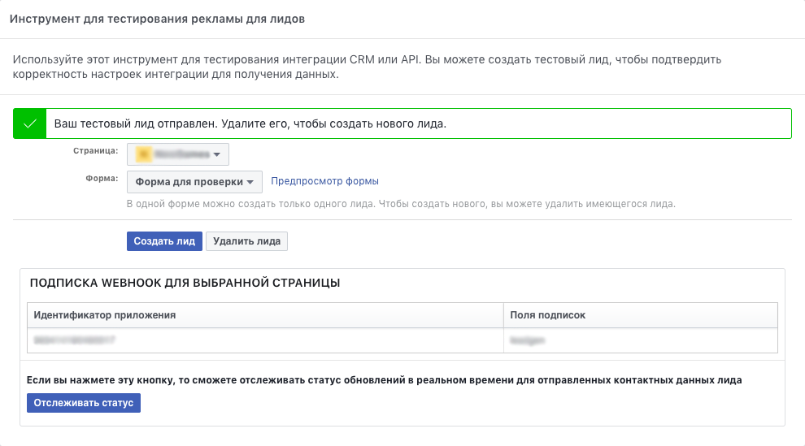

Чтобы создать новый лид, необходимо удалить старый и обновить страницу.

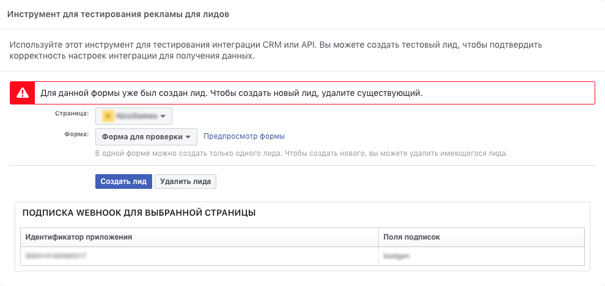
________

# FAQ

1. У меня не подтягиваются динамические метки

Динамические метки могут не подтягиваться, если у Аккаунта-администратора Страницы с нужной Формой нет доступа к Рекламному Аккаунту. Убедитесь, что у Аккаунта есть доступ к [рекламному аккаунту](#Страница-Facebook-роли). 

2. У меня не отображается нужная форма/страница при подключении аккаунта

Возможно, у вас нет доступа Администратора к нужной странице и, следовательно, к форме. Убедитесь, что у подключаемого аккаунта есть [доступ Администратор](#Страница-Facebook-роли) к нужной странице, и переподключите аккаунт.

3. У меня не отображается нужная форма/страница в настройках формы (после подключения аккаунта)

Попробуйте переподключить Аккаунт и обратите особое внимание на [шаги выдачи доступа](#интеграция-с-calltracking) к cтраницам и aормам. Убедитесь, что вы выбрали все нужные вам страницы и формы, а затем перейдите к настройкам.

4. У меня не включается форма в личном кабинете (переключатель)

Проверить, есть ли доступ к странице. Зайти в Facebook ()
Это может происходить из-за того, что был потерян доступ к страницам/формам. Например, если ваш аккаунт на Facebook подключен у нескольких аккаунтов Calltracking, при переподключении один из них мог не выбрать все доступные страницы на первом шаге подключения. Попробуйте переподключить аккаунт, обратив внимание на страницы, которые вы выбираете на каждом шаге подключения.

5. Я заказываю тестовый лид, но у меня не приходит звонок.

- Возможно, вы заказали звонок не с формы,а нажали на кнопку "создать лид". 
Попробуйте заказать тестовый лид с [превью формы](#Или-откройте-предпросмотр-страницы-заполните-данные-и-нажмите-Submit- чтобы-отправить-заполненный-лид).

- Убедитесь, что вы выбрали в выпадающем списке нужную форму.

- Форма, которую вы выбрали, может быть не подключена в личном кабинете Calltracking. [Пройдите шаги по подключению формы](#Интеграция-с-Calltracking) и попробуйте заново заказать лид. 

- Форма, на которую вы заказываете лид, может быть выключена в личном кабинете. [Убедитесь](#![Рис.31]), что ползунок рядом с формой находится в активном положении и попробуйте заново заказать лид.

- Если аккаунт Facebook используется в нескольких личных кабинетах CAlltracking, возможно при переподключении аккаунта другие пользователи выбрали не все используемые страницы и интеграция слетела. [Переподключите аккаунт](#Интеграция-с-Calltracking), выбрав на первом этапе подключения все страницы.

6. У меня не приходят лиды с формы

- Возможно, вы потеряли доступ к странице Facebook. Убедитесь, что у вас есть [необходимый доступ](#Страница-Facebook-роли)

- Форма, с которой заказан звонок, не подключена в личном кабинете. Убедитесь, что форма, с которой вы ожидаете лиды, [подключена](##Интеграция-с-Calltracking) в личном кабинете Calltracking.

- Если аккаунт Facebook используется в нескольких личных кабинетах CAlltracking, возможно при переподключении аккаунта другие пользователи выбрали не все используемые страницы и интеграция слетела. [Переподключите аккаунт](#Интеграция-с-Calltracking), выбрав на первом этапе подключения все страницы.

- Форма, с которой вы ожидаете лиды, может быть выключена в личном кабинете. [Убедитесь](#Чтобы-форма-работала-переведите-ползунок-напротив-формы-вправо-в-активное-состояние), что ползунок рядом с формой находится в активном положении.

- Возможно, у вас истек токен доступа Facebook. Переподключите аккаунт.

7. На первом этапе подключения не видно ни одной страницы

- Убедитесь, что у вас есть [необходимый доступ](#Страница-Facebook-роли). Если с правами и доступом все в порядке, проблема не на нашей стороне. Попробуйте обратиться в техническую поддержку Facebook. 

8. На первом этапе подключения нет нужных мне страниц

- Убедитесь, что у вас есть [необходимый доступ](#Страница-Facebook-роли). Если с правами и доступом все в порядке, проблема не на нашей стороне. Попробуйте обратиться в техническую поддержку Facebook. 

[Вернуться к оглавлению](#)

[Вернуться на главную](/README.md/#documentation)
