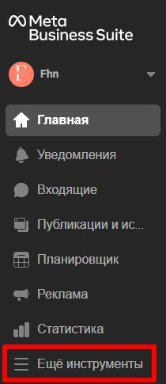

# facebook
* [Страница Facebook. Роли](#Страница-Facebook-роли)
* [Форма Facebook](#Форма-Facebook)
* [Интеграция с CallTracking](#Интеграция-с-CallTracking)
* [Создание тестового лида в Facebook](#Создание-тестового-лида-в-Facebook)
* [FAQ](#faq)

Что необходимо для интеграции:

- Страница в Facebook.

- Настроенная форма LeadAds.

- Активный виджет в ЛК CallKeeper.  

Порядок действий для создания интеграции:

## Страница Facebook. Роли  

Откройте в Facebook страницу, для которой будете создавать формы.

Убедитесь, что у вас есть доступ уровня «Администратор» к нужной странице.

Это можно проверить в Разделе «Настройки»:

Если вы хотите, чтобы интеграция подтягивала динамические параметры с Facebook (**campaign_id, campaign_name, ad_name, ad_id, adset_id, adset_name**), убедитесь, что у вас есть доступ к рекламному аккаунту в Facebook. Уровень доступа определяет владелец рекламного аккаунта.

Если вы владелец рекламного аккаунта, вы можете выдавать доступ к своему рекламному аккаунту другим людям.

 
Для этого перейдите в "настройки".
На открывшейся странице обратите внимание на раздел «Роли для рекламного аккаунта». Здесь указаны все аккаунты, которым выданы роли от имени вашего рекламного аккаунта.
Нажмите на "Добавить людей", там вы сможете выбрать аккаунт для роли и выдать ему роль.

Для подтягивания динамических параметров Facebook у аккаунта-администратора страницы должен быть доступ к рекламному аккаунту. 
Уровень доступа (Аналитик рекламного аккаунта/Рекламодатель рекламного аккаунта/Администратор рекламного аккаунта) вы выбираете сами.
Необходимо найти аккаунт которому вы хотите выдать роль и выбрать одну из ролей.

Если ваш рекламный аккаунт привязан не к пользователю, а к компании, то доступ настраивается через Business Manager.
Зайдите в рекламный аккаунт, в левом меню нажмите "настройки":

В открывшемся окне откройте у вас будут отображены все аккаунты которым выданы роли.
Новые роли можно выдать нажав "добавить людей": 

Затем откроется окно в котором необходимо найти аккаунт которому необходимо выдать роль и выбор роли для этого аккаунта:

## Форма Facebook

Откройте страницу, для которой вы настраиваете формы. У вашего рекламного аккаунта должен быть доступ к этой странице.

Перейдите во вкладку "ещё инструменты" и там найдите "Моментальные формы"

После этого нажмите на кнопку "Создать форму" в правом верхнем углу.

Создайте и настройте новую форму или скопируйте существующую:

Настройте новую форму, заполните необходимые поля, загрузите картинку.Укажите и сохраните имя формы, которое также отразится в ЛК CallKeeper.

В разделе «Вопросы» добавьте поля, которые будут отображаться в вашей форме. Обязательно добавьте поле для записи телефонного номера (Contact fields/Phone number).

## Интеграция с CallTracking

Зайдите в ЛК CallTracking. Во вкладке «Социальные сети» выберите Facebook Calls.

В открывшейся вкладке нажмите «Подключить аккаунт».

При подключении аккаунта в новом окне Facebook уточнит, под каким аккаунтом Facebook вы хотите залогиниться.

После этого откроется первое окно, на котором будут отображены все страницы Facebook, подключенные к аккаунту, под которым вы залогинились.

______
#### Примечание:

`Если вашим аккаунтом Facebook пользуются несколько аккаунтов CallTracking, то на это этапе нужно всегда выбирать все страницы. Эта настройка влияет на всех пользователей, интегрированных с этим аккаунтом Facebook.`
______

В личном кабинете CallTracking нажмите «Добавить новую форму»

Все созданные формы для выбранной страницы загрузятся в конструкторе, и вам останется выбрать соответствующий виджет, из которого берутся все настройки

Далее обязательный выбор поля, где содержится номер клиента, и по желанию можно добавить произвольные значения UTM-меток и текст для проговаривания:

Настройки интеграции завершены. Для активации переведите форму сбора заявок на Facebook в активное состояние, передвинув левый ползунок вправо:

________
#### Примечание: 

`Мы добавили дополнительную проверку на доступ к аккаунту, странице и форме Facebook. Если у нашего приложения возникнут проблемы с доступом к любой их этих сущностей, вы увидите соответствующую маркировку рядом с ней при нажатии "Проверить статус": зеленая галочка – все в порядке, красный крестик – есть проблема с подключением.`
________

## Создание тестового лида в Facebook

Вы можете проверить настройку своей интеграции, воспользовавшись инструментом для тестирования рекламы для лидов.

Авторизуйтесь в Facebook  и перейдите по ссылке: [https://developers.facebook.com/tools/lead-ads-testing/](https://developers.facebook.com/tools/lead-ads-testing/#_=_)

На этой странице вы можете отправить тестовые лиды на все созданные вами формы и страницы, закрепленные за активным аккаунтом Facebook.

  
Выберите нужную страницу и форму:

Вы можете отправить пустой лид, нажав на кнопку «Создать лид».

**В этом случае звонка по лиду не будет.**

Или откройте предпросмотр страницы, заполните данные и нажмите Submit, чтобы отправить заполненный лид.

**В этом случае по отправленному лиду произойдет звонок.**

Для каждой формы вы можете создать только один лид.

Чтобы создать новый лид, необходимо удалить старый и обновить страницу.

# FAQ

**1. У меня не подтягиваются динамические метки**

Динамические метки могут не подтягиваться, если у Аккаунта-администратора Страницы с используемой Формой нет доступа к [Рекламному Аккаунту](#Страница-Facebook-роли). 

**2. У меня не отображается нужная форма/страница при подключении аккаунта**

Возможно, у вас нет доступа Администратора к нужной странице и, следовательно, к форме. Убедитесь, что у подключаемого аккаунта есть [доступ Администратор](#Страница-Facebook-роли) к нужной странице, и переподключите аккаунт.

**3. У меня не отображается нужная форма/страница в настройках формы (после подключения аккаунта)**

Попробуйте переподключить Аккаунт и обратите особое внимание на [шаги выдачи доступа](#интеграция-с-calltracking) к cтраницам и формам. Убедитесь, что вы выбрали все нужные вам страницы и формы, а затем перейдите к настройкам.

**4. У меня не включается форма в личном кабинете (переключатель)**

Проверьте, есть ли доступ к странице. 
Это может происходить из-за того, что был потерян доступ к страницам/формам. Например, если ваш аккаунт на Facebook подключен у нескольких аккаунтов Calltracking, при переподключении один из них мог не выбрать все доступные страницы на первом шаге подключения. Попробуйте переподключить аккаунт, обратив внимание на страницы, которые вы выбираете на каждом шаге подключения.

**5. Я заказываю тестовый лид, но у меня не приходит звонок.**

- Возможно, вы заказали звонок не с формы, а нажали на кнопку "создать лид". 
Попробуйте заказать тестовый лид через [предпросмотр формы](#Создание-тестового-лида-в-Facebook).

- Форма, которую вы выбрали, может быть не подключена в личном кабинете Calltracking. Проверьте, подключена ли нужная форма. Если нет, [пройдите шаги по подключению формы](#Интеграция-с-Calltracking) и попробуйте заново заказать лид. 

- Форма, на которую вы заказываете лид, может быть выключена в личном кабинете. Убедитесь, что ползунок рядом с формой находится в активном положении и попробуйте заново заказать лид.

- Если аккаунт Facebook используется в нескольких личных кабинетах Calltracking, возможно при переподключении аккаунта другие пользователи выбрали не все используемые страницы и интеграция слетела. [Переподключите аккаунт](#Интеграция-с-Calltracking), выбрав на первом этапе подключения все страницы.

**6. У меня не приходят лиды с формы**

- Возможно, вы потеряли доступ к странице Facebook. Убедитесь, что у вас есть [необходимый доступ](#Страница-Facebook-роли)

- Форма, с которой заказан звонок, не подключена в личном кабинете. Убедитесь, что форма, с которой вы ожидаете лиды, [подключена](##Интеграция-с-Calltracking) в личном кабинете Calltracking.

- Если аккаунт Facebook используется в нескольких личных кабинетах CAlltracking, возможно при переподключении аккаунта другие пользователи выбрали не все используемые страницы и интеграция слетела. [Переподключите аккаунт](#Интеграция-с-Calltracking), выбрав на первом этапе подключения все страницы.

- Форма, с которой вы ожидаете лиды, может быть выключена в личном кабинете. Убедитесь, что ползунок рядом с формой находится в активном положении.

- Возможно, у вас истек токен доступа Facebook. Переподключите аккаунт.

**7. На первом этапе подключения не видно ни одной страницы**

- Убедитесь, что у вас есть [необходимый доступ](#Страница-Facebook-роли). Попробуйте обратиться в техническую поддержку Facebook, так как за отображение страниц в этом окне отвечает Facebook.

[Вернуться к оглавлению](#навигация)

[Вернуться на главную](/README.md/#documentation)
