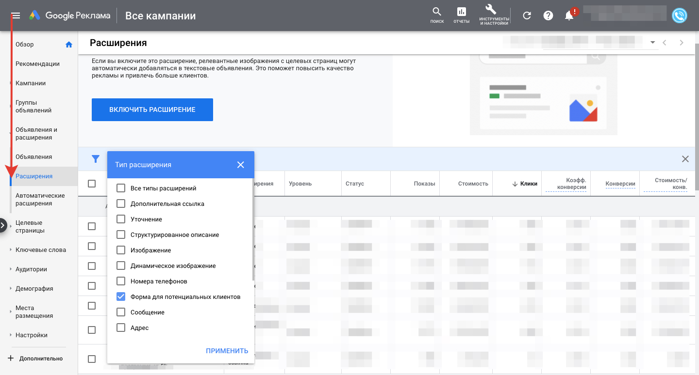
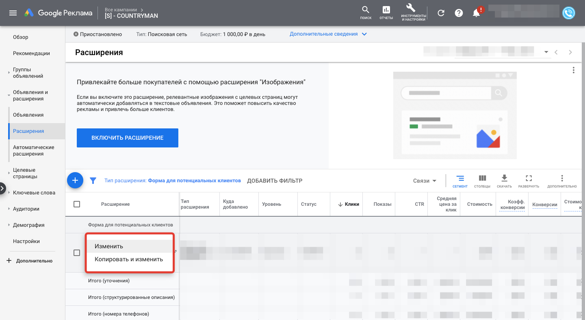
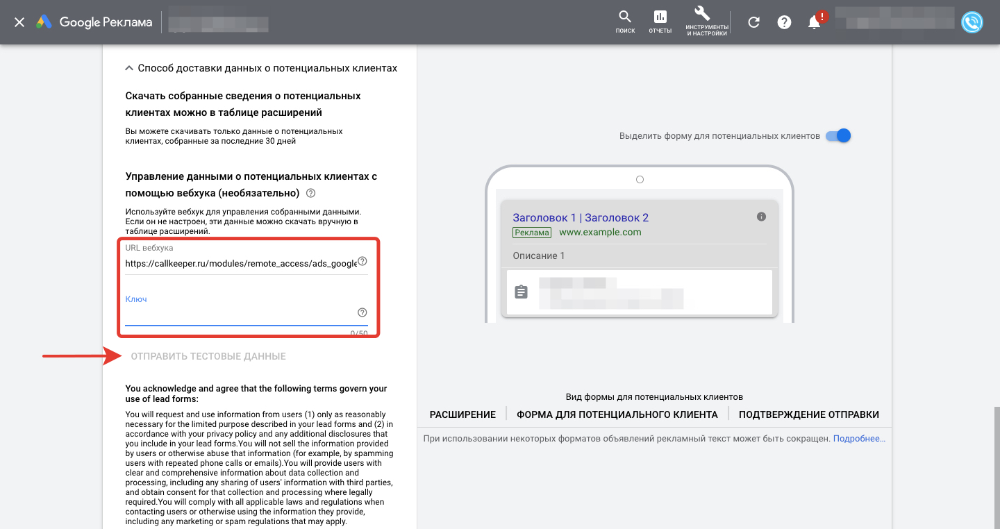

## Интеграция с формами Google Lead Form

## Навигация
* [Об интеграции ](#Об-интеграции)
* [Настройка интеграции ](#Настройка-интеграции)

## Об интеграции
Формат Google Lead Form позволяет получать больше заявок с рекламы Google Ads, поскольку пользователи могут заполнять их прямо на странице в поиске. Но при работе с такими заявками пользователи сталкиваются с рядом трудностей, так необходимо выгружать лиды в формате .csv, прозванивать вручную и загружать в стороннюю CRM.
Благодаря интеграции CallKeeper с лид-формами Google Lead Form процесс обработки заявок можно автоматизировать и получать сразу звонки, а не заявки.

## Настройка интеграции
1. Перейдите на сайт ads.google.com и выполните вход в свой аккаунт.
2. Перейдите на вкладку «Объявления и расширения» в левой панели меню сайта.
В выпадающем списке выберите «Расширения».
В открывшейся таблице выберите интересующее расширение, имеющее тип «формы для потенциальных клиентов», нажмите на имя формы, и в открывшемся контекстном меню выберите «Изменить».

3. Для интеграции с CallKeeper, открывшуюся страницу нужно пролистать вниз до раскрывающегося списка «Способ доставки данных о потенциальных клиентах», при нажатии на которую раскроется список настроек.
4. В раскрывшихся настройках заполните поля URL вебхука и Ключ. В поле URL вебхука укажите https://callkeeper.ru/modules/remote_access/ads_google_forms.php . В поле Ключ пропишите уникальный ключ — whash (уникальный
идентификатор виджета в CallKeeper, к которому вы привязываете Google Lead Form). Идентификатор находится в личном кабинете (во вкладке настройки виджета). Вы также можете запросить его у менеджера.

5. Для проверки корректности введенных данных нажмите на кнопку «Отправить тестовые данные», расположенную ниже полей URL вебхука и Ключ.
6. Если всё сделано правильно, после нажатия на кнопку «Отправить тестовые данные», ниже данной кнопки отобразится сообщение о том, что тестовые данные отправлены. Проверьте получение тестовых данных в вашей системе управления.
7. В случае указания некорректных данных, после нажатия на кнопку «Отправить тестовые данные», ниже данной кнопки отобразится предупреждение о том, что система управления данными возвращает некорректный ответ. В таком случае проверьте ваши данные и пройдите процедуру настройки сначала.
Важно!
В рамках интеграции с CallKeeper, необходимо придерживаться правила:
Одному виджету соответствует один ключ. Если Вам необходимо произвести интеграцию по нескольким виджетам, нужно будет создать соответствующее количество уникальных ключей.

Важно!
В рамках интеграции с CallKeeper, необходимо придерживаться правила:

Одному виджету соответствует один whash-ключ. Если Вам необходимо произвести интеграцию c несколькими виджетами, нужно будет использовать свои уникальные значения whash-ключа.

[Вернуться к оглавлению](#навигация)

[Вернуться на главную](/README.md/#documentation)
