# Интеграция CallKeeper и ВАТС Mango Office

Если вы пользуетесь виртуальной АТС Mango office, то с помощью этого руководства, вы сможете принимать как обратные звонки, так и входящие звонки на подменные номера CallKeeper в ВАТС Mango office и распределять их в соответствии с существующими правилами,  на сотрудников или отделы.

##### Вам понадобится:
1. Активированный аккаунт в CallKeeper с положителным балансом.
2. Аккаунт ВАТС Mango office.

## Шаг 1. Покупка номера
>Этот шаг можно пропустить, если у вас уже есть купленные номера в ckct.ru

1. В личном кабинете ckct.ru нужно перейти на вкладку номера и нажать **Купить номер**
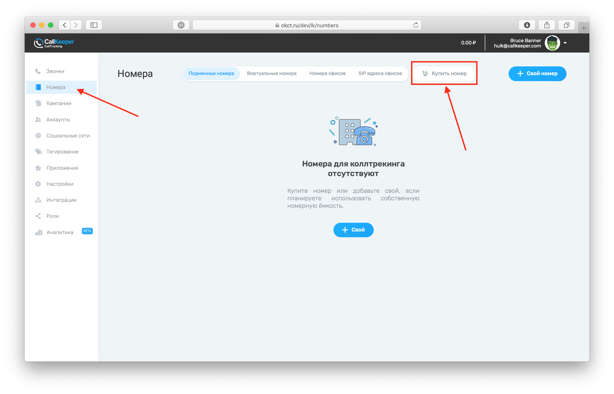
2. Выбрать понравившийся номер, добавить его в список, нажав +, а затем Купить

## Шаг 2. Подключение номера CallKeeper к виртуальной АТС Mango office

1. В Личном кабинете Mango office нужно зайти на **Обзорную панель**.
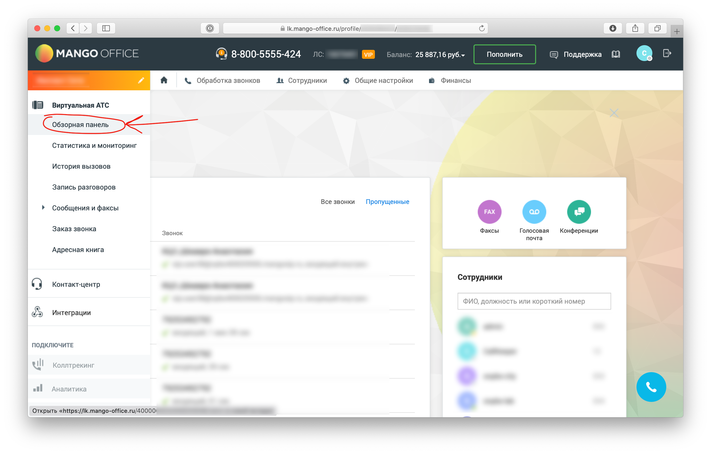
2. В разделе **Номера других операторов** нажать **Подключить**
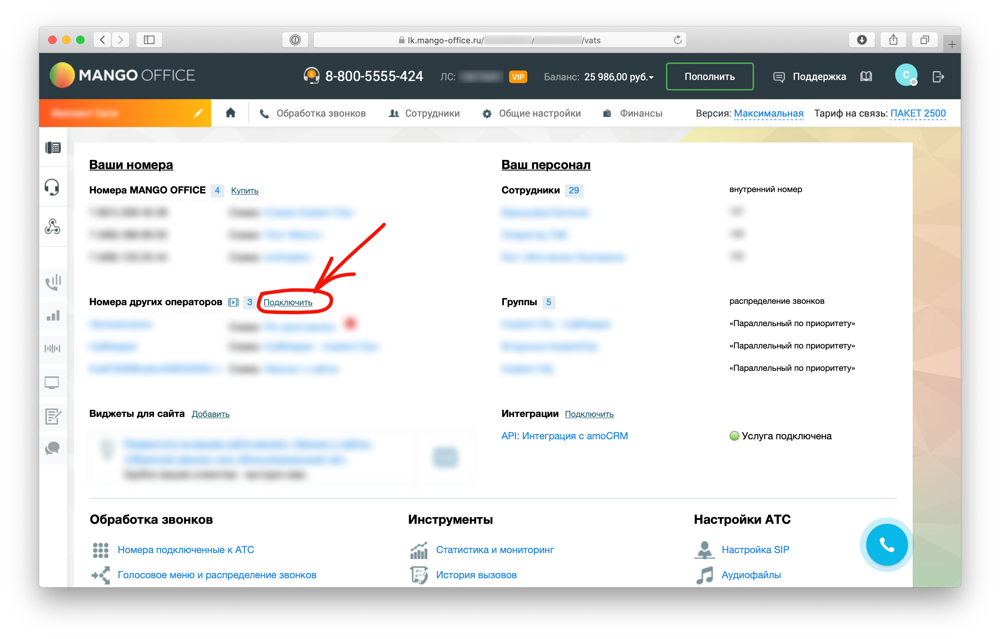
3. Выбрать **Пассивный SIP** и нажать **Продолжить**
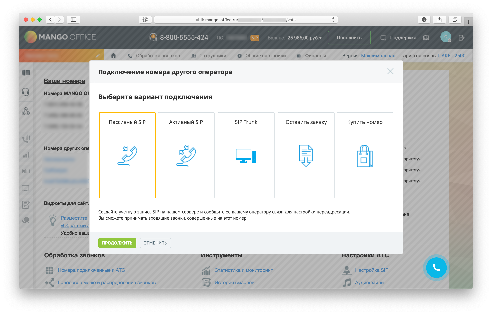
4. В открывшемся окне ввести купленный номер (или любое другое значение, например CallKeeper). 
Выбрать вариант **Задать параметры SIP-адреса вручную**. В поле перед ``@`` ввести **callkeeper**. SIP домен можно оставить без изменений.
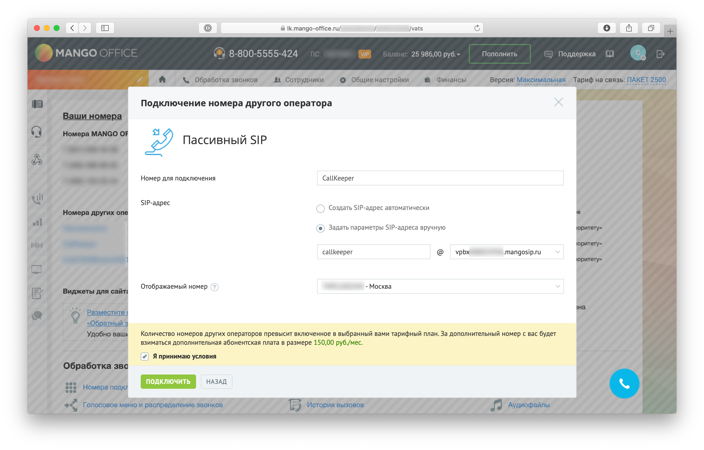
5. Затем нужно открыть выпадающее меню, кликнув по пункту **Обработка звонков** и выбрать **Голосовое меню и распределение звонков**.
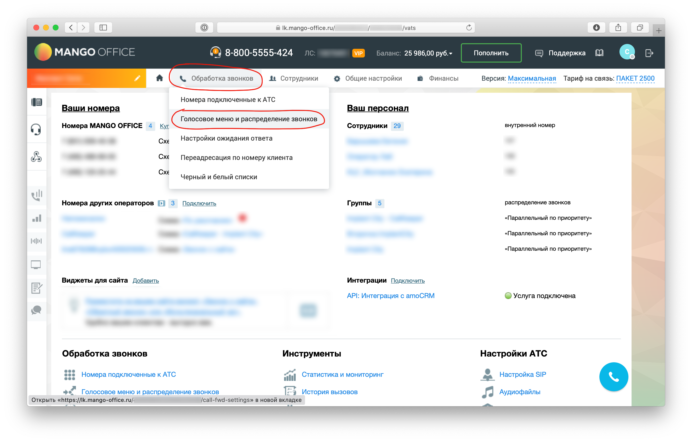
6. Перейти в подраздел Настройки для входящих линий и выбрать созданную в п.4 SIP-линию.
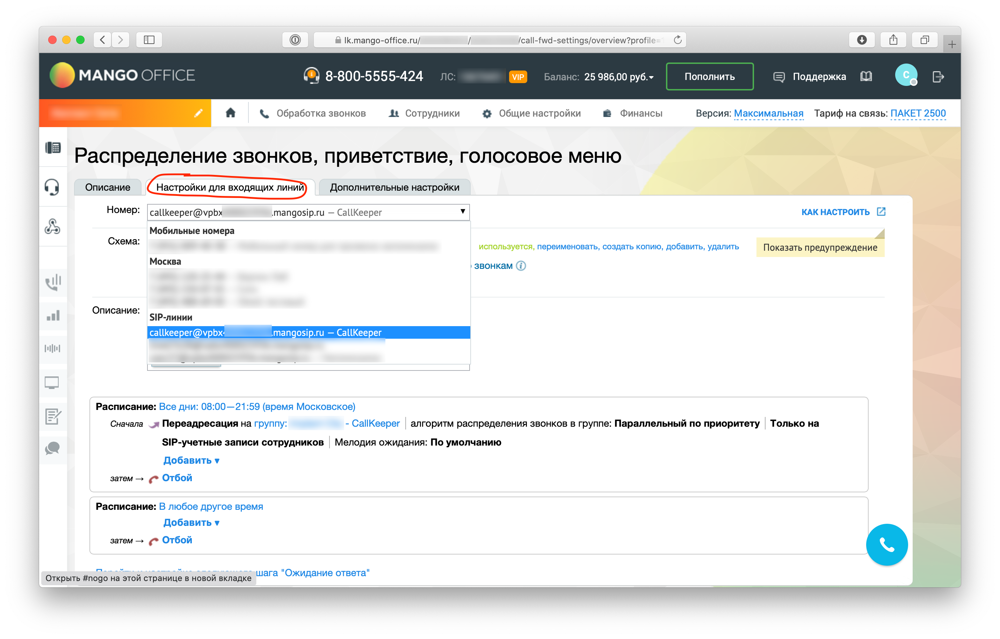
7. Выбрать существующую схему, нажать **создать копию**, затем нажать **активировать**. 
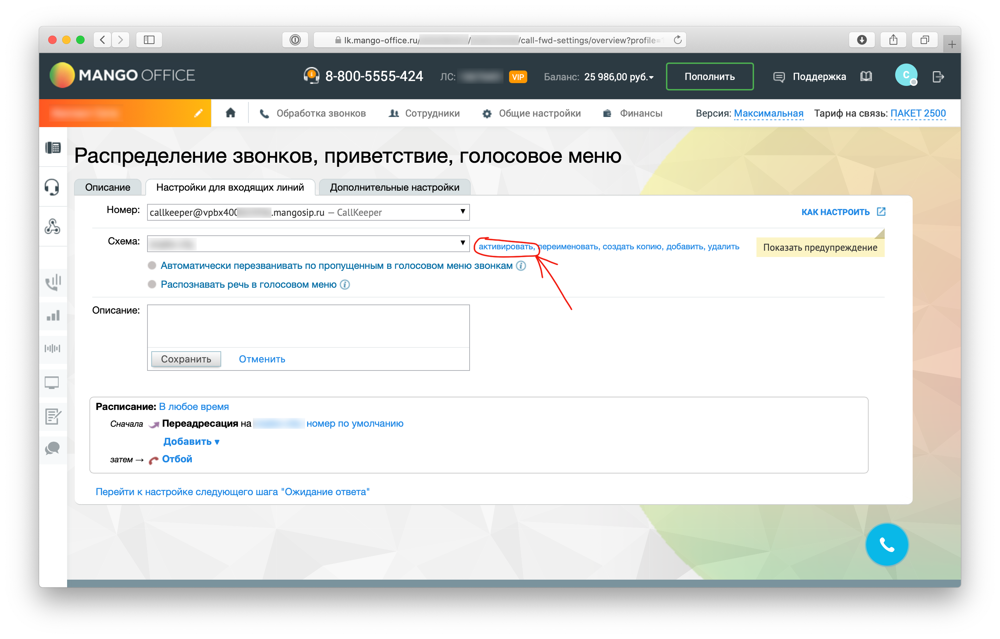
>Если SIP-линия будет использоваться для обратных звонков, то лучше отключить приветственное сообщение (IVR). 

## Шаг 3. Направление вызовов в ВАТС Mango office
1. Возвращаемся в личный кабинет ckct.ru в раздел Номера -> SIP-адреса офисов.
2. Нажимаем +SIP-адрес
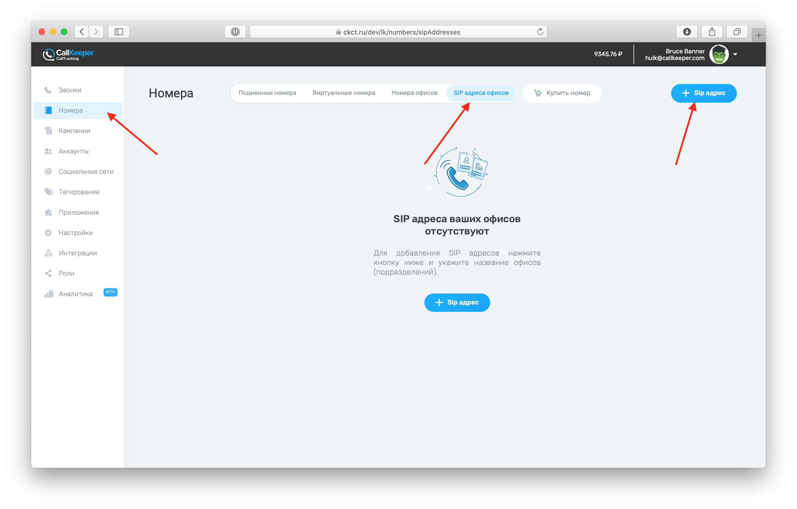
3. В открывшемся модальном окне вставляем в первое поле скопированный SIP-адрес. При желании можно переименовать Название офиса. Нажимаем **Добавить**.
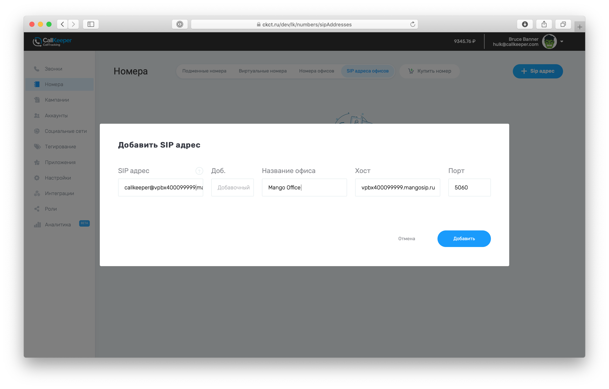
4. Переходим в раздел Кампании. Нажимаем **Добавить кампанию**.
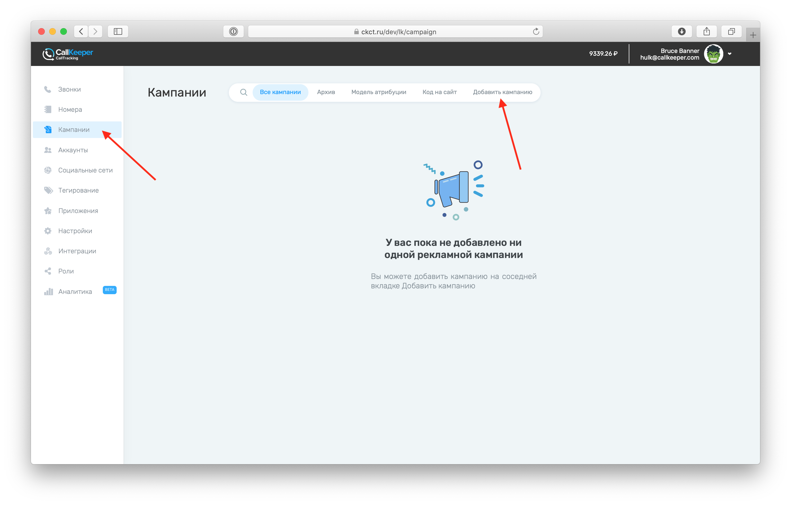
5. Вводим любые данные в поля Название и Сайт.
6. Нажимаем **Добавить** в карточке Офисы
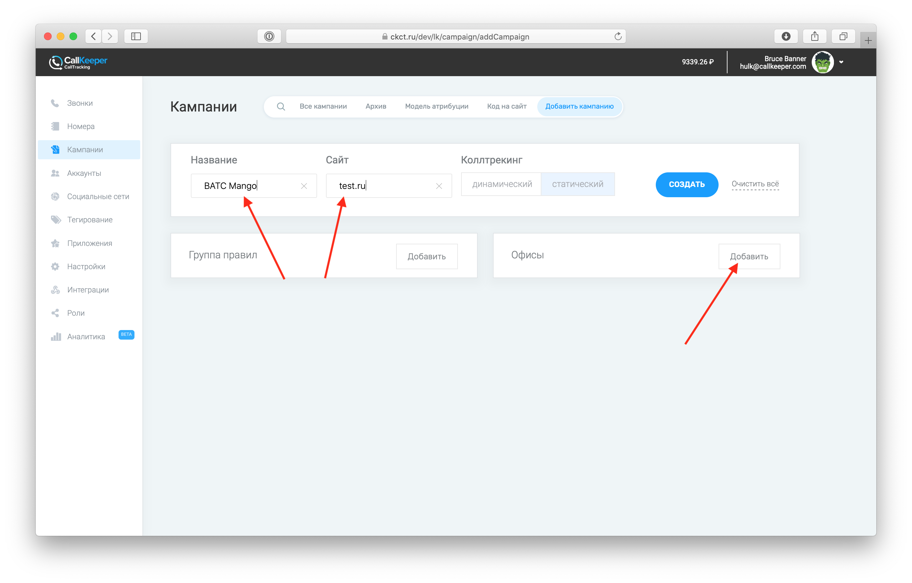
7. Выбираем Созданный в **пункте 3** SIP-адрес в поле Офис и вводим произвольное значение в поле **Селекторы блоков для разметки телефонов**. Нажимаем **Добавить**, а затем **Создать**.
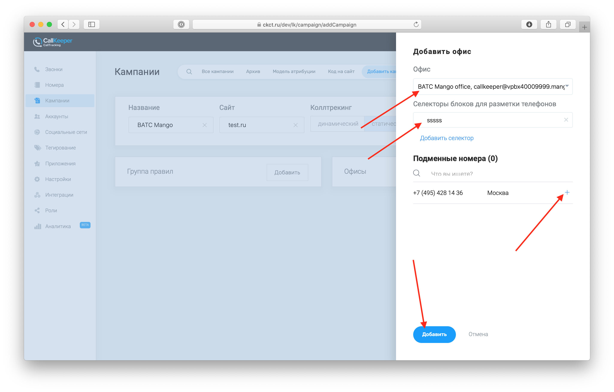
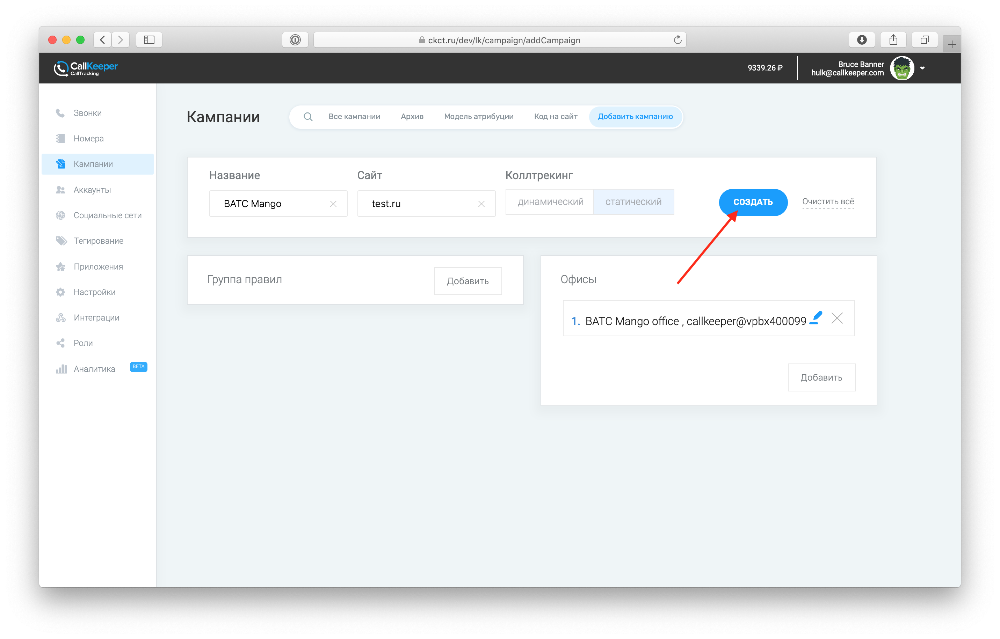
8. Делаем тестовый вызов на купленный номер. Он должен появиться в разделе **Звонки** в личном кабинете ckct.ru
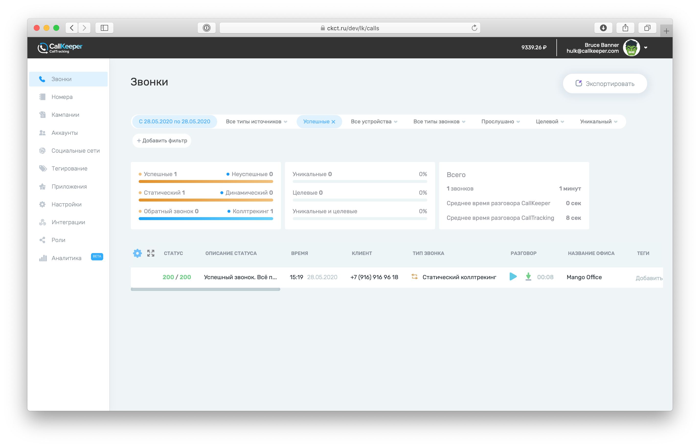

## Готово!
