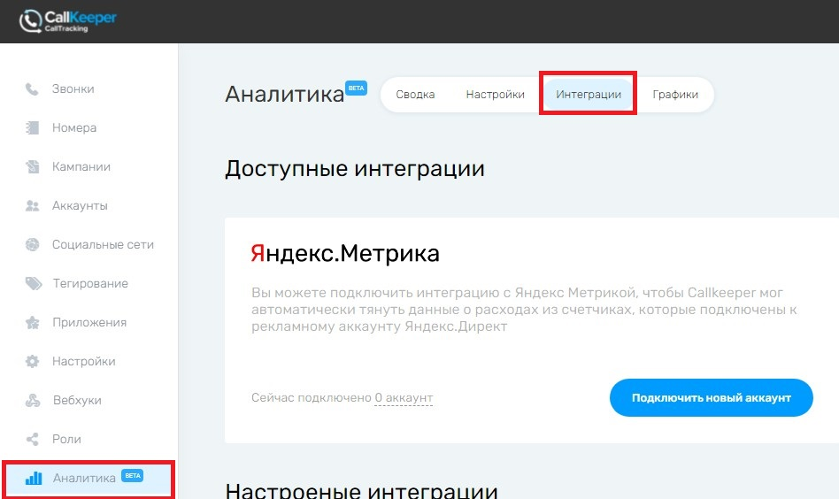
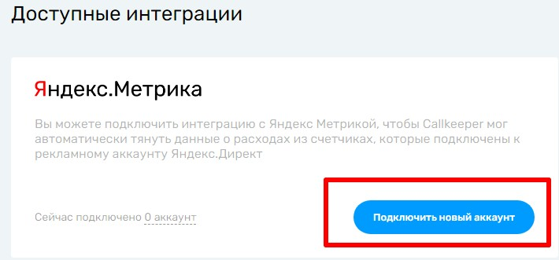
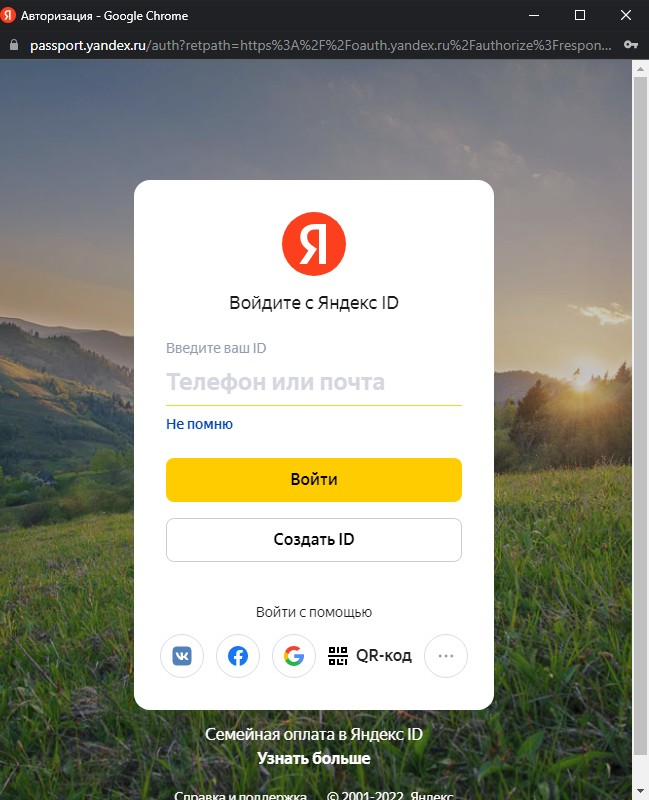

# Аналитика. Интеграция с Яндекс Метрикой

В кабинете ckct.ru во вкладке Аналитика мы отображаем данные, которые можно группировать по выбранным параметрам.
У нас есть возможность отображать на этой странице расходы на каналы. Эти расходы получаем из Яндекс Директ, доступ к которому открывает Яндекс Метрика.

## Как подключить Яндекс Директ к аналитике ckct.ru?

Для подключения следует произвести следующие действия:

1. Зайти в свой личный кабинет на https://ckct.ru/.

2. Перейти на вкладку аналитика в левой части экрана и выбрать в верхнем меню пункт интеграции.

4. Нажать на кнопку Подключить новый аккаунт в окне доступные интеграции.

5. В открывшемся окне необходимо авторизоваться и нажать "разрешить". После этого вы автоматически вернетесь на страницу настройки интеграций в аналитике ckct.ru.

## Поздравляем! Ваши счетчики добавлены в аналитику ckct.ru

**Важная информация:**

* Счетчики обновляются ежедневно, в момент открытия страницы аналитики. 
* Вы можете отключать и включать подключенные счетчики с помощью соответствующего переключателя.
* Подключаясь к Яндекс Метрике, мы получаем их id кампании, название кампании и величину трат. По умолчанию матчатся utm_campaign, в которых есть id кампании.
Если же в utm_campaign отсутствует id кампании, данные не сматчатся в автоматическом режиме. В таком случае, если вы не хотите менять содержимое
utm_campaign, можно использовать другую метку. Вы можете обратиться к своему менеджеру с этим вопросом, и мы настроим забор данных из другой метки.
