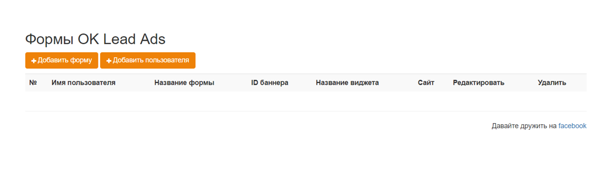

# Настройка интеграции с myTarget Lead Ads 

### Примечание:
Интеграция работает только для аккаунтов, перенесенных с callkeeper.ru/callkeeper.com

* [Форма OK Lead Ads]()
* [Интеграция с Calltracking]()

1. Создайте форму OK Lead Ads на сайте [Одноклассники](ok.ru).

С инструкцией по созданию OK Lead Ads можно ознакомиться по [ссылке](https://insideok.ru/blog/instrukciya-kak-sozdat-reklamnoe-obyavlenie-lead-ads).

2. Зарегистрируйтесь на сайте [myTarget](https://target.my.com) и создайте кампанию с привязкой к форме Lead Ads. Если у вас возникнут сложности с настройкой кампании, ознакомьтесь со [справочными материалами](https://target.my.com/adv/help/).

3. Перейдите в Личный кабинет Calltracking, раздел Социальные сети, вкладка myTarget.

Нажмите на кнопку "Добавить пользователя" и вы перейдете на сайт myTarget. Если вы залогинены на сайте myTarget, он запросит у вас разрешение предоставить приложению Callkeeper права чтения статистики. 

Если вы не залогинены, залогиньтесь и разрешите

После этого вы вернетесь на страницу Социальных сетей в личном кабинете.

Первая форма автоматически создатся после привязки аккаунта. Вы можете отредактировать ее, нажав на карандаш, либо удалить.

Чтобы добавить другие формы привязанные к этому же аккаунту myTarget, нажмите "+ Добавить новую форму".

Вы можете привязать несколько аккаунтов myTarget и добавлять формы для каждого из них.

5. Для создания привязки формы OK Lead Ads и виджета CallKeeper нажмите на кнопку "Добавить форму" и Вы перейдете на страницу создания/редактирования формы.

Чтобы создать форму выберите пользователя myTarget, виджет CallKeeper, введите произвольные название формы и адрес сайта, а также введите ID объявления, который можно найти на вкладке "Объявления" на странице myTarget.

Указание UTM-меток не является обязательным.

Звонки будут инициироваться после привязки транслируемого объявления к виджету.

### **Примечание**

К одному пользователю CallKeeper может быть привязано несколько конечных рекламодателей из myTarget. Привязка осуществляется не к рекламному агентству (у которого может быть несколько аккаунтов на myTarget), а именно к конечным пользователям.

Существует ограничение – одного рекламодателя myTarget можно привязать только к одному user id в системе CallKeeper. При этом после привязки можно создавать неограниченное количество баннеров, с которых будут собираться лиды.
