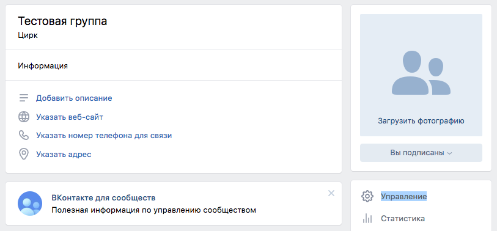
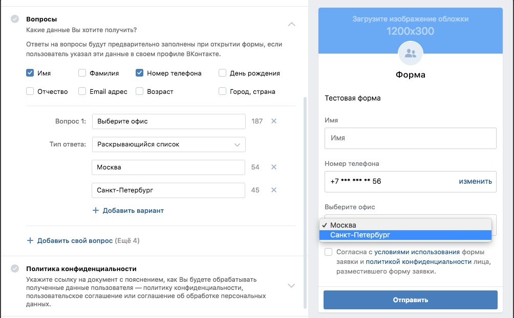
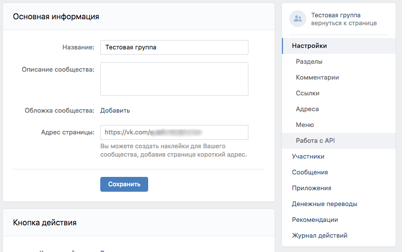
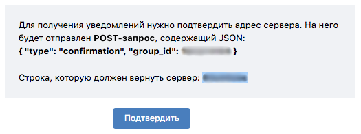
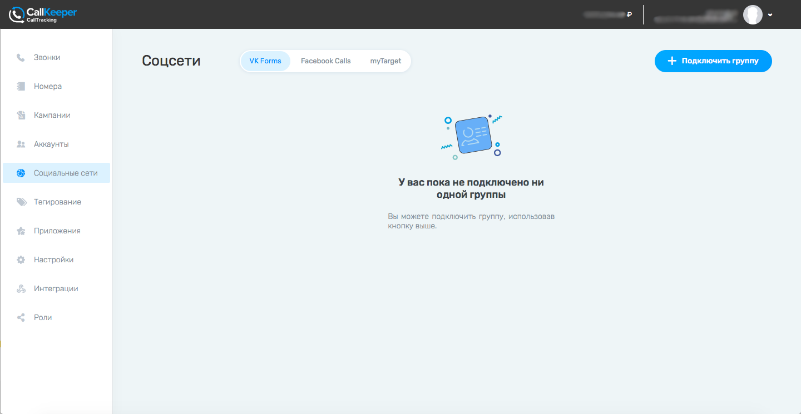

# Интеграция с VK Leads

#### Примечание:
`Инструмент доступен только для аккаунтов, перенесенных с callkeeper.ru/callkeeper.com`
________

## Навигация

* [Создание формы VK Leads]()
* [Настройка формы в Calltracking]()
  * [Сообщества]()
  * [Формы]()
  * [IVR]()

Что необходимо для интеграции:

- Группа (сообщество) ВКонтакте
- Настроенная форма VK Leads
- Аккаунт на Calltracking

## Создание формы VK Leads
Перейдите в группу ВКонтакте, которой вы управляете.

Нажмите на вкладку Управление и выберите раздел Приложения

Вам нужно установить в сообществе приложение "Форма сбора заявок". 

Найдите его в списке приложений и нажмите Добавить.

Откройте приложение и нажмите Добавить форму.

Заполните нужную информацию на открывшейся странице.

Чтобы получать лиды с формы, обязательно выберите поле с Номером Телефона.
Если в виджете, с которым вы планируете связать интеграцию, есть несколько офисов, вы можете добавить альтернативный вопрос с выбором офиса. 

После заполнения всех необходимых полей, назовите форму и нажмите "Сохранить форму".

Созданная форма сохранится в списке форм приложения. Вы можете посмотреть его, кликнув на название приложения в разделе Приложения Настроек группы.

Вы можете отредактировать ее в любой момент, кликнув на название формы.

Обязательно активируйте форму, кликнув на ее статус.

Далее перейдите в Настройках в раздел Работа с API

Вам нужен раздел Callback API - Настройки сервера. 
Если в вашей группе уже настраивались интеграции, то добавьте новый сервер, нажав "Добавить сервер".

Если вы только создали группу, то можно использовать первый сервер, который стоит там по умолчанию.
На этом этапе оставьте строку "Адрес" пустой - к ней нужно будет вернуться позже.

###### Заполните поле "Секретный ключ"
______
#### Примечание:

Секретный ключ должен быть уникальным. Рекомендуется воспользоваться любым сервисом генерации ключей. Обратите внимание, что ключ не должен содержать специальных символов, а длину вы можете определить на свое усмотрение.
______

Кроме секретного ключа вам понадобится **group_id** и **ответ сервера** ("Строка, которую должен вернуть сервер").

##### group_id 

##### ответ сервера

Перейдите в раздел Типы событий и поставьте галочку напротив типа "Lead forms: Новая заявка".

## Настройка формы в Calltracking

Перейдите в раздел Социальные сети во вкладку VK Forms.

Нажмите кнопку "+ Подключить группу"

Заполните поля в новом окне и нажмите "Добавить".

- Название сообщества - название вашей группы (сообщества ВКонтакте)
- Secret сообщества - 

[Вернуться к оглавлению](#)

[Вернуться на главную](/README.md/#documentation)

