# Интеграция с VK Leads
________

## Навигация

* [Создание формы VK Leads](#создание-формы-vk-leads)
* [Настройка формы в CallKeeper](#настройка-формы-в-callkeeper)

Что необходимо для интеграции:

- Группа (сообщество) ВКонтакте
- Настроенная форма VK Leads
- Аккаунт на CallKeeper

## Создание формы VK Leads

Перейдите в группу ВКонтакте, которой вы управляете.

Нажмите на вкладку Управление и выберите раздел Приложения

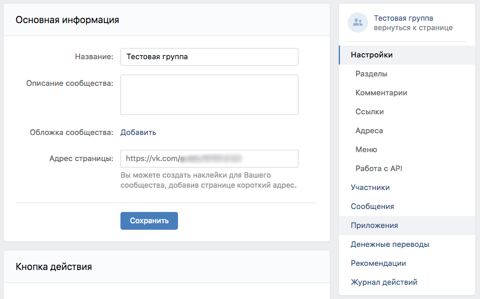

Вам нужно установить в сообществе приложение "Форма сбора заявок". 

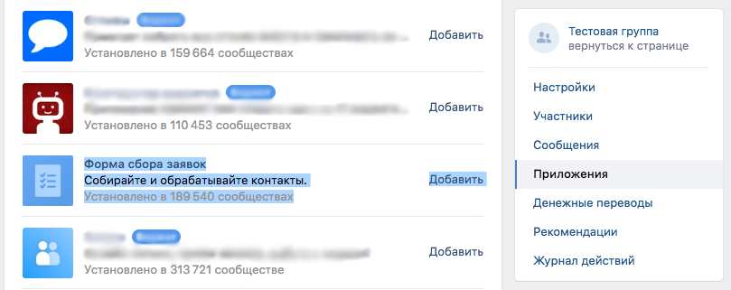

Найдите его в списке приложений и нажмите Добавить.

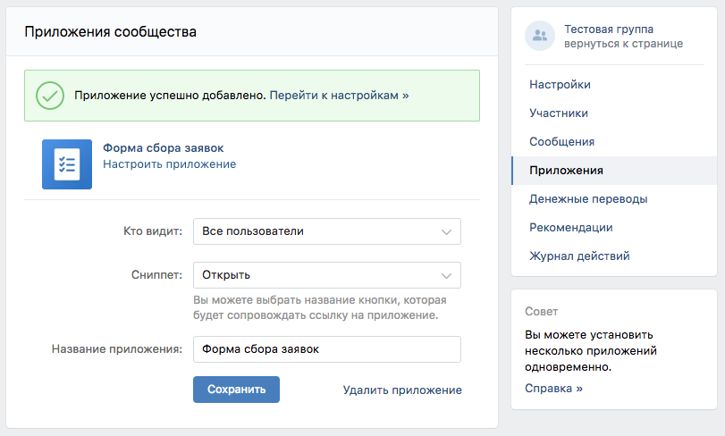

Откройте приложение и нажмите Добавить форму.

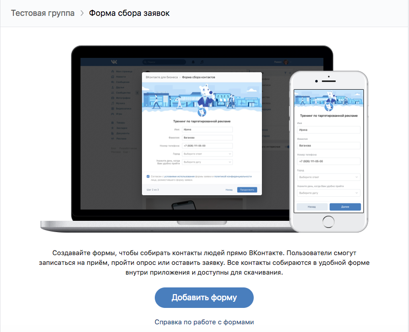

Заполните нужную информацию на открывшейся странице.

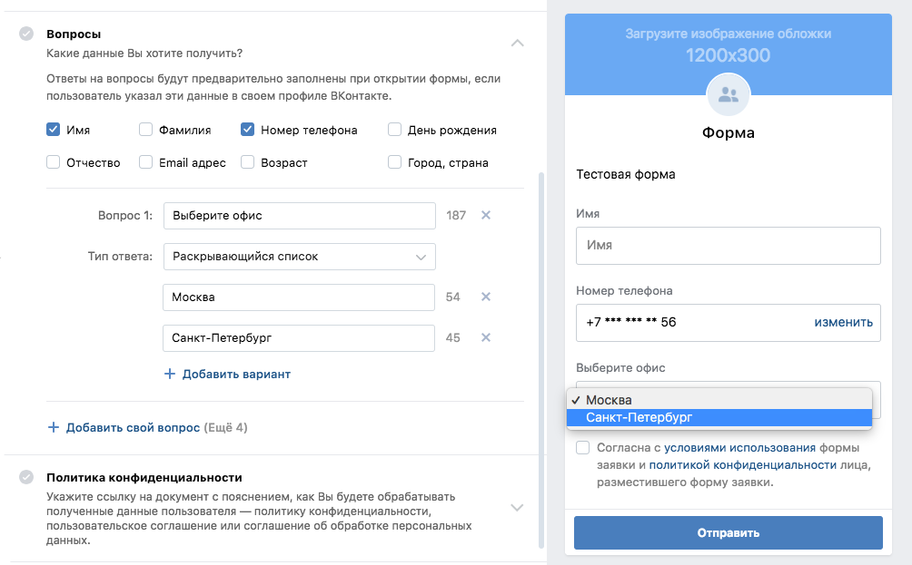

Чтобы получать лиды с формы, обязательно выберите поле с Номером Телефона.
Если в виджете, с которым вы планируете связать интеграцию, есть несколько офисов, вы можете добавить альтернативный вопрос с выбором офиса. 

После заполнения всех необходимых полей, назовите форму и нажмите "Сохранить форму".

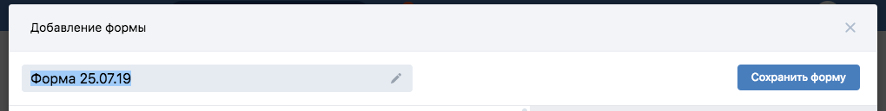

Созданная форма сохранится в списке форм приложения. Вы можете посмотреть его, кликнув на название приложения в разделе Приложения Настроек группы.

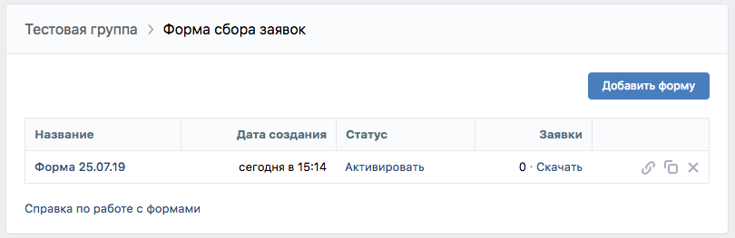

Вы можете отредактировать ее в любой момент, кликнув на название формы.

Обязательно активируйте форму, кликнув на ее статус.

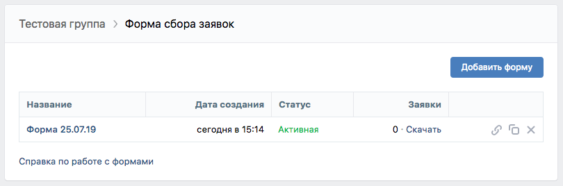

Далее перейдите в Настройках в раздел Работа с API

Вам нужен раздел Callback API - Настройки сервера. 
Если в вашей группе уже настраивались интеграции, то добавьте новый сервер, нажав "Добавить сервер".

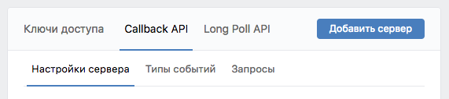

Если вы только создали группу, то можно использовать первый сервер, который стоит там по умолчанию.
На этом этапе оставьте строку "Адрес" пустой - к ней нужно будет вернуться позже.

##### Заполните поле "Секретный ключ"
______
#### Примечание:

Секретный ключ должен быть уникальным. Рекомендуется воспользоваться любым сервисом генерации ключей. Обратите внимание, что ключ не должен содержать специальных символов, а длину вы можете определить на свое усмотрение.
______

Кроме секретного ключа вам понадобится **group_id** и **ответ сервера** ("Строка, которую должен вернуть сервер").

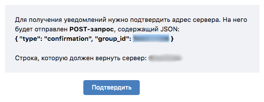
##### group_id 

##### ответ сервера

Перейдите в раздел Типы событий и поставьте галочку напротив типа "Lead forms: Новая заявка".

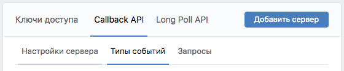

## Настройка формы в CallKeeper

Перейдите в раздел Сервисы/Вконтакте Leads 

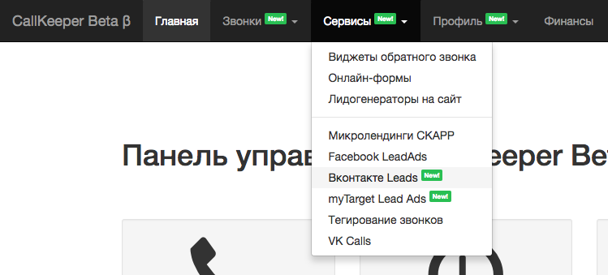

В выпадающем списке выберите "Добавить сообщество" и нажмите кнопку "Добавить форму".

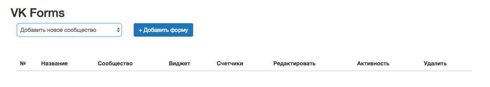

Если вы уже подключали ранее формы VK Leads, то в выпадающем списке будут варианты сообществ, которые вы уже подключали. В этом случае выберите нужное сообщество и нажмите кнопку "Добавить форму" 

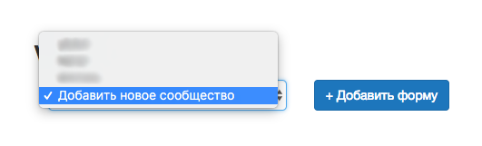

В открывшемся меню нужно будет заполнить нужные поля.

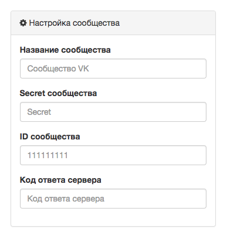

- Название сообщества - название вашей группы (сообщества ВКонтакте)
- Secret сообщества - секретный [ключ сообщества](#заполните-поле-секретный-ключ). 
- ID сообщества - уникальный [идентификатор сообщества](#group_id) 
- Код ответа сервера - [строка, которую должен вернуть сервер](#ответ-сервера)

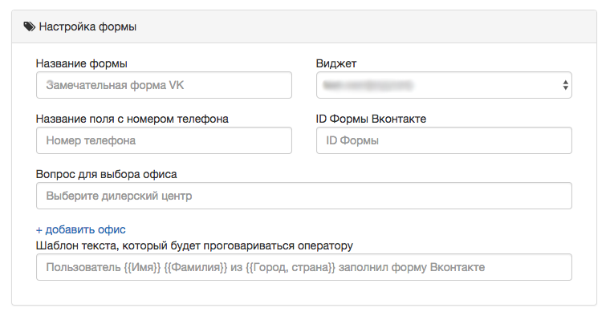

- Название поля с номером телефона - обязательное поле. Укажите здесь поле, которое вы настроили в самой форме VK.

- Вопрос для выбора офиса - точное названия поля, в котором пользователь выбирает офис (берется из созданной формы).

- Шаблон текста, который будет проговариваться оператору - здесь вы можете написать фразу, которая будет проговариваться менеджеру. В шаблоне можно проговорить содержимое полей из формы. Для этого укажите точное название поля в фигурных скобках.

- ID Формы Вконтакте - id вашей формы.

Скопируйте ссылку на созданную форму, которую вы хотите прикрепить, вставьте ссылку в строку браузера (или в любой редактор текста). Последнее значение в строке - form_id=X, где Х - это id формы.

Вы можете добавить utm-метки. Эти поля необязательны.

После заполнения полей нажмите кнопку "Сохранить".

Все прикрепленные формы будут отображаться в этом же разделе.

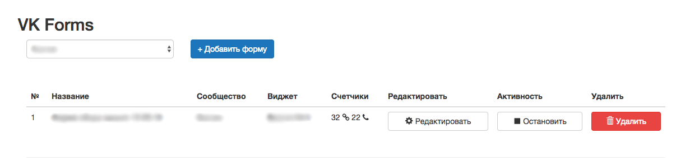

Обратите внимание на колонку "Счетчики". Здесь будет отображаться количество лидов, поступивших на форму, и количество звонков по ним.

Вы можете отредактировать форму или приостановить ее работу, нажав на соответствующие кнопки.

_______

Для завершения интеграции вернитесь в настройки вашей группы Вконтакте.

Раздел Настройки/Работа с API/Callback API/Настройки сервера.

Введите в строку "Адрес" : https://api.callkeeper.ru/vkLead

и нажмите "Подтвердить".

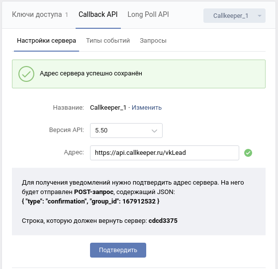

Настройка интеграции завершена. Можете разместить готовую форму, скопировав ее ссылку, и заказать звонок.

[Вернуться к оглавлению](#навигация)

[Вернуться на главную](/README.md/#documentation)

