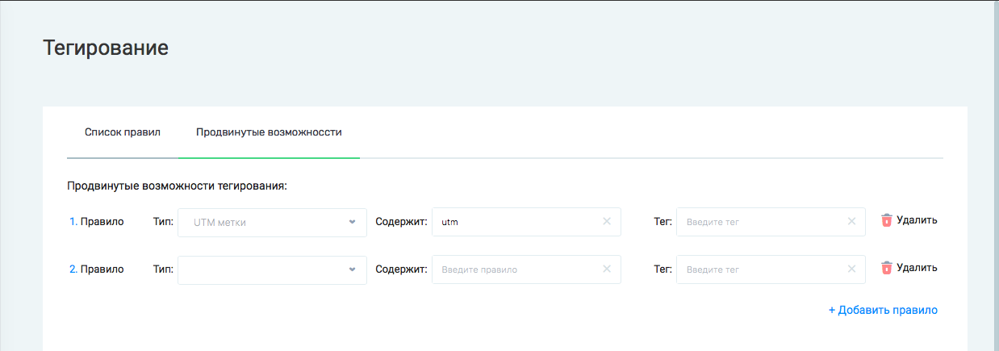

# Тегирование 

#### Примечание:
`Инструмент доступен только для аккаунтов, перенесенных с callkeeper.ru/callkeeper.com`

## Навигация

* [Автоматическое тегирование](#автоматическое-тегирование)
* [Продвинутые настройка](#продвинутые-настройки)

## Автоматическое тегирование

В личном кабинете Calltracking в разделе Тегирование можно настроить автоматическое тегирование для звонков CallKeeper.

Во вкладке Список правил вы можете настроить правила для автоматического тегирования звонков CallKeeper тегами "Уникальный" и "Целевой".

Выберите виджет и связанные с ним инструменты, звонки с которых при выполнении условий длительности звонка (для целевых) или количество дней для выборки (для уникальных). Укажите счетчик GA, который будет привязан к этому конкретному правилу и виджету, для которого оно создано.

Все созданные правила будут отображаться в этой же вкладке. Вы можете отредактировать их или удалить.

_______

## Продвинутые настройки

На вкладке Продвинутые настройки вы можете настроить автоматическое тегирование звонков собственными тегами.

**Тип** - выбор условия для автоматического тегирования.

- UTM-метки - проверка соответствия utm-меткам.
- Номер подразделения - номер телефона подразделения, на которое заказан звонок.
- Страница заказа - страница, на которой находился пользователь во время заказа звонка
- Страница входа - первая страница сайта, на которую зашел пользователь
- Отмененный вызов - звонок, который был отменен менеджером

**Содержит** - правило (строка), при наличии которого в параметрах звонка будет срабатывать автотегирование

**Тег** - пользовательский тег, который будет присвоен звонку

Все созданные правила будут отображаться в этой же вкладке. Вы можете отредактировать их или удалить.

[Вернуться к оглавлению](#навигация)

[Вернуться на главную](/README.md#documentation)
