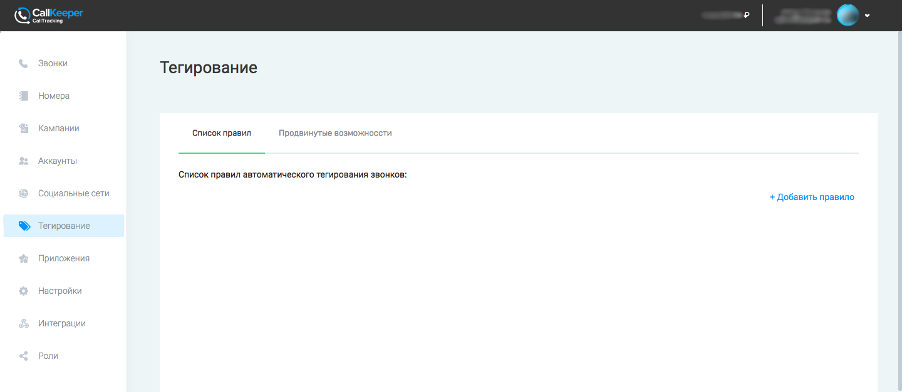

# Тегирование 

#### Примечание:
`Инструмент доступен только для аккаунтов, перенесенных с callkeeper.ru/callkeeper.com`

## Навигация

* [Автоматическое тегирование](#автоматическое-тегирование)
* [Продвинутые настройка](#продвинутые-настройки)

## Автоматическое тегирование

В личном кабинете Calltracking в разделе Тегирование можно настроить автоматическое тегирование для звонков CallKeeper.

## Продвинутые настройки

[Вернуться к оглавлению](#навигация)

[Вернуться на главную](/README.md#documentation)
