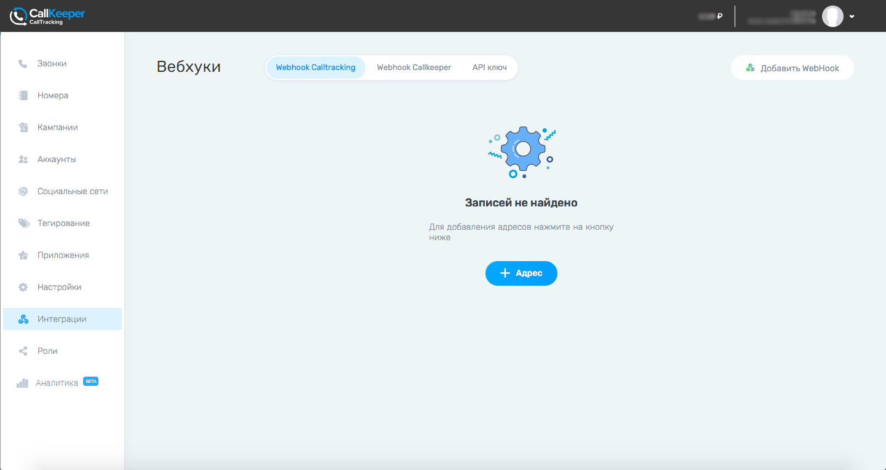
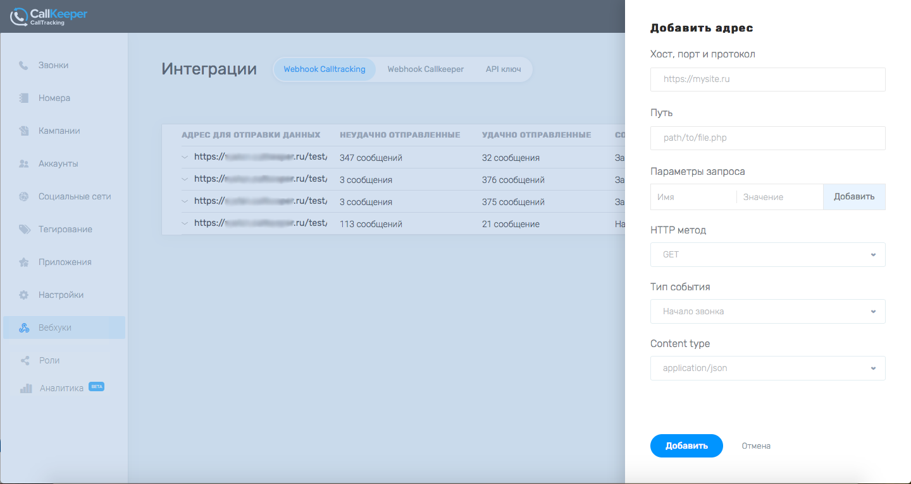
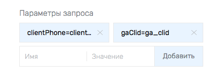

# Настройка передачи вебхуков из личного кабинета CallTracking

Вы можете настроить отправку вебхуков по определенным событиям.
Для этого в личном кабинете ckct перейдите в раздел «Вебхуки».

Здесь будут отображаться все настроенные вебхуки.

Для добавления нового вебхука нажмите «+ Адрес».

Заполните поля в открывшейся вкладке.

## Описание полей

**«Хост, порт и протокол»** - хост - доменное имя сервера или его IP, порт - дефолтный http-порт - 80; в некоторых случаях, если прием данных настроен на другой порт, указывается через двоеточие после домена, протокол - http/https,

**«Путь»** - все,что идет в строке до знака вопроса (если его нет, то до конца строки)

**«Параметры запроса»** (имя, значение) - параметры, идущие после знака вопроса.
Вы можете дать свое название (нужное для получения информации на стороне клиента), которое будет соответствовать нашим предустановленным параметрам в звонках. Их список вы можете увидеть щелкнув по полю "Значение". 
В поле "Имя" задайте нужное название для ключа, в поле "Значение" выберите соответствие нашему параметру.

**HTTP метод** - get - все параметры передаются в самой строке; post - данные не видно явно из строке, передаются в теле запроса

**«Тип события»** - начало или завершение звонка. Определяет, в какой момент будет отправляться вебхук - когда соединение будет установлено или после завершения звонка. Учтите, что при отправке вебхука а начале звонка мы не сможем передать некоторые данные (например, duration - длительность звонка). 

**«Content type»** - специальный http-заголовок, который определяет тип содержимого тела запроса

Нажмите кнопку «Добавить».

Все созданные пути для вебхуков сохранятся во разделе «Интеграции».

Вы можете удалить вебхуки, нажав на значок мусорного ведра или отредактировать созданные вебхуки, нажав на кнопку с карандашом.
